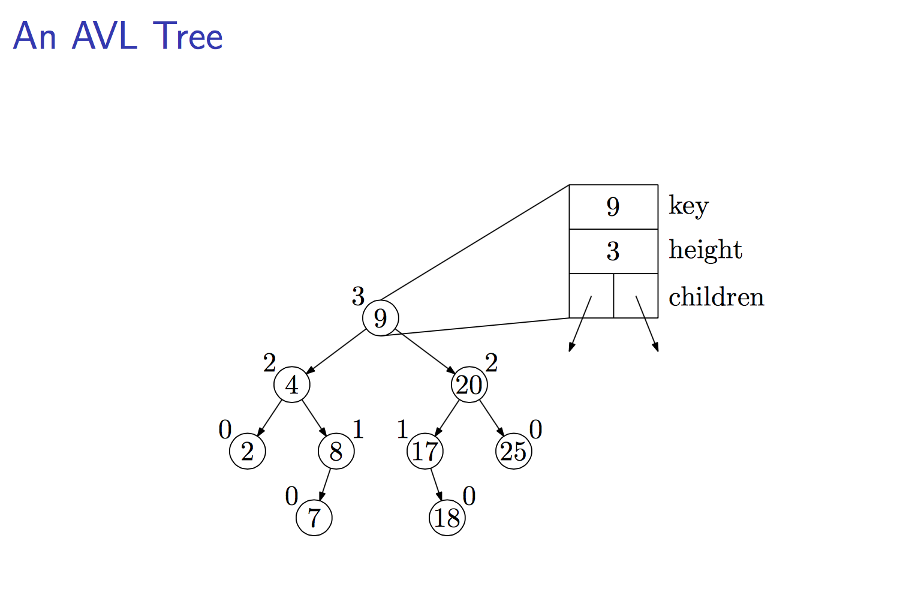
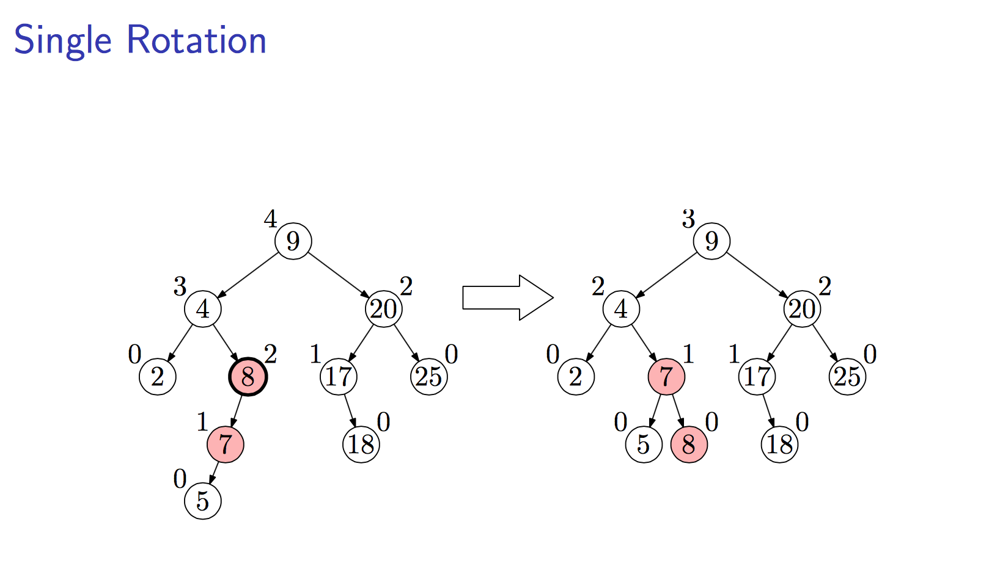
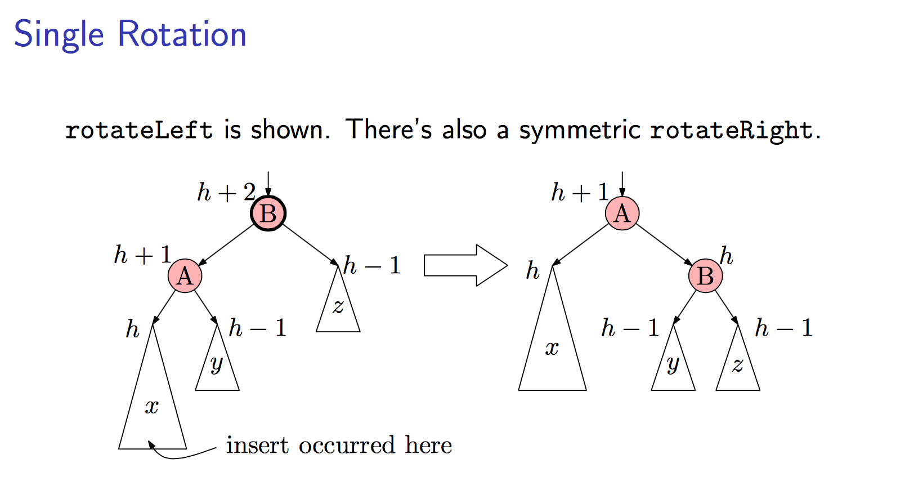
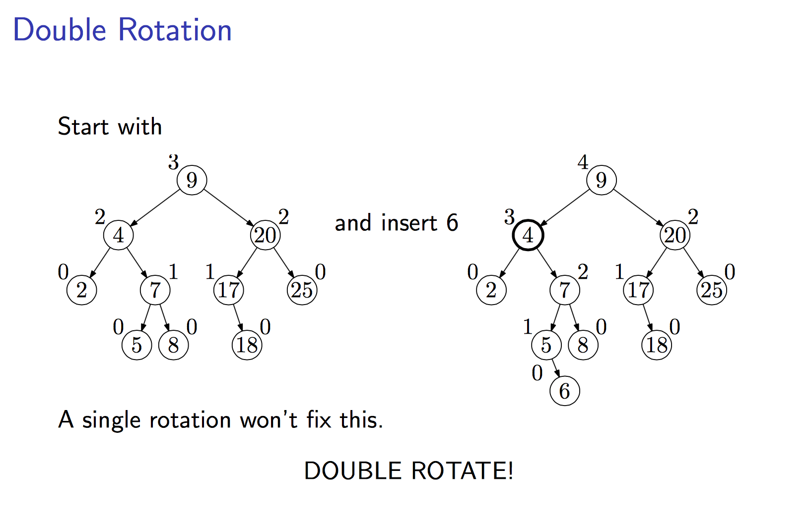
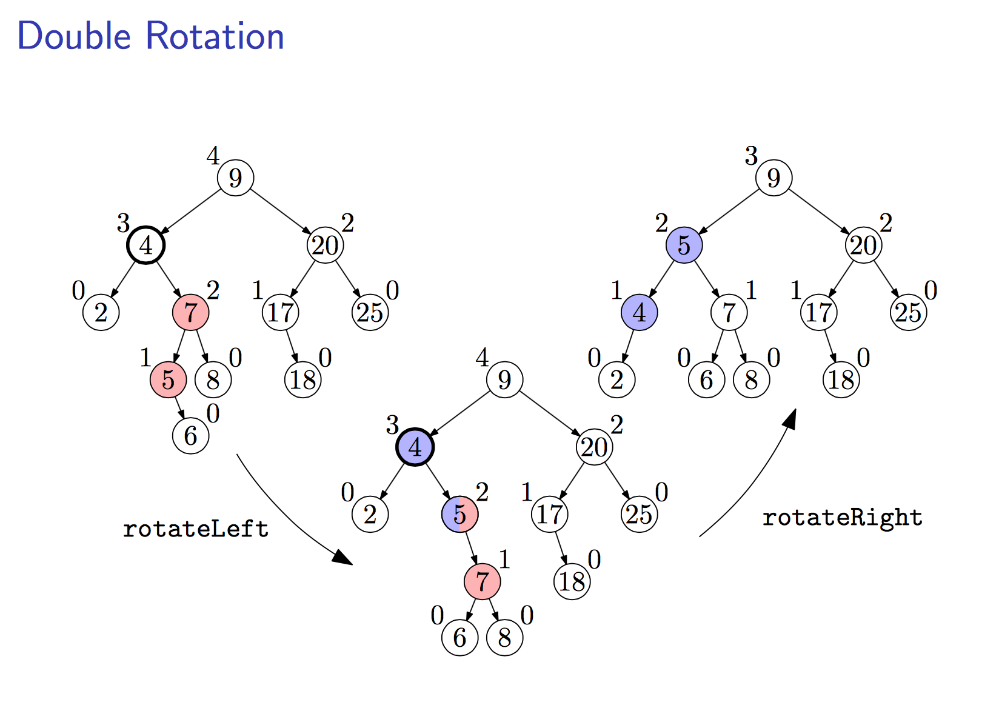
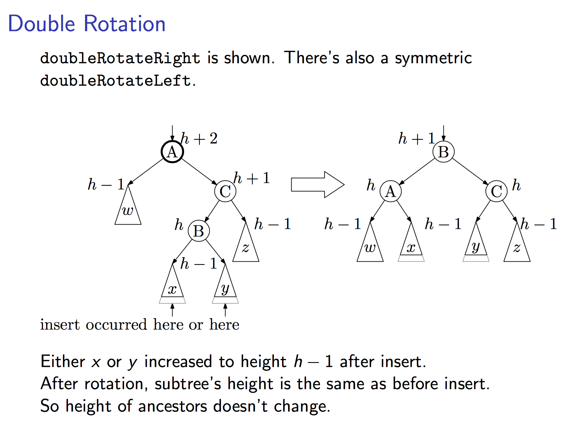

# AVL Balanced Tree
### Introduction
- Binary Search Trees are fast if they’re shallow.
- Apply rotation to a BST to achieve a balanced tree.
- balance(x) = height(x.left) − height(x.right)
- height(NULL) = −1
- Siblings in a tree should have about the same height.
	- balance(x) = 0 then perfectly balanced.
	- For all nodes x, −1 ≤ balance(x) ≤ 1, then tree height ≤ 1.44lg(n).





__Keynote__: Identify the first node that is unbalanced, from bottom up (node 8 in this case).










### AVL Tree Observations 

- Binary search trees that allow only slight imbalance
- Worst-case __*O(logn)*__ time for find, insert, and delete 􏰀 
- Elements (even siblings) may be scattered in memory

## Implementation
```cpp
template <class T>
class AVLTreeNode{
    public:
        T key;            
        int height;         
        AVLTreeNode *left; 
        AVLTreeNode *right;   

        AVLTreeNode(T value, AVLTreeNode *l, AVLTreeNode *r):
            key(value), height(0),left(l),right(r) {}
};

template <class T>
class AVLTree {
    private:
        AVLTreeNode<T> *mRoot;

    public:
        AVLTree();
        ~AVLTree();

        int height();
        int max(int a, int b);

        void preOrder();
        void inOrder();
        void postOrder();

  
        AVLTreeNode<T>* search(T key);
        AVLTreeNode<T>* iterativeSearch(T key);

        T minimum();
        T maximum();

        void insert(T key);

        void remove(T key);
        void destroy();
        void print();
    private:
      
        int height(AVLTreeNode<T>* tree) ;

        void preOrder(AVLTreeNode<T>* tree) const;
      
        void inOrder(AVLTreeNode<T>* tree) const;
        
        void postOrder(AVLTreeNode<T>* tree) const;

        AVLTreeNode<T>* search(AVLTreeNode<T>* x, T key) const;
      
        AVLTreeNode<T>* iterativeSearch(AVLTreeNode<T>* x, T key) const;

        AVLTreeNode<T>* minimum(AVLTreeNode<T>* tree);
  
        AVLTreeNode<T>* maximum(AVLTreeNode<T>* tree);

        AVLTreeNode<T>* leftLeftRotation(AVLTreeNode<T>* k2);

        AVLTreeNode<T>* rightRightRotation(AVLTreeNode<T>* k1);

        AVLTreeNode<T>* leftRightRotation(AVLTreeNode<T>* k3);

        AVLTreeNode<T>* rightLeftRotation(AVLTreeNode<T>* k1);

        AVLTreeNode<T>* insert(AVLTreeNode<T>* &tree, T key);

        AVLTreeNode<T>* remove(AVLTreeNode<T>* &tree, AVLTreeNode<T>* z);

        void destroy(AVLTreeNode<T>* &tree);

        void print(AVLTreeNode<T>* tree, T key, int direction);
};

```
[Reference](http://www.cnblogs.com/skywang12345/p/3577360.html)