# CPSC 404 Advanced Database

### Relationships among Files, Disks, RAM, Buffer Pool(s), DBMS, OS

#### Typical Memory Hierarchy:


#### Components of a Disk Drive
- The platters spin (e.g., 7200 rpm)
- The whole arm assembly is moved in, or out, to position a head on a desired __track__, k.
- All tracks with the same track # (e.g., track k) make up __cylinder__ k.
- Block size is a multiple of sector size, the logical partition.
- Only one head reads/writes at any one time.


#### Accessing a Disk Page:
- Access time = Seek time + Rotational delay + Transfer time
- Access time: time to read or write a disk page
- Seek time: move arm to position the disk head at a cyl/track (1-20ms)
- Rotational delay: wait for block to rotate under head (0-10ms)
- Transfer time: move data between disk and RAM ( 1ms/4K page)

__Example__:

- Megatron 747: disk rpm = 3840
- Block size = 4096 bytes (4K)
- 4 platters of 2 surfaces each 2<sup>13</sup> = 8192 cylinders
- Average # sectors/track = 2<sup>8</sup> = 256
- #bytes/sector = 2<sup>9</sup> = 512
- Moving head assembly between cylinders = 1 ms (setup time) + 1 ms/500 cylinders

1. What is the max/avg seek time?
	- Max: the entire #cylinders: 1 + 8192/500 x 1ms
	- Avg: __1/3__ of #cylinders: 1 + 8192/(3 x 500) x 1ms
2. What is the max/avg rotational latency time?
	- Max: the entire #sectors: 1/(3840/60) x 1000ms
	- Age: __1/2__ of #sectors: Max/2
3. What is the transfer time?
	- Max*4/256 = transfer time in ms/block 

#### Arranging Pages on Disk:
- Prefetching for a sequential scan of data pages. (e.g., read 32 or more pages at a time)
- Anticipatory prefetch - DBMS may be able to “predict” what the user wants to do next
- Key to lowering I/O costs: reduce seek and rotation time!
- __The “next block” concept__. We prefer to access: Blocks on same track > Blocks on same cylinder > Blocks on adjacent cylinders.
- Arrange blocks in a file sequentially can minimize seek and rotational delays.

#### Solid State Disks (SSDs)
- Flash memory is based on EEPROMs (e.g., MP3 players, cameras, cell phones)
- Advantages: No spinning disks or moving parts, lower power requirement and faster reads.
- Disadvantages: Costy, smaller capacity, slower random writes, limited write cycles (~100000)

#### Ram vs. Disk:
- About 5 orders of magnitude difference in speeds (nanoseconds vs. milliseconds)


#### Indexes
> An index can be created in a table to find data more quickly and efficiently. Updating a table with indexes takes more time than updating a table without (because the indexes also need an update). So only create indexes on columns (and tables) that will be frequently searched against.  
> SQL example: _CREATE INDEX index_name ON table_name (column_name)_

- DBMS = Data + Data Structure + Seaching Algorithm

### Buffer Pool Management
- A DBMS buffer pool is part of RAM, and is managed independently of the OS.
- A page is the smallest unit of transfer between disk and main memory.
- Logical memory has __“pages”__, and physical memory (RAM) has __“frames”__.
- The Translation Lookaside Buffer (TLB), a fast L1 hardware cache used to determine whether or not a particular page is currently in memory.


#### When a Page is Requested ...
- If requested page is not in buffer pool:
	- Choose a frame for replacement. If that frame is dirty, write it to disk, and read requested page into chosen frame.
- Pin the new page and return its address
	- __“Pin”__ = hold in memory & don’t allow another page to overwrite it; add 1 to the in-use count
- Requestor of page must unpin it, and indicate whether the page has been modified:
	- Maintain a dirty bit for the page
- Page may be requested many times
	- Maintain a pin count, and A page is a candidate for replacement iff: pin_count = 0
- Concurrency control and recovery mechanisms may entail additional I/O when a frame is chosen for replacement
	- e.g., Write-Ahead Log protocol

#### Force vs. Steal; ARIES:
- Related to __crash recovery__
- __Force__: At transaction commit time, force (i.e., write) the transaction’s updated pages to disk (after writing the
log records to disk.)
- __Steal__: When the BP desperately needs a free page, we can write a dirty page for an uncommitted transaction to disk (i.e., we steal a frame from an in-flight transaction).

#### Page fault occurs ...
 when a program accesses a page that is mapped in the virtual address space, but not loaded in physical memory.

### Buffer Manager
- The software layer responsible for bringing pages from disk to main memory as needed.
- The buffer manager manages the available main memory by partitioning it into a collection of pages, which we collectively refer to as the buffer pool.
- The main memory pages in the buffer pool are called frames. (slots that can hold a page)
- The goal is to provide access to more data than will fit in main memory, and the basic idea is to bring in pages from disk to main memory as needed, replacing pages no longer needed in main memory. (Similar in OS & Virtual Memory)
- The ability to predict reference patterns allows for a better choice of pages to replace and makes the idea of specialized buffer replacmnent policies more attractive in the DBMS environment.
- Being able to predict reference patterns enables the use of a simple and very effective strategy called __prefetching of pages__ (32-64 4KB pages in general.

### Page Replacement Algorithms
- FIFO: Victim = oldest page
- Least Recently Used (LRU): Victim = page that hasn’t been referenced for the longest time
- MRU: Victim = page that has been most recently used
- Clock Replacement:
	- Each page is given a “second chance”. We’ll cycle through the pages, as necessary, looking for a victim.
	- Idea: If a page is referenced often enough, its reference bit (RB) will stay set, and it won’t be a victim.

#### Clock Algorithm (One Version):
We assume that an existing page in the BP that is reused has its RB set to 1 upon reuse (the RB can also reflect the pin count).

```python
If an empty frame exists in the BP:
	- Use it to store the new page’s data
	- Set its RB to 1 and set its arrival time to 'current'
else:
	- Find the oldest page (i.e., oldest timestamp) in the BP
	- If that page’s RB is set to 0:
		- Replace that BP page with the new one
		- Set the new page’s RB to 1, and its arrival time to “current”
	else: 
		- Give that page a second chance (victim not found yet)
		- Decrement that page’s RB to 0
		- Update that page’s arrival time to “current”
```

#### Extended Clock Algorithm:

- Include both a reference bit and a dirty bit (RB/DB)
- DB is set if page needs to be written to disk
- Similar to Clock PRA
- Again, victim search begins with the oldest page. The first 0/0 or 0/0* is the victim.
	- 0/0 or 0/0* Becomes: Victim (* = write out the dirty page)
	- 0/1 Becomes: 0/0*
	- 1/0 or 1/0* Becomes: 0/0 or 0/0*
	- 1/1 Becomes: 0/1

#### Sequential Flooding:
- Page replacement policy can have big impact on # of I/Os. Also, depends on the data access pattern
- __Sequential flooding__: Nasty situation caused by LRU + repeated sequential scans:
	- When #buffer frames < #pages in file, means each page request causes an I/O (page fault)
	- Example: LRU with 8 available buffer frames, read and process pages 1-9 from Table X

#### DBMS vs. OS File System
_OS does disk space & buffer mgmt, so why not let the OS manage these tasks?_  
A DBMS needs to have control over events that most OS’s don’t need to worry about for their own paging activities. Such events include _forcing a page to disk, controlling the order of page writes to disk, working with files that span disks, having the ability to control prefetching and page replacement policies_ based on predictable access patterns, etc.

- Differences in OS support: portability issues
- Buffer management in DBMS requires ability to:
	- Pin a page in the buffer pool, or force a page to disk.
	- Adjust replacement policy, and prefetch pages based on access patterns in typical DB operations.

### IBM DB2
- Physical objects (files) are tablespaces and indexspaces, they contain pages.
- A tablespace is a unit of backup and recovery. (There is often one table per tablespace)
- A view can involve one or more tables, and most views are not stored on disk.
- DB2 resolves deadlocks by aborting ('Rolling back') the transaction involved in the deadlock that has the fewest log records.

---
### System Catalog
- A fundamental property of a database system is that it maintains a description of all the data that it contains.
- A relational DBMS maintains information about every relation and index that it contains.
- __System catalog content__: 
	- The size of the buffer pool and the page size, 
	- Relation name, the attribute name and type of each of its attributes.
	- The index name and structure of each index on the relation. 
	- The integrity constraints (e.g., primary key and foreign key constraints) 
- Statistics about relations and indexes are stored in the system catalogs and updated periodically.
- The catalogs also contain information about users, such as accounting information and authorization information (e.g., Joe User can modify the Enrolled relation, but only read the Faculty relation).
- A relational DBMS is that the system catalog is itself a collection of relations. 

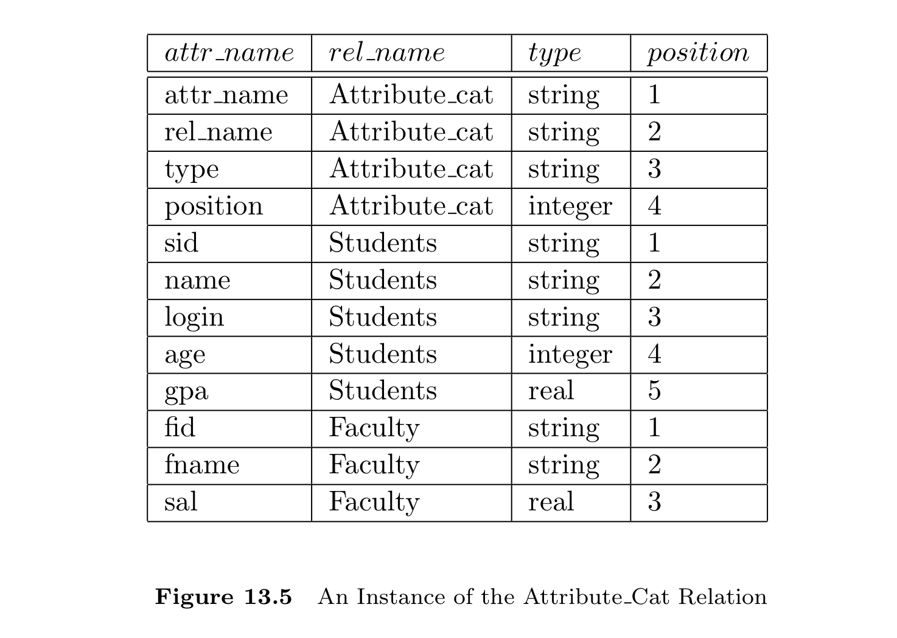

---
### Disk Service Time (to Fetch Pages)
- DBMSs read and write disk pages frequently
- The fact that you request disk page p does not necessarily mean that you’ll get service quickly
- Reasons:
	- Contention, including nearly simultaneous requests many DB users or processes.
	- Disk scheduling

### Disk Scheduling Algorithms
Simultaneou Pages Requests: cyl. 1400, 2500, 170, 160, 161, 3500, 162

- FCFS: First Come, First Served: 1400, 2500, 170, 160, 161, 3500, 162
- SSTF: Shortest Seek Time First: 162, 161, 160, 170, 1400, 2500, 3500
	- Minimization of total head travel time
 
__Example 2__: Assume we’re on cyl. 165, having just come from cyl. 164, and now we get the following requests: 1400, 2500, 170, 160, 161, 3500, 162

- Elevator Algorithm
	- “Scan with (or without) Look” option
	- “Look” means only go as far as needed (elevator analogy: don’t go to the extreme floors unless a user request has been made).
	- Service Order: 170, 1400, 2500, 3500, 162, 161, 160

What is the service order if, while servicing cyl. 1400, we get these new requests: 1250, 1400, and 1500?

- Service Order: 170, 1400, 1400, 1500, 2500, 3500, 1250, 162, 161, 160

## Record Formats & Store Records

- We can think of a page as a collection of __slots__, each of which contains a record. A record is identified by using the pair (page id, slot number); this is the record id (rid).
- If all records on the page are guaranteed to be of the __same__ length, record slots are uniform and can be arranged consecutively within a page.
- __Fixed Record__: Using an array of bits, one per slot, to keep track of free slot information. Locating records on the page requires scanning the bit array to find slots whose bit is on; when a record is deleted, its bit is turned off.

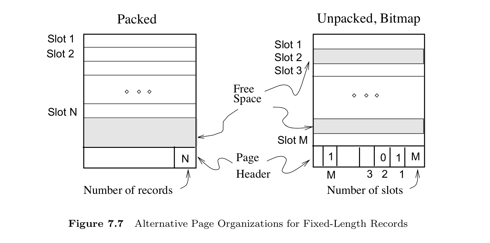

---
- If records are of __variable length__, then we cannot divide the page into a fixed collection of slots. 
- when a record is inserted, we must allocate just the right amount of space for it, and when a record is deleted, we must move records to fill the hole created by the deletion, in order to ensure that all the free space on the page is contiguous.
- The most flexible organization for variable-length records is to maintain a __directory of slots__ for each page, with a ⟨record offset, record length⟩ pair per slot.
- __Record offset__: the offset in bytes from the start of the data area on the page to the start of the record.
- Deletion is readily accomplished by setting the record offset to -1.
- Record id (rid) does not change when the record is moved; only the record offset stored in the slot changes.
- One way to manage free space is to maintain a pointer (that is, offset from the start of the data area on the page) that indicates the start of the free space area. 
- When a new record is too large to fit into the remaining free space, we have to move records on the page to reclaim the space freed by records that have been deleted earlier. The idea is to ensure that after reorganization, all records appear __contiguously__, followed by the available free space.
- A subtle point to be noted is that the slot for a deleted record cannot always be removed from the slot directory (except the last slot on current data page).
- When a record is inserted, the slot directory should be scanned for a slot that currently does not point to any record, and this slot should be used for the new record.
- A new slot is added to the slot directory only if all existing slots point to records.

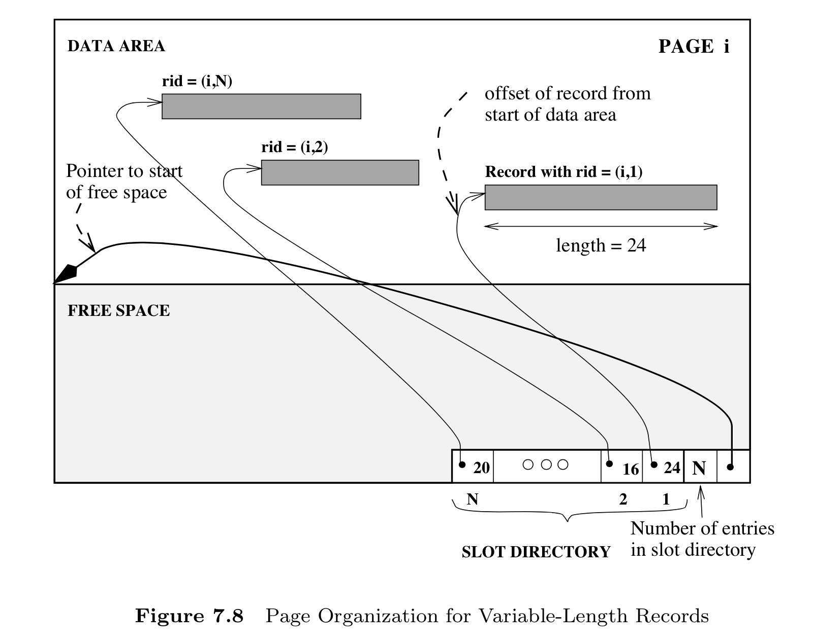

---
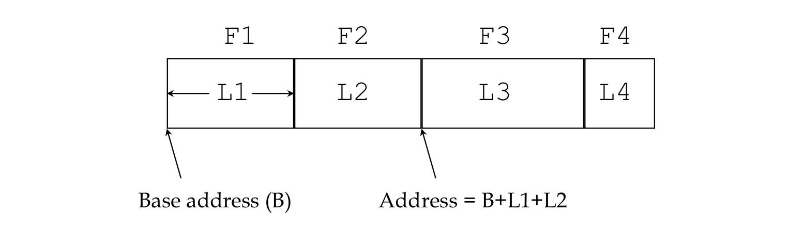

- __Fixed-Length Records__:
	- The information about field types is the same for all records in the table.
	- Schema info (column names, data types, lengths, order) is stored in the DBMS’s __catalog__.
	- Finding the i’th field does not require scanning the whole record
- __Variable-Length Records__:
	- Option 1: Store fields consecutively, separated by delimiters, requires a scan of the record in order to locate a desired field.
	- Option 2: Reserve some space at the beginning of a record for use as an array of integer offsets—the ith integer in this array is the starting address of the ith field value relative to the start of the record. 
		- we also store an offset to the end of the record; this offset is needed to recognize where the last field ends.
		- If a field contains a null value, the pointer to the end of the field is set to be the same as the pointer to the beginning of the field

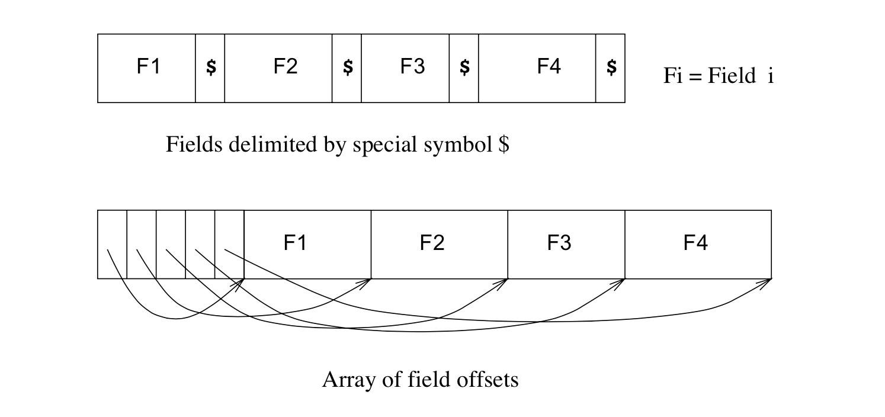

## Indexes
### Introduction
- Indexes are auxiliary structures that support efficient retrieval of records based on the values of a search key. 
- We can retrieve records by:
	- Scanning all records in a file sequentially, or
	- Specifying the rid (record ID), if known
- Sometimes we want to retrieve records by specifying the values in one or more fields. For example:
	- Find the name of the student with student ID 86753091.
	- Find all 1st year students with the last name “Lee”.
	- Find all 4th year students in the CPSC department who have not taken CPSC 304.
- __Indexes__ are __file structures__ that enable us to answer such value-based queries efficiently.

- On the one hand, we want to keep as much data as possible about an entity.
- On the other hand, we want good performance.
- Two major categories of indexes:
	- Tree-structured indexes
	- Hash index structures
- For any index, there are 3 alternatives for storing data entries k*, whose search key is k:
	- Whole data record with search key value k
	- ( k, rid of data record (on disk) with search key value k )
	- ( k, list of rids of data records with search key k )
- Tree-structured indexing techniques support both range searches and equality searches.
- B+ tree: A dynamic, balanced tree structure
	- Adjusts well to changes and supports both equality and range queries.
	- Skew is generally not an issue.

---
## B+ Tree
- In B+ trees every node contains m entries, where d ≤ m ≤ 2d. The value d is a parameter of the B+ tree, called the __order__ of the tree. For the root it is simply required that 1 ≤ m ≤ 2d.
- Non-leaf nodes with m index entries contain m + 1 pointers to children.
- __B+ Trees in Practice__: 
	- Typical order: 100. Typical fill-factor: 67%
	- Average fanout = 133
	- Typical capacities: Height 4: 133<sup>4</sup> = 312,900,700 records, Height 3: 133<sup>3</sup> = 2,352,637 records
- (Unique) Search, Insert, or Delete is O(log<sub>F</sub> N), where F = fanout and N = # leaf pages (or roughly the total # of leaf + internal pages). 

### Insertion
- Find correct leaf L.
- Put data entry onto L.
	- If L has enough space, done!
	- Else, must split L (into L and a new node L2)
		- Redistribute entries evenly, copy up middle key.
		- Insert index entry pointing to L2 into parent of L.

### Deletion
- Start at root, find leaf L where entry belongs
- Remove the entry
	- If L is at least half-full, done!
	- If L has only d-1 entries,
		- Try to re-distribute, borrowing from sibling (adjacent node with same parent as L)
		- If re-distribution fails, merge L and sibling
- If merge occurred, must delete entry from parent of L
- Merge could propagate to root, decreasing height

### Bulk-Loading a B+ Tree
- For creating a B+ tree index on an existing collection of data records.
- Initialization: Sort all data entries, insert pointer to first (leaf) page in a new (root) page

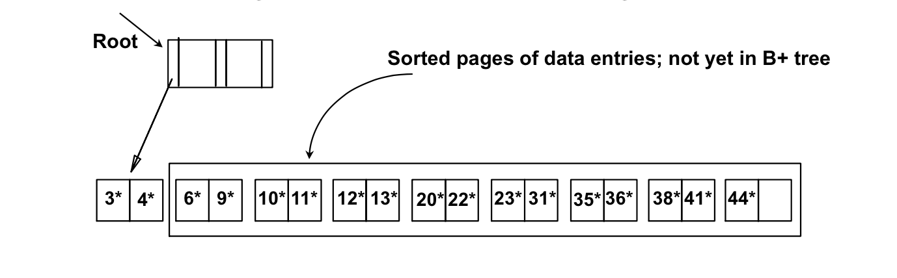

### Prefix Key Compression
- Key compression increases fanout, reduces height
- Key values in index entries only ’direct traffic’; but often, we can compress them.
- e.g., If we have adjacent index entries with search key values Danielle Miller, David Smith and Deepak Murthy, we can abbreviate David Smith to Dav
- If there is a data entry Davey Jones, we can only compress David Smith to Davi
- In general, while compressing, must leave each index entry greater than every key value (in any subtree) to its left
- Index entries for leaf pages always entered into right-most index page just above leaf level. When this fills up, it splits.
- Much faster than repeated inserts, especially when one considers locking!
- Non-bulk approach: Multiple SQL INSERT statements
	- Slow, and does not give sequential storage of leaves.
	- Lots of locking overhead.
	- Lots of log records can be generated when loading a table via INSERT statements!

### Dulpications
- Some indexes may have a lot of duplicates, and can be handled via:
	- Overflow pages
	- Alternative 3 indexes
	- Concatenating the key and the rid, and then treating this combination as a unique key (Alternative 2)

---
## Hash Based Indexing
- Hash-based indexes are usually the best choice for equality selections.
- No traversal of trees and direct computation of where k* should be
- The __Extendible Hashing__ scheme uses a directory to support inserts and deletes efficiently without any overflow pages.
- The __Linear Hashing__ scheme uses a clever policy for creating new buckets and supports inserts and deletes efficiently without the use of a directory.

### Static Hashing

- The pages containing the data can be viewed as a collection of __buckets__, with one primary page and possibly additional overflow pages per bucket.
- # primary pages fixed, allocated sequentially, never de-allocated; overflow pages, if needed.
- To search for a data entry, we apply a hash function h to identify the bucket to which it belongs and then search this bucket.
- To insert a data entry, we use the hash function to identify the correct bucket and then put the data entry there. 
- If there is no space for this data entry, we allocate a new overflow page, put the data entry on this page, and add the page to the overflow chain of the bucket. 

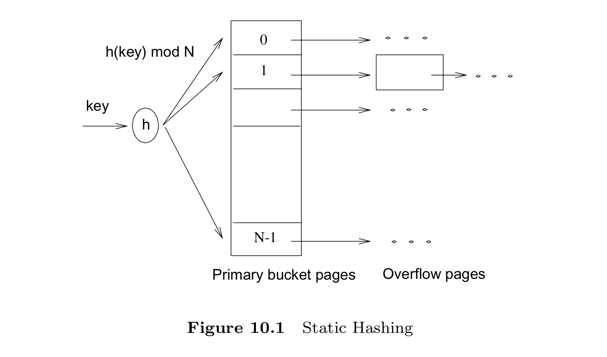

### Extendible Hashing
- Doubling the total number of buckets, but reading and writing all pages is expensive (slow)!
- __Idea__: use a directory of pointers to buckets, and double the size of the number of buckets by doubling just the directory and splitting only the bucket that overflowed.
- The directory is much smaller than the file; so, doubling it is much cheaper.
- Global depth of directory: Max # of bits needed to tell which bucket an entry belongs to
- Local depth of a bucket: # of bits used to determine if an entry belongs to this bucket
- Before insertion, suppose the local depth of the bucket = the global depth. The insertion will cause local depth to become > global depth; therefore, the directory is doubled by copying it and adjusting the pointers to the appropriate pages.
- If the directory already exists in memory, an equality search is answered with one disk access; otherwise, two.

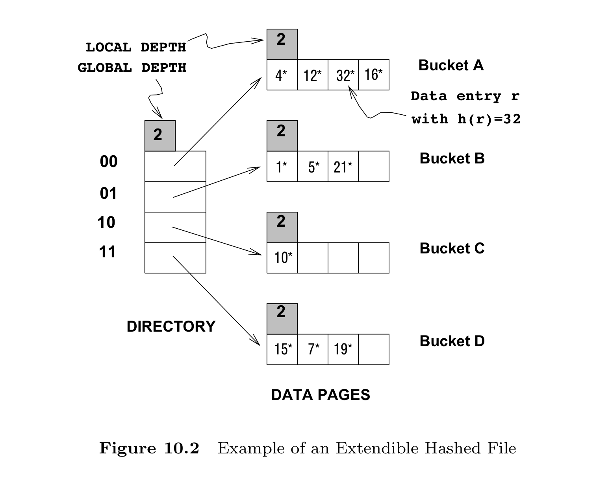

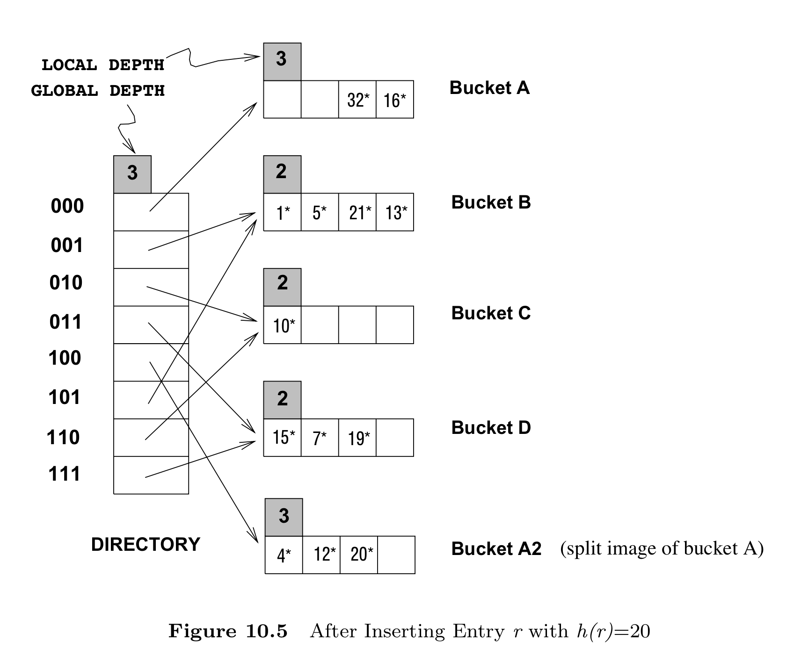

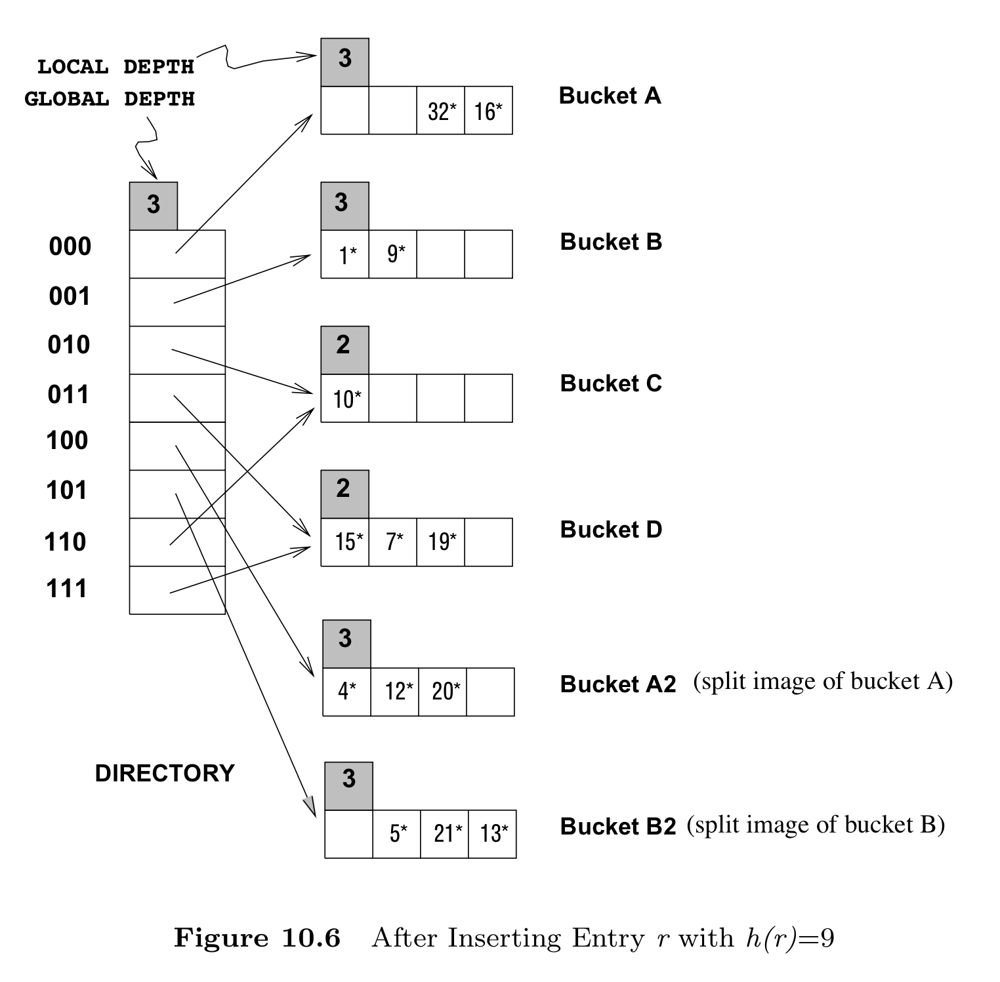

### Linear Hashing
- Another dynamic hashing scheme - an alternative to Extendible Hashing.
- LH handles the potential problem of long overflow chains without using a directory; and handles duplicates in a nice way.
- __Idea__: Use a family of hash functions h<sub>0</sub>, h<sub>1</sub>, h<sub>2</sub>, ... to map the key to the appropriate bucket:
	 - h<sub>i</sub>(key) = h(key) mod(2<sup>i</sup> N); N = initial # buckets
	 - h<sub>0</sub> handles the case with N buckets
	 - h<sub>1</sub> handles the case with 2N buckets
	 - h<sub>2</sub> handles the case with 4N buckets
- h<sub>i+1</sub> doubles the range of h<sub>i</sub> (similar to directory doubling)
- Directory avoided in LH by using overflow pages, and choosing bucket to split round-robin.
- Splitting proceeds in ‘rounds’. Round ends when all N<sub>R</sub> initial (for round R) buckets are split. 
- Buckets 0 to Next-1 have been split; Next to N<sub>R-1</sub> are yet to be split.
- Current round number is __Level__
- __Search__: To find bucket for data entry r, find h<sub>Level</sub>(r):
	-  If h<sub>Level</sub>(r) in range ‘Next to N<sub>R</sub> – 1 ’ , r belongs here
	- Else, r belongs to either bucket h<sub>Level</sub>(r) or bucket h<sub>Level</sub>(r) + N<sub>R</sub>; must apply h<sub>Level+1</sub>(r) to find out which

- __Insert__: Find bucket by applying h<sub>Level</sub> / h<sub>Level+1</sub> :
	- If bucket to insert into is full:
		- Add overflow page and insert data entry
		- Split __Next__ bucket and increment __Next__
- __Split rule__: “at most one split per insertion”
	- Only split when you have to allocate a new bucket

- Since buckets are split round-robin, long overflow chains typically don’t develop.
	- Over time, the chains will shrink, as the index “matures”.

### Linear Hashing Example
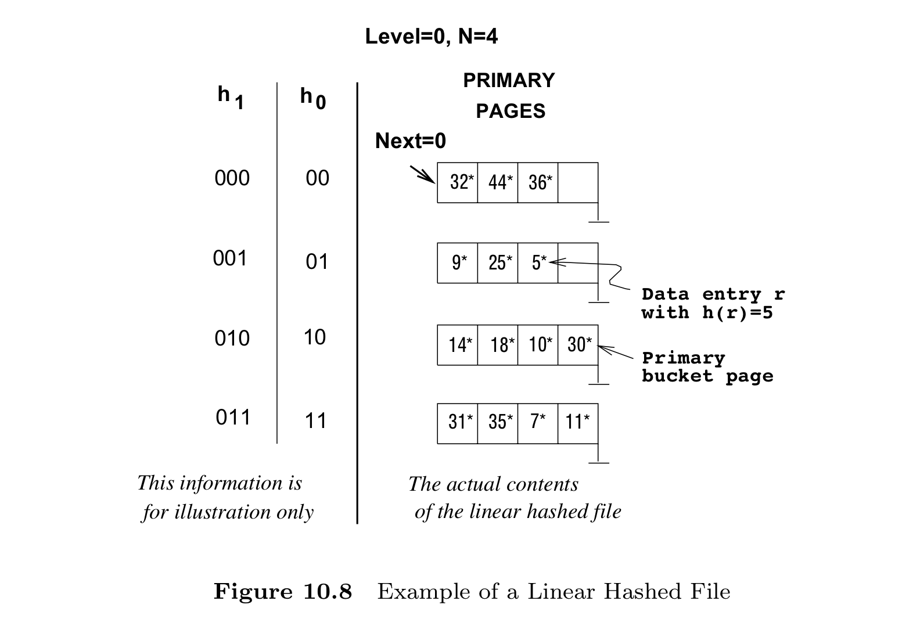

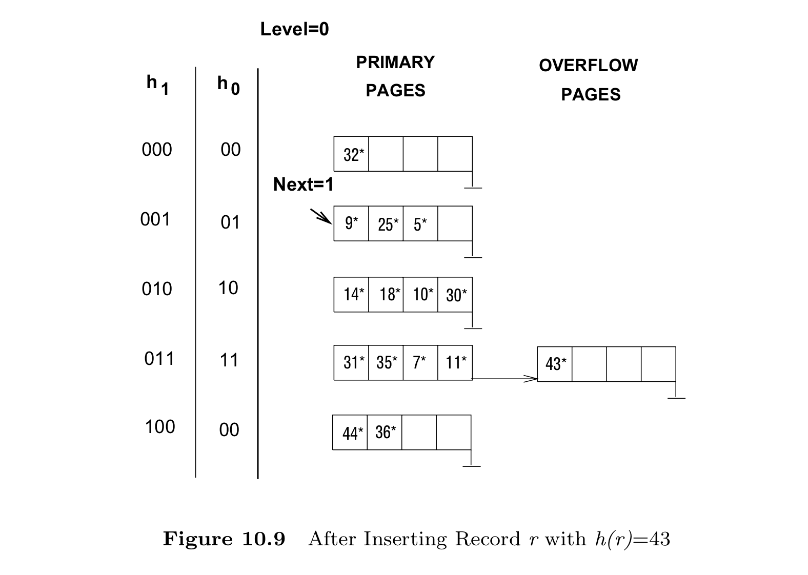


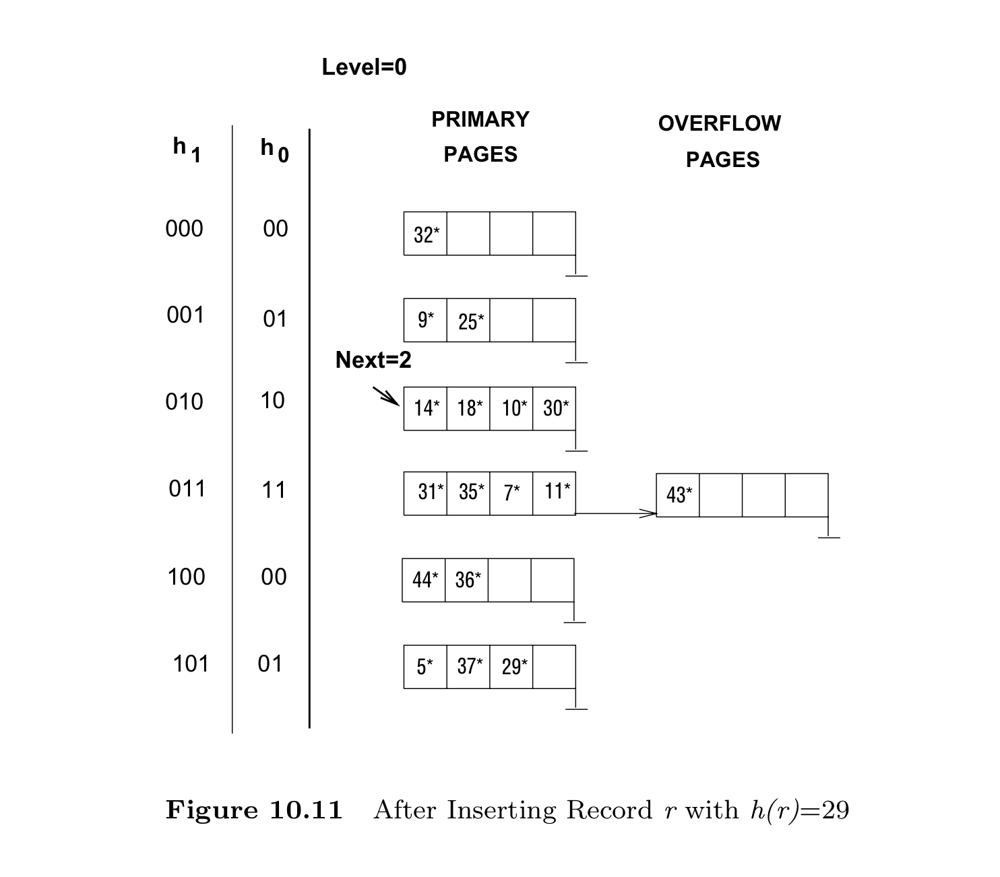

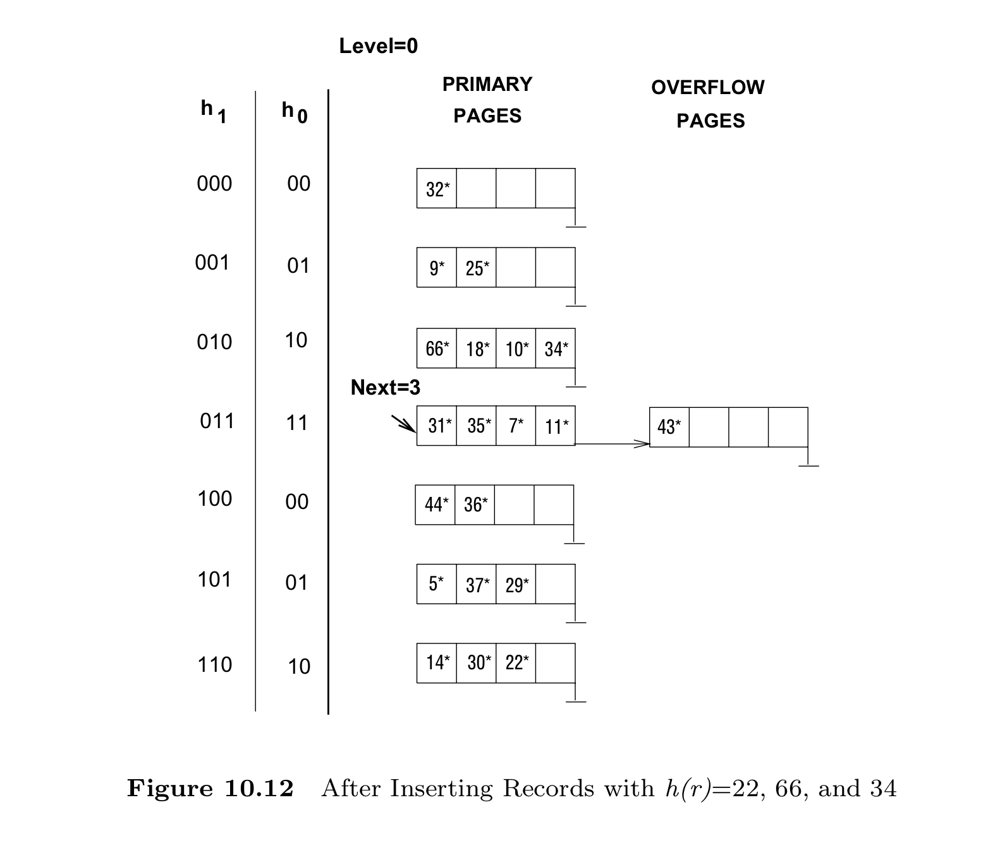

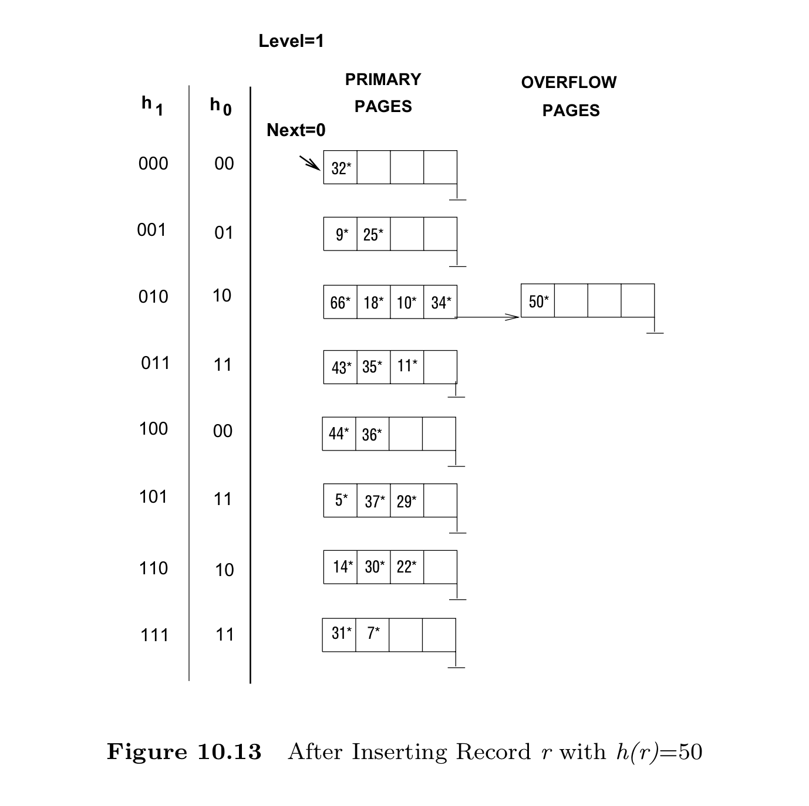

---
## External Sorting
- Sorting is a classic problem in computer science
	- A large number of cycles is devoted to sorting.
- __Problem__: An important database-related problem: How can we sort 10GB (or 10TB!) of data with only
a small fraction of that amount of RAM?
- When the data to be sorted is too large to fit into available main memory, we need to use an external sorting algorithm. Such algorithms seek to minimize the cost of disk accesses.
- Using repeated passes over the data, even very large datasets can be sorted with a small amount of memory.
- Common in-memory sorting algorithms (like Quicksort) don't optimize disk I/O's. (I/O issues is important consideration)

### General Multiway External Mergesort Algorithm (GMEMS)
- Suppose we need to sort a disk-resident file of size N pages with B pages of RAM (buffer pool space) available, where N > B
- __Algorithm__:
	1. Read B blocks/pages of data into memory, sort that data, and write it to a temporary file on disk. (This file is called a “sorted run” (SR) or “sublist” of length B.)
	2. Repeat Step 1 until all N pages have been read in, and therefore the file has possibly many SRs of size B (except for the last SR which may be shorter).
		- Each SR is itself sorted; but 2 side-by-side SRs likely are not
		- The sublists (SRs) are stored using temporary disk space.
	3. Until the whole file is sorted, do:
		- Merge up to B-1 of the sorted runs to form an even longer SR.
		- This longer SR is also written out as a temporary file on disk (unless it’s the final product, in which case you may wish to store it permanently)
	4. Delete the consumed (smaller, input) sorted runs 


- __Multi-way External Mergesort Example__:
	- Suppose that we have 5 buffer pages available, and want to sort a file with 108 pages.
	- __Pass 0__ produces ⌈108/5⌉ = 22 sorted runs of five pages each, except for the last run, which is only 3 pages long.
	- __Pass 1__ does a four-way merge to produce ⌈22/4⌉ = 6 sorted runs of 20 pages each, except for the last run, which is only 8 pages long.
	- __Pass 2__ produces ⌈6/4⌉ = two sorted runs; one with 80 pages and one with 28 pages.
	- __Pass 3__ merges the two runs produced in Pass 2 to produce the sorted file.
	- __Result__: In each pass we read and write 108 pages; thus the total cost is 2∗108∗4 = 864 I/Os. Applyingourformula,wehaveN1 = ⌈108/5⌉ = 22andcost=2∗N∗(⌈log<sub>B−1</sub>N1⌉+1) = 2 ∗ 108 ∗ (⌈log<sub>4</sub>22⌉ + 1) = 864, as expected.

	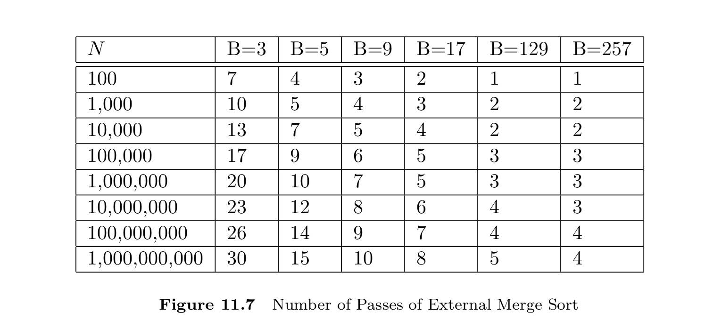

- In practice, # of runs is rarely more than 2.
- In practice, External Mergesort runs in O(N) time, where N is the number of pages.

### Improving External MergeSort
- Group blocks by cylinder (“cylindrification”)
- One big disk -> several smaller disks
- Mirrored disks = multiple copies of the same data
- Disk scheduling: the “elevator” algorithm
- “Prefetching” or “Double Buffering”

### Cylindrification
- A more intelligent approach to reduce the number of seeks
- When reading or writing blocks in a known order, place them together on the same cylinder.
- Once we reach that cylinder (with one seek), we can read block after block, with negligible rotational latency, and no extra seeks.

### Blocked I/O and double buffering.
- __Buffer blocks__: read and write in units of b pages, each pass merge floor( (B/b - 1 ) runs.
- A blocking factor of b pages => we read and write b pages at a time.
- Page I/Os (number of passes multiplied by the number of pages in the file)

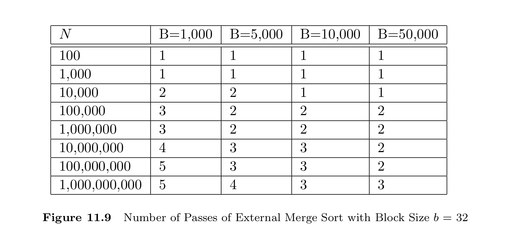

- __Double Buffering__:
	- In the context of external sorting, we can achieve overlap of CPU and I/O processing by allocating extra pages to each input buffer.
	- Suppose that a block size of b = 32 is chosen. The idea is to allocate an additional 32-page block to every input (and the output) buffer.
	- Assuming that the time to consume a block is greater than the time to read in a block, the CPU is never idle.

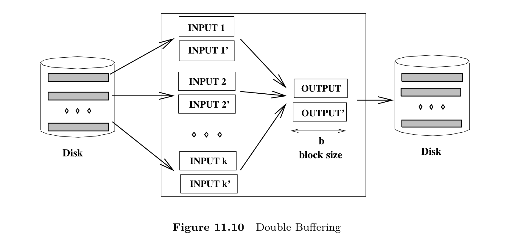

### B+ Trees for Sorting
If the file to be sorted has a clustered B+ tree index with a search key equal to the fields to be sorted by, then we can simply scan the sequence set and retrieve the records in sorted order. This technique is clearly superior to using an external sorting algorithm. If the index is unclustered, an external sorting algorithm will almost certainly be cheaper than using the index.

## Query Evaluation and Optimization 
- Query Processing factors: The sizes of the relations involved, existing indexes and sort orders, the size of the available buffer pool, and the buffer replacement policy.
- __Access Paths__: The alternative ways to retrieve tuples from a relation.
	- An access path is either (1) a file scan or (2) an index plus a matching selection condition.
	- The selectivity of an access path is the number of pages retrieved (index pages plus data pages) 
	- The most selective access path is the one that retrieves the fewest pages; using the most selective access path minimizes the cost of data retrieval.
- The key is to utilize information in the selection condition and to use an index if a suitable index is available.
- The goal of a query optimizer is to find a good evaluation plan for a given query. 
- The optimizer generates alternative plans and chooses the plan with the least estimated cost. To estimate the cost of a plan, the optimizer uses information in the system catalogs.

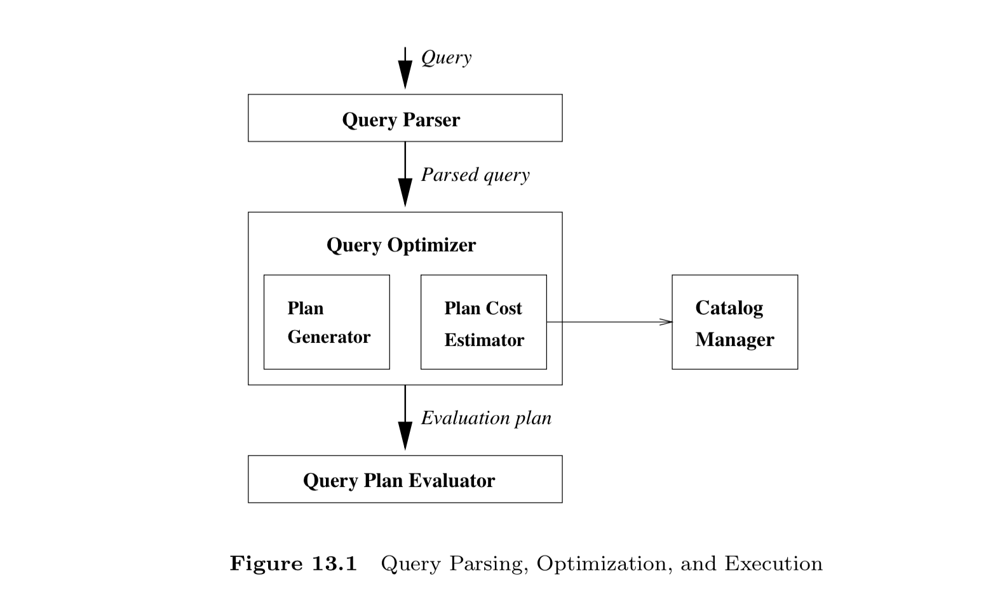

- A __query evaluation__ plan (or simply plan) consists of an extended relational algebra tree, with additional annotations at each node indicating the access methods to use for each relation and the implementation method to use for each relational operator.

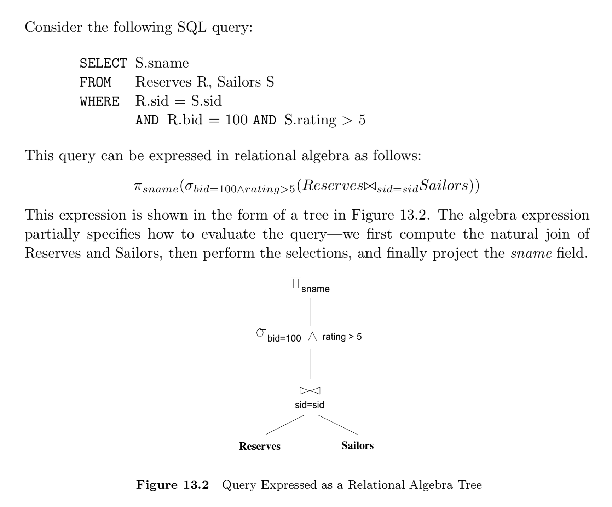

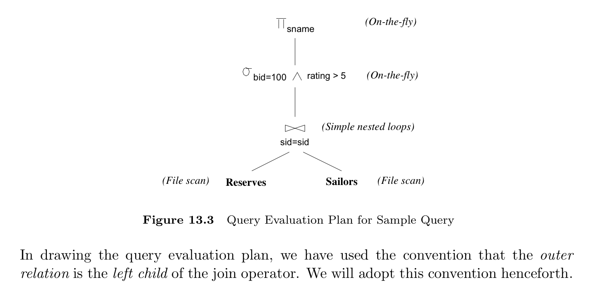

### The Join Operation 
We assume that there are M pages in R with p<sub>R</sub> tuples per page, and N pages in S with p<sub>S</sub> tuples per page. 
#### Nested Loops Join
```python
foreach tuple r ∈ R do 
		foreach tuple s ∈ S do
			if r==s then add ⟨r,s⟩ to result
```

- __Total Cost__: M + p<sub>R</sub> ∗M ∗N  ~140 hours
- A simple refinement is to do this join page-at-a-time. 
- For each page of R, we can retrieve each page of S and write out tuples ⟨r,s⟩ for all qualifying tuples r ∈ R-page and s ∈ S-page.
- Total Cost:  M + M ∗ N 	~1.4 hours

#### Block Nested Loops Join


__Cost__: M + ceiling( M/(B-2) ) * N

#### Index Nested Loops Join
If there is an index on one of the relations on the join attribute(s), we can take advantage of the index by making the indexed relation be the inner relation. 

#### Sort-Merge Join
The basic idea behind the sort-merge join algorithm is to sort both relations on the join attribute and to then look for qualifying tuples r ∈ R and s ∈ S by essentially merging the two relations.

__Cost__: The cost of sorting R is O(M logM ) and the cost of sorting S is O(N logN ). The cost of the merging phase is M + N if no S partition is scanned multiple times.

This approach is especially attractive if at least one relation is already sorted on the join attribute or has a clustered index on the join attribute. In practice the I/O cost of the merge phase is typically just a single scan of each relation. 

#### Hash Join

__Cost__: The cost of this phase is therefore 2(M + N). In the second phase we scan each partition once, assuming no partition overflows, at a cost of M + N I/Os. The total cost is therefore 3(M + N ),

### Pipelined Evaluation
- When a query is composed of several operators, the result of one operator is sometimes pipelined to another operator without creating a temporary relation to hold the intermediate result.
- Pipelining the output of an operator into the next operator saves the cost of writing out the intermediate result and reading it back in, and the cost savings can be significant.
- When the input relation to a unary operator (e.g., selection or projection) is pipelined into it, we sometimes say that the
operator is applied on-the-fly.

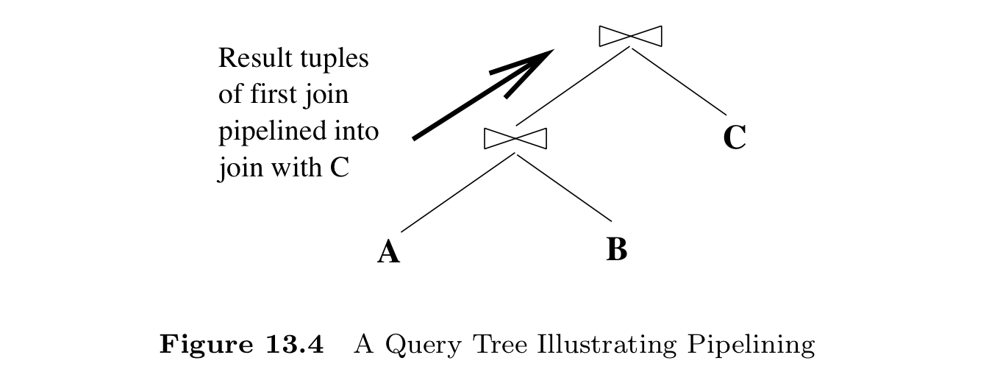

### Pushing Selections
- Evaluate Selection before Join operation
- A further refinement is to push the projection, just like we pushed the selections past the join.

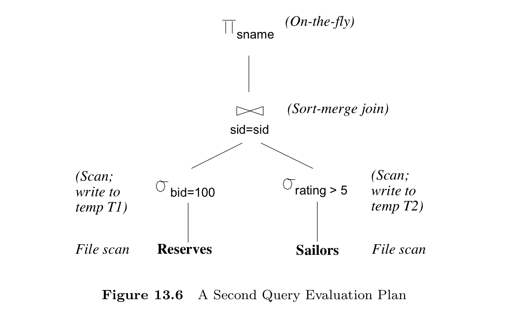

### Using Indexes, Query Trees and Plans
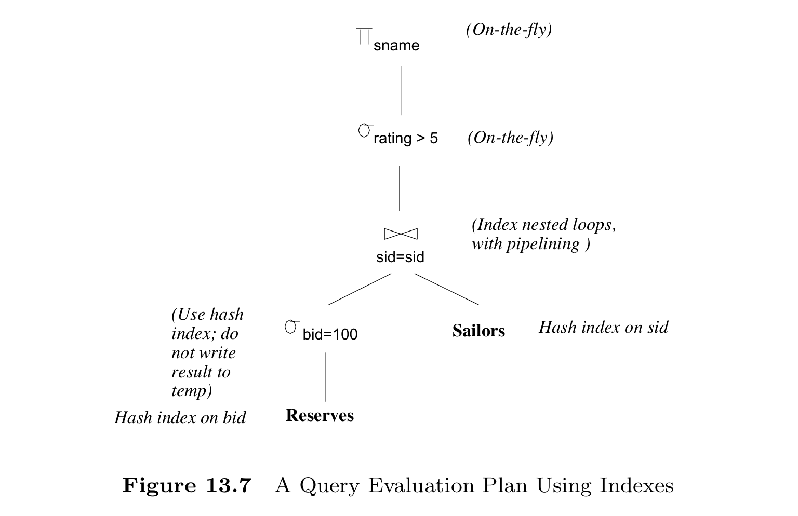


---
## Data Warehouse and Decision Support
__Decision Support__: Current and historical data are comprehensively analyzed and explored, identifying useful trends and creating summaries of the data, in order to support high-level decision making. 

__Data Warehouses__: Contain data drawn from several databases maintained by different business units, together with historical and summary information; help with the organizational decision making of an enterprise. The availability of a warehouse facilitates the application of OLAP and data mining tools, and conversely, the desire to apply such analysis tools is a strong motivation for building a data warehouse.

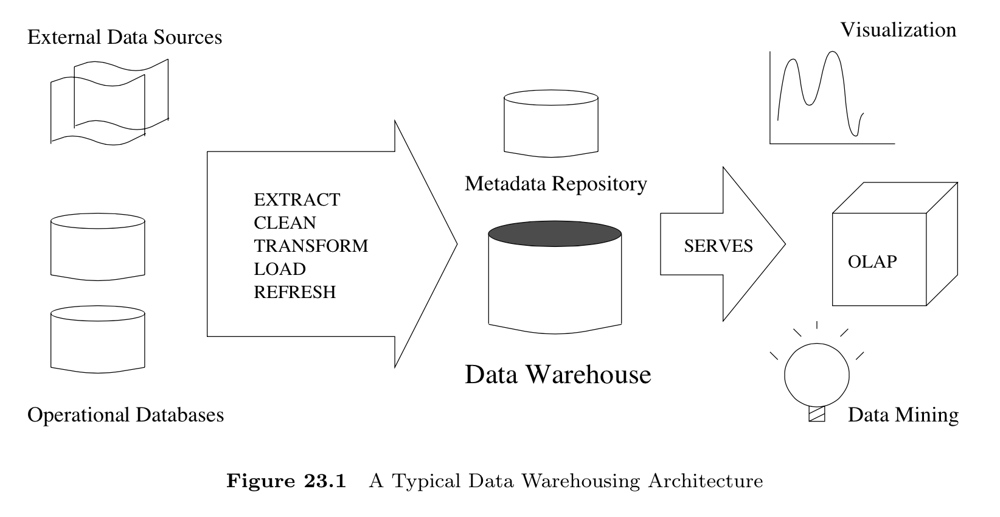

### Online Transaction Processing (OLTP) 

### Online Analytic Processing (OLAP)

