## Asymptotic Analysis
#### Proof by...
- __Counterexample__
	- show an example which does not fit with the theorem
	- Thus, the theorem is false.
- __Contradiction__
	- assume the opposite of the theorem
	- derive a contradiction
	- Thus, the theorem is true.
- __Induction__
	- prove for a base case (eg. n = 1)
	- assume for all n <= k (for arbitrary k)
	- prove for the next value (n = k + 1)
	- Thus, the theorem is true

- - -

### Induction (format)
- Prove: 1 + 2 + 3 + ... + n = n(n+1)/2
- Step before: Identify the variable (eg. var is __n__ in this case)
- Base case: n = 1, 1 = 1
- Induction hypothesis: Assume true for n=k, 1+2+3+...+k = k(k+1)/2, show that it's true for n=k+1
- Induction steps: ...
- This concludes our inductive proof. Therefore 1 + 2 + 3 + ... + n = n(n+1)/2

QED

- - -

### Analysis of Algorithms
- How long the program runs (Time complexity) and how much memory it uses (Space complexity)
- Input size n (a non-negative integer, sometimes multiple measure)
- Example of running time:
	- T(n) =  4n + 5
	- T(n) = 0.5nlog(n) - 2n + 7
	- T(n) = 2^n + n^3 + 3n

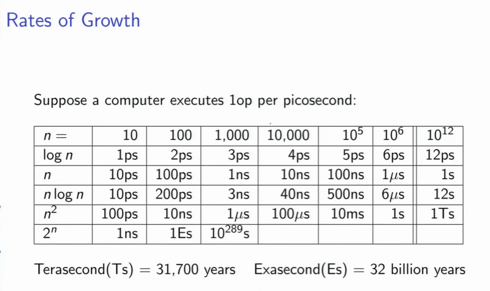

- - -

### Big-O Notation
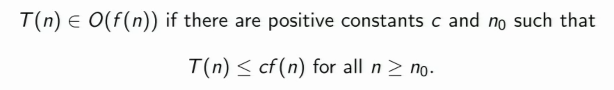

#### Big-Omega and Big-Theta Notation
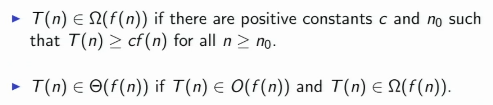

### L’Hospital’s Rule
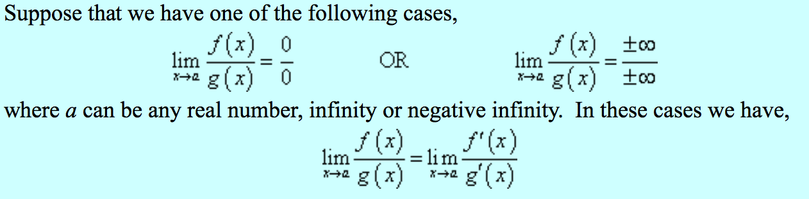

### Typical Asymptotics
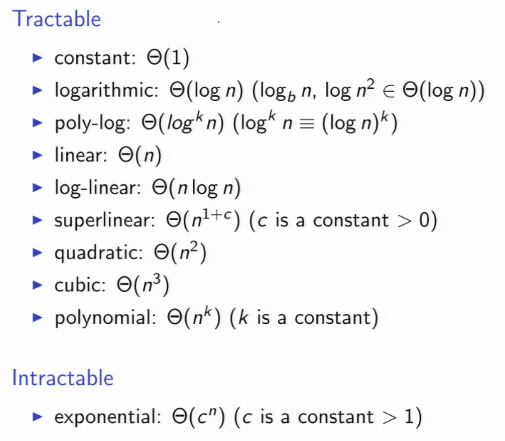

#### Sample Asymptotic Relations
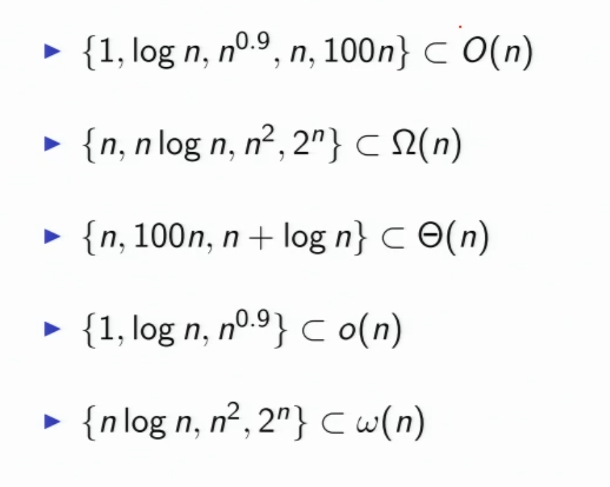

#### Runtime Example:
```python
	i = 1
	while i < n:
		for j = 1 to i:
			sum = sum + 1
		i += i
```
- For each 'while loop', the inner 'for loop' gets runned for i times
- i = 1, 2, 4, 8, 16...
- Hence in total, T(n) = 1 + 2 + 4 + 8 + 16...  => Sum(2^k) [k=0, ceil(__lg(n)__)-1]
- Formula that should be implanted as a computer scientiest:
- __Sum(2^k) [k=0, n] = 2^(n+1) - 1__
- Hence, T(n) = 2^ceil(lg(n)) - 1 <= 2^(lg(n)+1) - 1 <= 2n - 1
- Therefore, T(n) ∈ Θ(n)

- - -

### Arithmetic Sequences
Find value at term __n__, given initial term = __a__, and diff = __d__:

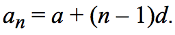

Summation of Arithmetic Sequences:

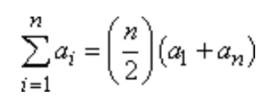

### Geometric Sequences
Find value at term __n__, given initial term = __a__, and common ratio = __r__:


Summation of Geometric Sequences:

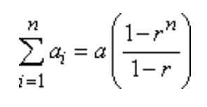

Special case when abs(r) < 1:

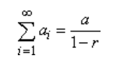

- - -

### [Summation of 2 to the power of n](http://math.stackexchange.com/questions/22599/how-do-i-prove-this-by-induction-sum-of-powers-of-2)
Prove that for every natural number __n__,


### Solving Recurrence

#### Substitution:
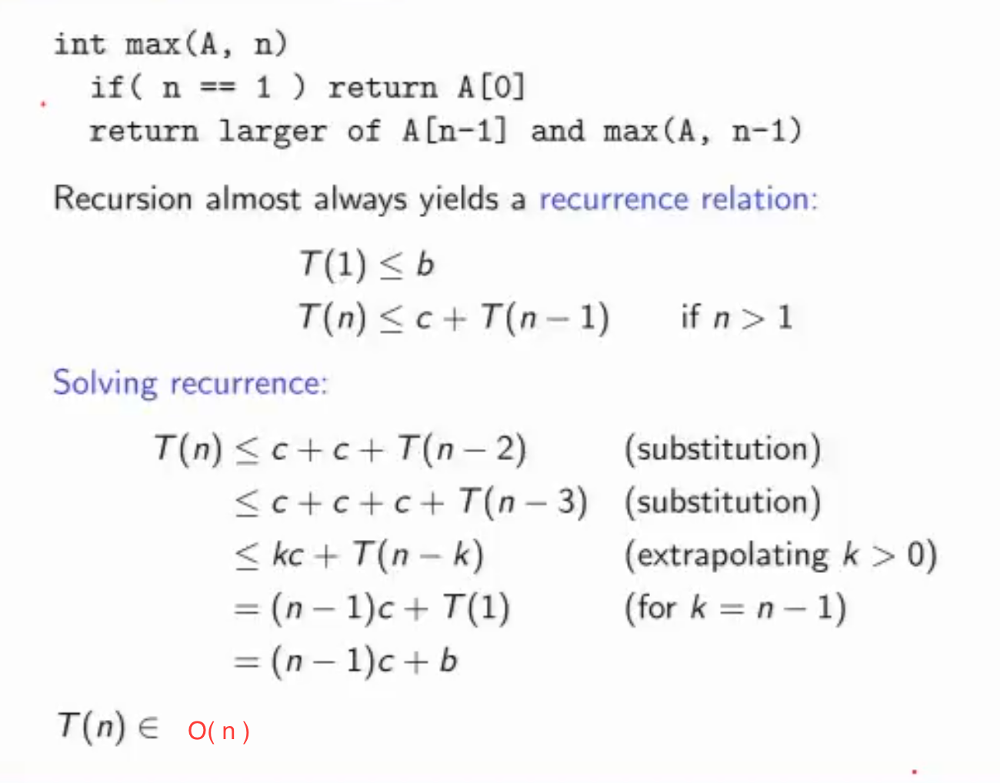

__Mergesort__:

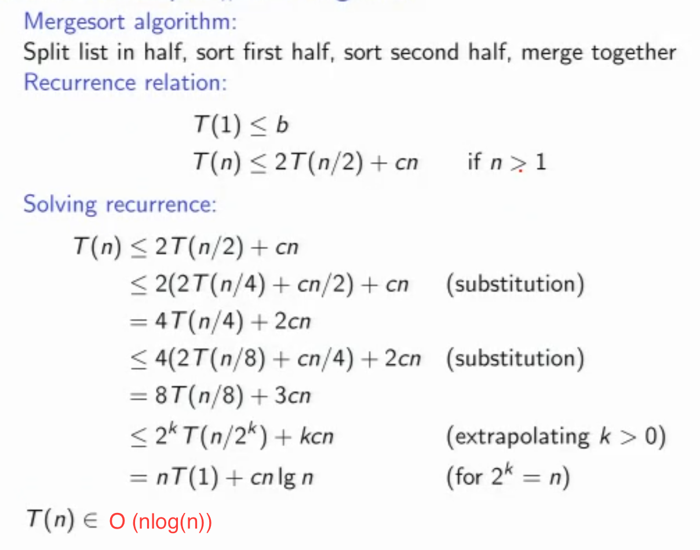

__Note__:

- To avoid recursive calls:
  - store base case values in a table
	- before calculating the value for n
		- check if the value for n is in the table
		- if so, return it
		- if not, calculate it and store it in the table
- This strategy is called memoization and is closely related to __dynamic programming__.

__Tail Recursion__: <br>
In traditional recursion, the typical model is that you perform your recursive calls first, and then you take the return value of the recursive call and calculate the result.
In tail recursion, you perform your calculations first, and then you execute the recursive call, passing the results of your current step to the next recursive step. <br>

```python
# Normal recursion
def recsum(x):
 if x == 1:
  return x
 else:
  return x + recsum(x - 1)


"""
# Python interpreter would evaluate.
recsum(5)
5 + recsum(4)
5 + (4 + recsum(3))
5 + (4 + (3 + recsum(2)))
5 + (4 + (3 + (2 + recsum(1))))
5 + (4 + (3 + (2 + 1)))
15

"""

# Tail recursion
def tailrecsum(x, running_total=0):
  if x == 0:
    return running_total
  else:
    return tailrecsum(x - 1, running_total + x)


"""
# Python interpreter would evaluate.
tailrecsum(5, 0)
tailrecsum(4, 5)
tailrecsum(3, 9)
tailrecsum(2, 12)
tailrecsum(1, 14)
tailrecsum(0, 15)
15

"""

```

__Eliminating Tail Recursion__: <br>

```c
// Search A[i..j] for key (Binary Search)
// init: i=0, j=length(A)-1
// Return index of key or -1 if key not found.

int bSearch(int A[], int key, int i, int j) {
	if (j < i) return -1;
	int mid = (i + j) / 2;
	if (key < A[mid])
		return bSearch(A, key, i, mid-1);
	if (key > A[mid])
		return bSearch(A, key, i, mid+1);
	else
		return mid;
}

// To eliminate tail recursion, the key is to store the local variables
// bSearch without tail recursion

int bSearch(int A[], int key, int i, int j) {
	while ( j >= i) {
		int mid = (i + j) / 2;
		if (key < A[mid])
			j = mid - 1;
		else if (key > A[mid])
			i = mid + 1;
		else
			return mid;
	}
	return -1;
}

```


