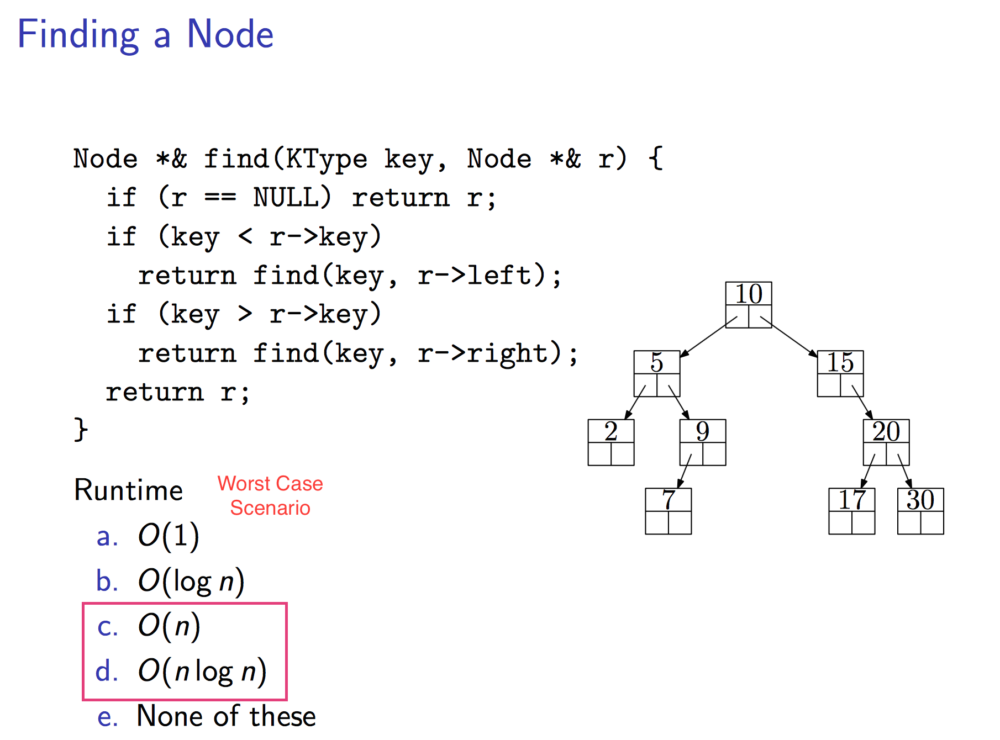
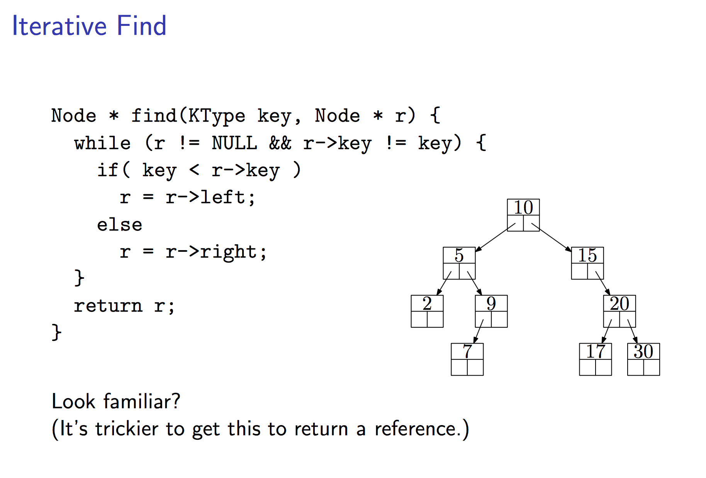
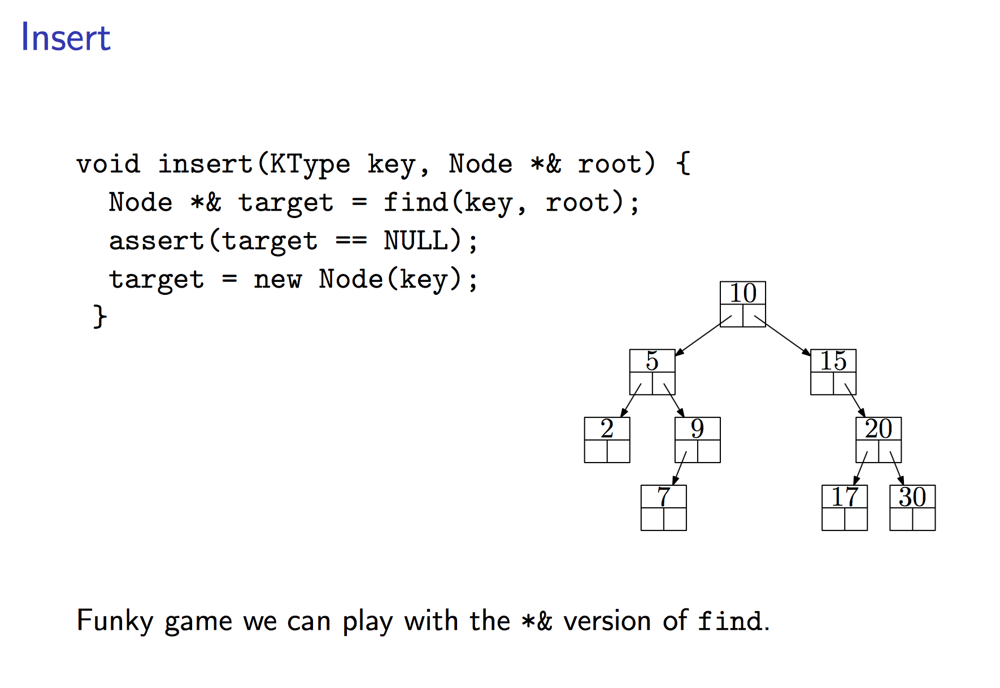
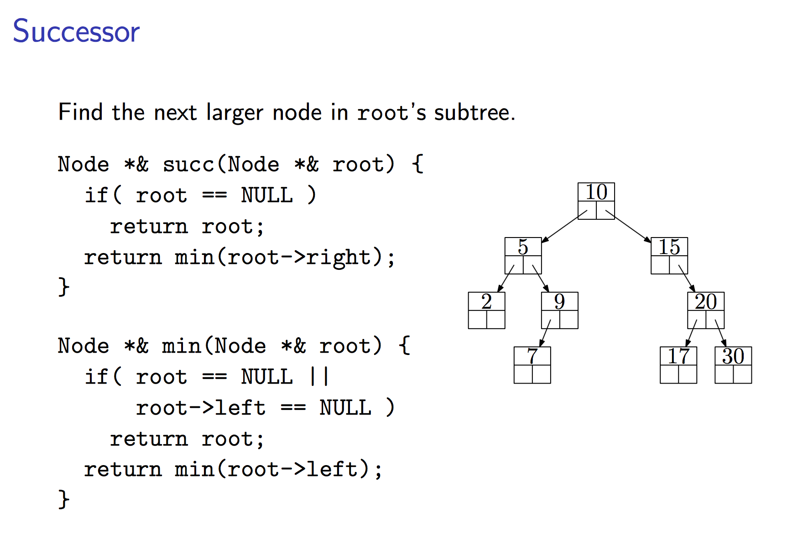
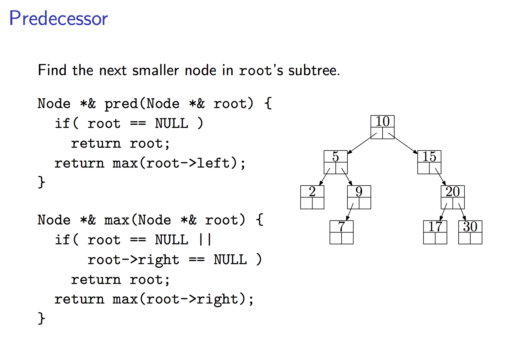
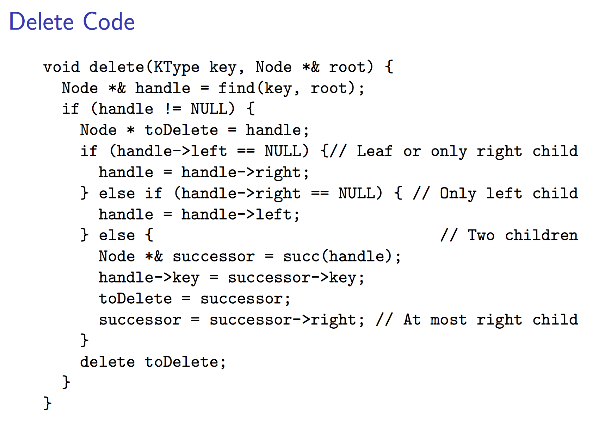

# Binary Tree

## Introduction
#### Binary tree is:
- Empty, or 
- Root and its left and right binary subtrees
- Formal definition: binary tree is a tree data structure in which each node has at most two children, which are referred to as the left child and the right child. 

#### Properties 
- Max # of leaves (height h): 2<sup>h</sup>
- Max # of nodes (height h): 2<sup>h+1</sup> - 1
- Height (n nodes): floor( lg(n) )


### Listing


```python
# In-order listing:
Recurse(left)
Visit(root)
Recurse(right)
# Result: 2, 5, 7, 9, 10, 15, 17, 20, 30

# Pre-order listing:
Visit(root)
Recurse(left)
Recurse(right)
# Result: 10, 5, 2, 9, 7, 15, 20, 17, 30

# Post-order listing:
Recurse(left)
Recurse(right)
Visit(root)
# Result: 2, 7, 9, 5, 17, 30, 20, 1
```




### BST Insertion


__Runtime__:

- Worst case: Θ(n<sup>2</sup>)
- Average case: Θ(n log n) (assuming all orderings equally likely)

---




### BST Deletion


__Runtime__ for BST degrades after a sequence of deletions and insertions, O(n<sup>1/2</sup> - height)

__Solution__: Keep search trees shallow, balance on insertion (AVL Tree) and find (Spray Tree)

## BST Implementation
```cpp
template <class T>
class BSTNode{
    public:
        T key;            // key value
        BSTNode *left;    // left child
        BSTNode *right;   // right child
        BSTNode *parent;  // parent node

        BSTNode(T value, BSTNode *p, BSTNode *l, BSTNode *r):
        		// initialize instance variables
            key(value),parent(),left(l),right(r) {}

};

template <class T>
class BSTree {
    private:
        BSTNode<T> *mRoot; 

    public:
        BSTree();
        ~BSTree();

        void preOrder();
        void inOrder();
        void postOrder();

        BSTNode<T>* search(T key);
        BSTNode<T>* iterativeSearch(T key);

        T minimum();
        T maximum();

        BSTNode<T>* successor(BSTNode<T> *x);
        BSTNode<T>* predecessor(BSTNode<T> *x);

        void insert(T key);
        void remove(T key);
        void destroy();
        void print();
    private:
 				
 				// private method for internal function handlings
        void preOrder(BSTNode<T>* tree) const;
      
        void inOrder(BSTNode<T>* tree) const;
        
        void postOrder(BSTNode<T>* tree) const;

        BSTNode<T>* search(BSTNode<T>* x, T key) const;

        BSTNode<T>* iterativeSearch(BSTNode<T>* x, T key) const;

        BSTNode<T>* minimum(BSTNode<T>* tree);

        BSTNode<T>* maximum(BSTNode<T>* tree);

        void insert(BSTNode<T>* &tree, BSTNode<T>* z);

        BSTNode<T>* remove(BSTNode<T>* &tree, BSTNode<T> *z);

        void destroy(BSTNode<T>* &tree);

        void print(BSTNode<T>* tree, T key, int direction);
};
```
```cpp
template <class T>
void BSTree<T>::preOrder(BSTNode<T>* tree) const
{
    if(tree != NULL)
    {
        cout<< tree->key << " " ;
        preOrder(tree->left);
        preOrder(tree->right);
    }
}

template <class T>
void BSTree<T>::preOrder() 
{
    preOrder(mRoot);
}

template <class T>
void BSTree<T>::inOrder(BSTNode<T>* tree) const
{
    if(tree != NULL)
    {
        inOrder(tree->left);
        cout<< tree->key << " " ;
        inOrder(tree->right);
    }
}

template <class T>
void BSTree<T>::inOrder() 
{
    inOrder(mRoot);
}


template <class T>
void BSTree<T>::postOrder(BSTNode<T>* tree) const
{
    if(tree != NULL)
    {
        postOrder(tree->left);
        postOrder(tree->right);
        cout<< tree->key << " " ;
    }
}

template <class T>
void BSTree<T>::postOrder() 
{
    postOrder(mRoot);
}

template <class T>
BSTNode<T>* BSTree<T>::search(BSTNode<T>* x, T key) const
{
    if (x==NULL || x->key==key)
        return x;

    if (key < x->key)
        return search(x->left, key);
    else
        return search(x->right, key);
}

template <class T>
BSTNode<T>* BSTree<T>::search(T key) 
{
    search(mRoot, key);
}

template <class T>
BSTNode<T>* BSTree<T>::iterativeSearch(BSTNode<T>* x, T key) const
{
    while ((x!=NULL) && (x->key!=key))
    {
        if (key < x->key)
            x = x->left;
        else
            x = x->right;
    }

    return x;
}

template <class T>
BSTNode<T>* BSTree<T>::iterativeSearch(T key)
{
    iterativeSearch(mRoot, key);
}

template <class T>
BSTNode<T>* BSTree<T>::maximum(BSTNode<T>* tree)
{
    if (tree == NULL)
        return NULL;

    while(tree->right != NULL)
        tree = tree->right;
    return tree;
}

template <class T>
T BSTree<T>::maximum()
{
    BSTNode<T> *p = maximum(mRoot);
    if (p != NULL)
        return p->key;

    return (T)NULL;
}

template <class T>
BSTNode<T>* BSTree<T>::minimum(BSTNode<T>* tree)
{
    if (tree == NULL)
        return NULL;

    while(tree->left != NULL)
        tree = tree->left;
    return tree;
}

template <class T>
T BSTree<T>::minimum()
{
    BSTNode<T> *p = minimum(mRoot);
    if (p != NULL)
        return p->key;

    return (T)NULL;
}

template <class T>
BSTNode<T>* BSTree<T>::predecessor(BSTNode<T> *x)
{
    if (x->left != NULL)
        return maximum(x->left);

    BSTNode<T>* y = x->parent;
    while ((y!=NULL) && (x==y->left))
    {
        x = y;
        y = y->parent;
    }

    return y;
}

template <class T>
BSTNode<T>* BSTree<T>::successor(BSTNode<T> *x)
{
    if (x->right != NULL)
        return minimum(x->right);

    BSTNode<T>* y = x->parent;
    while ((y!=NULL) && (x==y->right))
    {
        x = y;
        y = y->parent;
    }

    return y;
}

template <class T>
void BSTree<T>::insert(BSTNode<T>* &tree, BSTNode<T>* z)
{
    BSTNode<T> *y = NULL;
    BSTNode<T> *x = tree;

    while (x != NULL)
    {
        y = x;
        if (z->key < x->key)
            x = x->left;
        else
            x = x->right;
    }

    z->parent = y;
    if (y==NULL)
        tree = z;
    else if (z->key < y->key)
        y->left = z;
    else
        y->right = z;
}


template <class T>
void BSTree<T>::insert(T key)
{
    BSTNode<T> *z=NULL;
    if ((z = new BSTNode<T>(key,NULL,NULL,NULL)) == NULL)
        return ;

    insert(mRoot, z);
}

template <class T>
BSTNode<T>* BSTree<T>::remove(BSTNode<T>* &tree, BSTNode<T> *z)
{
    BSTNode<T> *x=NULL;
    BSTNode<T> *y=NULL;

    if ((z->left == NULL) || (z->right == NULL) )
        y = z;
    else
        y = successor(z);

    if (y->left != NULL)
        x = y->left;
    else
        x = y->right;

    if (x != NULL)
        x->parent = y->parent;

    if (y->parent == NULL)
        tree = x;
    else if (y == y->parent->left)
        y->parent->left = x;
    else
        y->parent->right = x;

    if (y != z) 
        z->key = y->key;

    return y;
}

template <class T>
void BSTree<T>::remove(T key)
{
    BSTNode<T> *z, *node; 

    if ((z = search(mRoot, key)) != NULL)
        if ( (node = remove(mRoot, z)) != NULL)
            delete node;
}

template <class T>
void BSTree<T>::print(BSTNode<T>* tree, T key, int direction)
{
    if(tree != NULL)
    {
        if(direction==0)   
            cout << setw(2) << tree->key << " is root" << endl;
        else            
            cout << setw(2) << tree->key << " is " << setw(2) << key << "'s "  << setw(12) << (direction==1?"right child" : "left child") << endl;

        print(tree->left, tree->key, -1);
        print(tree->right,tree->key,  1);
    }
}

template <class T>
void BSTree<T>::print()
{
    if (mRoot != NULL)
        print(mRoot, mRoot->key, 0);
}

template <class T>
void BSTree<T>::destroy(BSTNode<T>* &tree)
{
    if (tree==NULL)
        return ;

    if (tree->left != NULL)
        return destroy(tree->left);
    if (tree->right != NULL)
        return destroy(tree->right);

    delete tree;
    tree=NULL;
}

template <class T>
void BSTree<T>::destroy()
{
    destroy(mRoot);
}

```