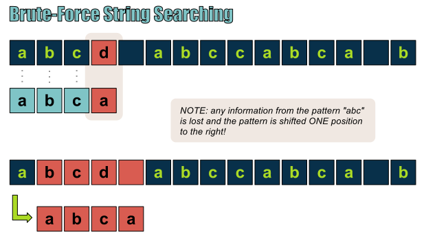

# Brute Force

### Problem: Matching Strings
Given a source string and a target string, find whether the target string is a substring of the source string. Return the first index of the match in the source string if matches, otherwise return -1.



```java
public static int bruteforce(String source, String sub) {  
        int j = 0, i = 0,index=-1;  
        while (i < source.length() && j < sub.length()) {  
            if (source.charAt(i) == sub.charAt(j))   
            {  
                i++; j++;  
            } else {  
            // i go back to the starting index, and advance by 1  
                i = i - j + 1;  
                j = 0;  
            }  
        }  
         if (j == sub.length()) {  
                index = i - sub.length();  
            } else {  
                index = -1;  
            }  
  
        return index;  
    }

```
__Runtime__: O(n<sup>2</sup>)

#### Enhanced: KMP Algorithm

```java
public class KMP {

	public static int[] getNext(String sub)
	{
		int j=1, k=0;
		int[] next = new int[sub.length()];
		next[0]=-1;
		next[1]=0;
		
		while(j<sub.length()-1) {
			if(sub.charAt(j)==sub.charAt(k)) {
				next[j+1]=k+1;
				j++;
				k++;

			} else if(k==0) {
				next[j+1]=0;
				j++;

			} else {
				k=next[k];
			}
		}
		return next;
	}
	
	public static int kmp(String src,String sub) {
		int[] next = getNext(sub);
		
		int i=0, j=0, index=-1;
		while(i<src.length() && j<sub.length()) {
			if(src.charAt(i) == sub.charAt(j)) {
				i++;
				j++;
			}
			else if(j==0) {
				i++;
			} else {
				j=next[j]; //slide to the right
			}			
		}

		if(j==sub.length()) {
			index = i-sub.length();
		}
		return index;
	}
}
```
__Runtime__: O(n + m)

[Reference](http://blog.csdn.net/fangfully/article/details/18189905)