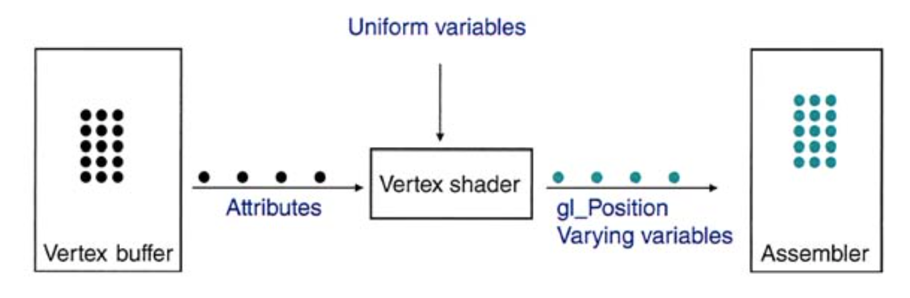
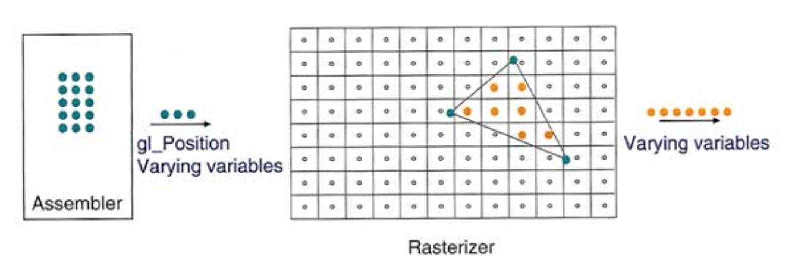
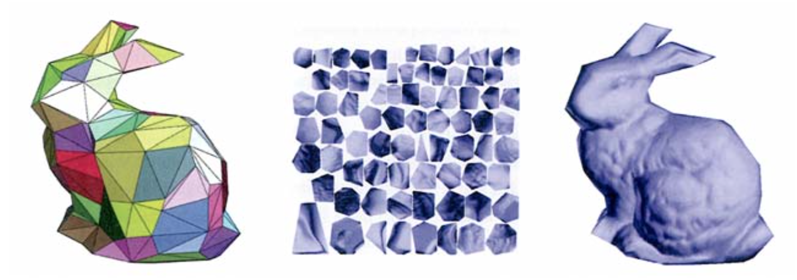
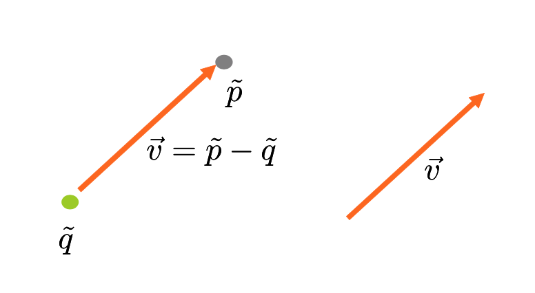
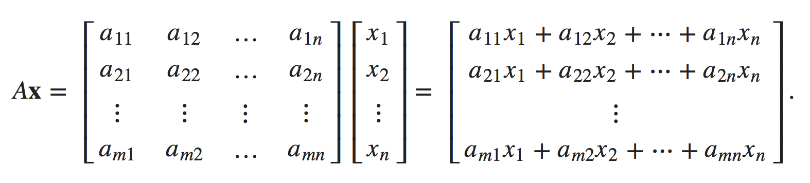

# CPSC 314 Computer Graphics

### OpenGL Pipeline

#### Vertex Shader
- Shapes are “discretized” into primitives: __triangles__, line segments, ...
- Display objects are composed of arrays of flat surfaces (typically triangles) and vertices define the location and other attributes of the corners of the surfaces.
- Vertices are stored in a vertex buffer.
- When a draw call is issued, each of the vertices passes through the vertex shader
- On input to the vertex shader, each vertex (black) has associated attributes.
- On output, each vertex (cyan) has a value for gl_Position and for its varying variables.

#### Rasterization (光栅化)
- The data in gl_Position are used to place the three vertices of the triangle on a virtual screen.
- The rasterizer figures out which pixels (orange) are inside the triangle and interpolates the varying variables from the vertices to each of these pixels.

#### Fragment Shader
- Each pixel (orange) is passed through the fragment shader, which computes the final color of the pixel (pink).
- The pixel is then placed in the framebuffer for display.
- By changing the fragment shader, we can simulate light reflecting off of different kinds of materials.

### Texture Mapping

- A simple geometric object described by a small number of triangles.
- Details stored in an auxiliary image called a texture.
- Traingles <=> Textures map to form graphics

---
### Linear Algebra

#### Points and Vectors
- A vertex is not a point, it consists of attributes such as: point, normal, color, neighbours...
- Vector = Magnitude + Direction
- Magnitude of a vector = Length = Norm of a vector = ||a|| = Sqrt(a1^2 + a2^2 + a3^2 + ... + an^2)
- Vector space: eg. R2 = 2D space, R3 = 3D space (An infinitely large set of vectors, where each of those vectors have n components.)
- A vector space is a set V on which two operations + and · are defined, called vector addition and scalar multiplication.
	- Closure: If u and v are any vectors in V, then the sum   u + v   belongs to V.
	- Closure: If v in any vector in V, and c is any real number, then the product   c · v   belongs to V.

__Geometric data types__: points are shown as dots, and vectors as arrows.  

#### Linear combinations and span
Let V be a R-vector space and v1,...,vk ∈ V. A linear combination of these vectors is any expression of the form:  
_c1v1 + c2v2 + ... + ckvk_  
where the coefficients c1, c2 ... ck are scalars.

- span(v1,...,vk) = Rk

#### Linear independence
Let A = { v1, v2, …, vr } be a collection of vectors from Rn . If r > 2 and at least one of the vectors in A _can be written as a linear combination of the others_, then A is said to be __linearly dependent__. The motivation for this description is simple: At least one of the vectors depends (linearly) on the others. On the other hand, if no vector in A is said to be a _linearly independent set._

#### Subspace of Rn
Let V be a subset of Rn, V is a subspace of Rn iff:  

- Contains the 0 vector
- Closure under addition: the sum of any two elements in V is an element of V.
- Closure under scalar multiplication: every scalar multiple of an element in V is an element of V
- eg. The set V = {(x, 3x): x ∈ R} is a Euclidean vector space, a subspace of R2.

#### Basis
Let V be a subspace of Rn for some n. A collection B = { v1, v2, …, vr  } of vectors from V is said to be a basis for V if B is linearly independent and spans V. (Minimal set of vectors that span V, we can use a basis as a way to produce any of the vectors in the space.)

#### Dot product
Vector a: ( a1, a2, …, an ), Vector b: ( b1, b2, …, bn )  
_a · b = a1 × b1 + a2 × b2 + ... + an × bn_  
a · a = ||a||2 

#### Cross product
 The cross product a × b of two linearly independent vectors a and b is a vector that is perpendicular to both. (Orthogonal)

#### Orthogonal
Two vectors are orthogonal if a · b = 0, which implies that Θ = 90. (Perpendicular)

#### Unit Vector
A vector with has a length of 1. (||v|| = 1)

#### Orthonormal basis
> A basis in which all vectors are orthogonal, and have norm = 1.

- all vectors are unit vectors
- all vectors are orthogonal
- linearly independent
- eg. { (1, 0, 0), (0, 1, 0), (0, 0, 1) }

Dot product of two vectors u, v in an orthonormal basis:  
_u · v = 0_

#### Transformation
Def: function operating on vectors. (e.g., T: R3 -> R2 == f: x -> y )

#### Linear Transformation
A linear transformation between two vector spaces V and W is a map T: V -> W such that the following hold:

-  T(v1+v2) = T(v1)+T(v2) for any vectors v1 and v2 in V. (additivity)
- T(av) = aT(v) for any scalar a. (homogeneity of degree 1)

#### Matrix

#### Matrix-vector product
 If A is an m x n matrix (i.e., with n columns), then the product Ax is defined for n x 1 column vectors x, resulting in m x 1 column vectors.  
The general formula for a matrix-vector product is:

__Note__: Can be also viewed as linear combination or span( v1, v2, …, vn = span(A) )

#### Identity and Inverse 

---
Let V be a R-vector space and v1,...,vk ∈ V. If vk is in the span of v1, ..., vk-1, then:  
 _span{v1,...,vk} = span{v1,...,vk-1}_

>Theorem 1: Given a system of n equations and m unknowns there will be one of three
possibilities for solutions to the system.

>1. There will be no solution.
2. There will be exactly one solution.
3. There will be infinitely many solutions.

>If there is no solution to the system we call the system inconsistent and if there is at least one solution to the system we call it consistent.

