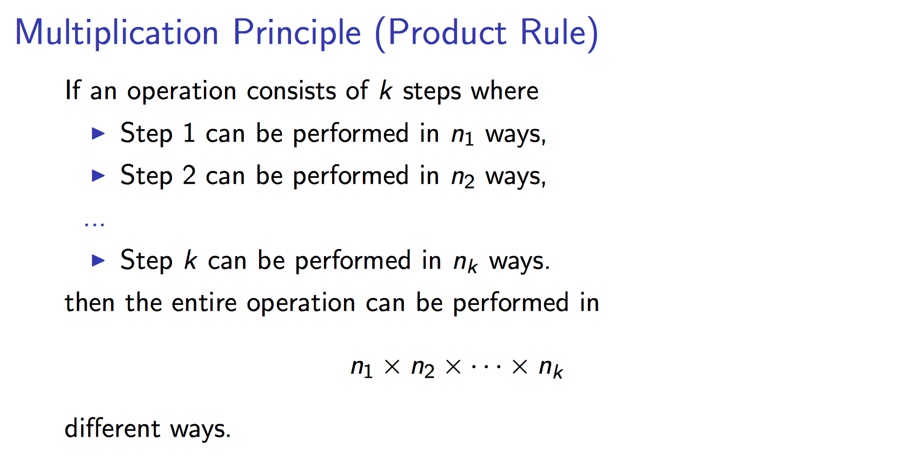
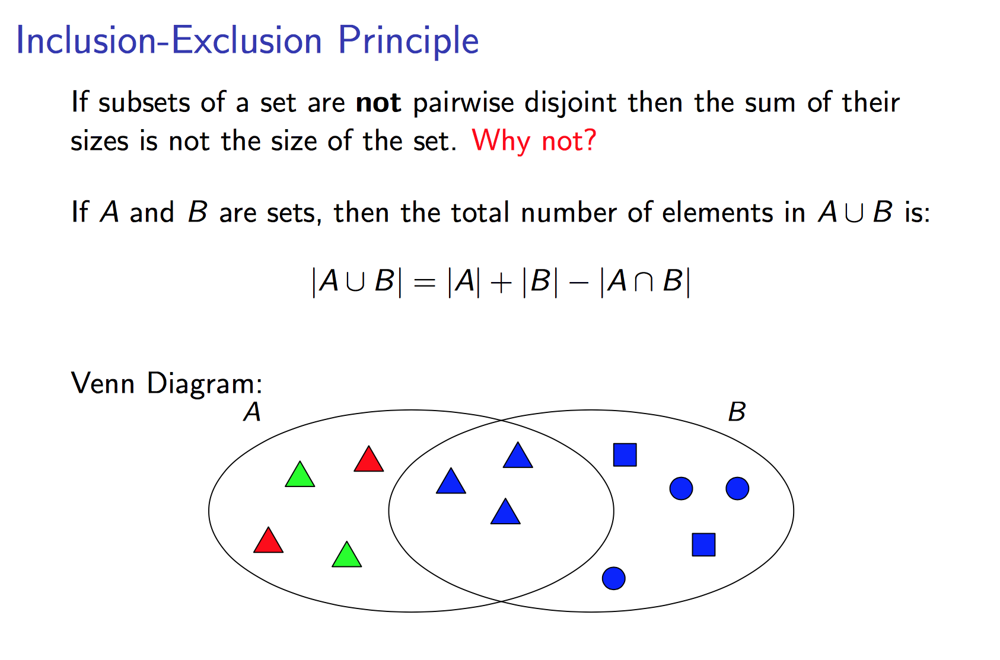
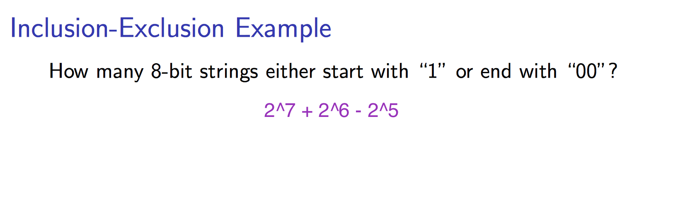
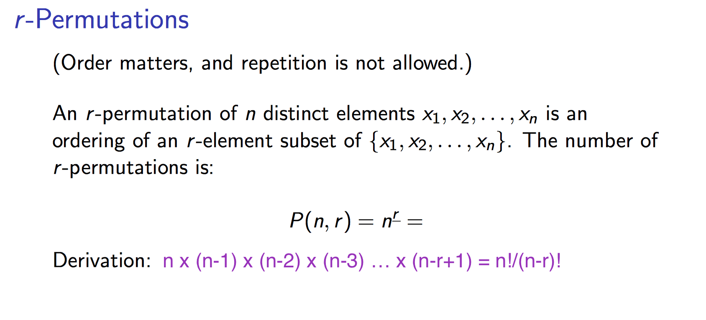

# Counting Principles

__Permutation Example__: In how many ways can 7 girls and 3 boys line up, if the boys must stand next to each other?

- __Answer__: (8! * 3!)

__Example 1__: How many strings can be made by reordering the letters PEPPER

- __Answer__: 6!/(2!3!1!)

__Example 2__: How many ways are there to distribute hands of 5 cards to each of 4 players from a deck of 52 cards?

- __Answer__: 52!/(5!5!5!5!32!)

---
[Reference: Mathisfun](http://www.mathsisfun.com/combinatorics/combinations-permutations.html)