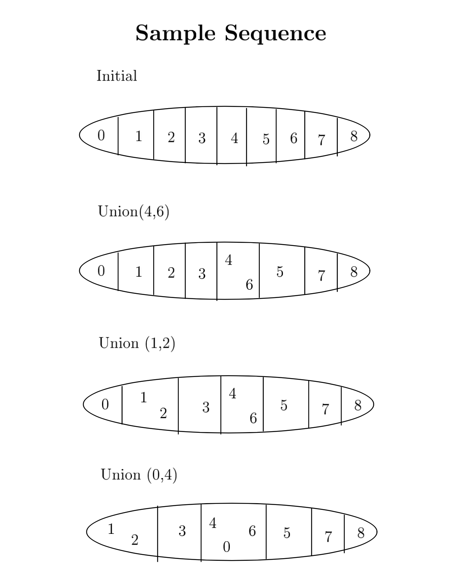

# Disjoint-set Data Structure

### Introduction
- A group of sets where no item can be in more than one set
- The disjoint set is an abstract data type that supports two operations: union and find
- _union(x, y)_ means merge the set containing x with the set containing y. 
- _find(x)_ should return some representation of the set containing x.



```cpp
struct Item {
	char data;
	Item* parent;
}
```