# CPSC 416 Distributed Systems
> A __distributed system__ is an application that executes a collection of protocols to coordinate the actions of multiple processes on a network, such that all components cooperate together to perform a single or small set of related tasks.

#### Pitfalls when Developing Distributed Systems
1. The network is reliable.
2. The network is secure.
3. The network is homogeneous.
4. The topology does not change. 
5. Latency is zero.
6. Bandwidth is infinite.
7. Transport cost is zero.
8. There is one administrator

## Design goals
- Heterogeneity 
	- Systems constructed from: Networks, Computer hardware, and Software
	- The challenge is must get these different systems and environments to inter-operate
- Concurrency 
	- The ability of a system component (e.g., server) to handle multiple simultaneous operations
	- Distributed systems are naturally concurrent (multiple clients operating in parallel)
	- Bottleneck: single server or network.
	- Server may stall while processing a client request; while request is stalled, server should be able to start other requests
- Scalability
	- The ability of a component to handle increased load without significant change
		- Changes to handle increased load should be proportional to the load increase
		- Performance degradation should be proportional to load increase
	- Key goal is to require incremental changes to a system as load increases
	- Allows server to handle increasing client load, this is a key issue for web-based systems
	- Don’t try to scale arbitrarily
		- Generalized scalability results in increased complexity, costs, and time to market
	- Key design constraints: expected system size and growth
	- Focus for expected size, and provide for scaling to handle growth
	- CND: Content Delivery Networks
		- Address translation: from url like espn.com to url of nearby content server
- Openness
	- Two types of openness are important: non-proprietary and extensibility
	- Non-proprietary: public protocols allows clients and servers from different vendors to talk to each other
	- Extensibility is the ability to customize to meet unanticipated needs.
- Fault Tolerance
	- Tolerate partial failures
	- Dealing with partial failure
		- Recoverability: persistent data and for long-running computations, and prevent loss or corruption of data
		- Availability: prevent service interruption
- Security (Privacy and Authentication) 
	- Sender: should be able to control what other programs and people can read or modify the message
	- Receiver: should be able to identify message sender
	- Privacy (protect against eavesdropping) and authentication (know who you are talking to)
	- Key mechanism: cryptography
- Transparency
	- Goal: make distributed programming as easy as local so solve all previous problems
	- How: hide hard stuff behind software abstraction and present single system image to programmers

__Types of transparency__:

- Access transparency
	- Identical operations used to access object regardless of local/remote
	- Important because it simplifies remote access
- Location transparency
	- Access to remote object without knowing where object is or how to find it
	- Important because can move or replicate objects without telling clients
	- Ideally would like location and access transparency together
- Performance transparency
	- Access to remote object as fast as access to local object
	- Hard because remote access is usually slower, sometimes the difference doesn’t matter, but sometimes it does
- Failure & Security Transparency
	- Failure Transparency: Conceals faults allowing applications to complete despite other hardware/software failures
	- Security Transparency: The ability to provide different levels of privacy or authentication without changing the distributed application

__Other Transparencies__:

- Mobility: Migration - moving a resource, Relocation – moving while in use
- Replication – hides the fact there may be replicas (need same name and contents)
- Concurrency/scaling transparency – hide the fact there could be multiple simultaneous users – resource stays consistent and access time constant

## Design Challenges

### Naming
- __Identifiers__: Name used to directly access a resource
	- Examples: IP address & port number, URL, mailing address
	- Not location transparent 
- __Pure name__: A location-transparent name
	- Compared to an identifier:
		- (+) move or replicate without changing name
		- (–) difficult (slow) to locate resource
		- (–) name encodes no location information
	- Examples: IP domain names, your name
- __Resolution__: converting pure name -> identifier
	- Examples: DNS, Phone book (name => number), “open” (Filename => inode)
- __Name contexts__:
	- Name’s meaning can depend on context
	- Examples: domain names (context is IP),  local phone numbers (context is Vancouver) 
- __Protection using ACLs__:
	- Access Control Lists (ACL) attached to resources, list users that can access the resource
	- Requires user authentication, user list is maintained on every resource and permission is checked on every access
- __Capabilities__: Names do two things:
	- name resource
	- grant permission to access the resource
	- a client that holds a capability for a resource has everything needed to access the resource
	- Access control: permission granted when capability issued, and access allowed when valid capability is presented

### Workload Allocation
- Key goal is to use resources efficiently by allocating load evenly among processors
- There are two models:
	- Centralized access to a processor pool
	- Collection of loosely coupled computers

#### Processor pool model
- Put workstations in a closet
- Tightly-coupled operating system or middleware
	- users access via a common shared access point
	- users log into pool not an individual machine
	- system allocates work to different processors to balance load
	- Example: Cloud Computing

#### Loosely Coupled Approach
- Everybody has their own processor
	- connected in a loosely-couple fashion (WAN)
- Problem is that load is not well balanced: processing power barely used or idled

#### Utilizing Idle Workstations
- Benefits: move programs from overloaded nodes
- __Key Issue__: can’t impact users who “own” the processor and owner has priority

---
### Consistency Maintenance
- Four key aspects to consistency
	* __Atomicity__: All-or-nothing property
		- Want all operations to complete or none
		- Issue: operations may include multiple nodes
		- Examples: Transfer between savings and chequing accounts, Internet commerce
	* __Coherence__: Keeping replicated data consistent
		- Why? Increases availability and improves performance
		- Issue: when one copy of an object is updated the system must maintain coherence by updating or invalidating the other copies
		- To maintain consistency we often need to know the order things happened 
	* __Clock Consistency__: Consistent view of time and event ordering
		- Issue: network messages and network performance is unpredictable and the exchange of messages takes time
		- Challenge: establish event ordering
	* __Failure Consistency__: 
		- Fail-stop model: components fail only by stopping instead of giving a “wrong” answer, a simplified failure model 
		- Byzantine failure model: 

## Network
Network = Host + Adapters + Wire + Switches/Routers + Software

#### Network Characteristics
- communication style: Unicast, point-to-point, or multicast/broadcast; order
- performance: rate, delay, and predictability; fairness

#### Performance Metrics
- __Throughput__: network transfer rate
	- e.g., use to determine maximum rate to be used to guarantee a level of video quality
- __Latency__: network delay for sending a single message
	- e.g., used to determine how long it will take to download a web page
- __Jitter__: fluctuations in message latency
	- e.g., used to determine how much streaming media should be buffered
- __Packet Loss Rate__: represents the extreme cases or subsets of the above situations

---

## Distributed Coordination

- __Coordinator__: a node that organizes the actions of a set of nodes
- __Problems__: 
	- How to decide on what node or nodes should take over the role of the failed node.
	- How do we ensure that the data the “new” node is going to use is up to date.

#### Coordinator failure
- __Goal__: implement a strategy to deal with coordinator failure
- Two main issues:
	- Picking a new coordinator: detect failure and deal with it
	- Reconstructing coordinator state

#### Electing a new coordinator
- __Key Problem__: must do this without a coordinator
- Detecting failure:
	- any node might detect failure first
- Election:
	- name for process of reaching agreement
	- must run without coordination
	- must deal with arbitrary node failures
	- all the nodes must agree who new coordinator is when election is over
- Key ideas:
	- Before failure: nodes agree on a strategy, and assign total order on nodes
	- After failure:
		- use order to find the “highest” surviving node
		- use broadcast so that all nodes agree

### Election algorithms

#### Bully algorithm
- __Assumption__::
	- every node knows about every other node
	- every node has a unique node number
- __Invariant__:
	- node with highest number is always coordinator
-__Bully election__:
	- held whenever coordinator failure detected
	- reach global agreement on highest remaining node number

- Three types of messages:
	- elect, answer, coord
- Start election
	- send elect to all nodes with higher numbers, and wait for at least one answer
- When elect received
	- reply with answer, and start a new election
- New coordinator
	- is node that starts election but receives no answer
	- it sends coord message to all nodes with lower numbers
	- coord message include new list of nodes
- Adding nodes: call election if new node number is highest

#### Runtime
- __Base case__:
	- node with second highest id detects failure
	- total messages = n-2 (coord messages, less with broadcast)
- __Worse case__:
	- node with lowest id detects failure
	- total messages = O(n2)
- __Election latency__:
	- 3 sends + 1 timeout

---
#### Ring algorithm
- Organize nodes logically into a ring
- When a node detects a failure
	- send elect to neighbor, includes node number
	- If neighbor down, try its neighbor, and so on
- When node receives elect:
	- if not in node set, adds node number to elect and passes it on
	- otherwise, pick highest node in node set as coordinator, 
	- and send coord message around ring to nodes in node set
- Doesn’t tolerate failures very well

#### Runtime
- __Messages required__: 2n (n for elect message and n for coord message)
- __Election latency__: 2n - 1 sends to (n-1)(timeouts)

### Network Partition
- A network partition is a network failure that divides the distributed system into multiple connected sub-networks
- __Problem__:
	- ensure that there is only a single coordinator even if network partitions
- __Solution__:
	- quorum protocol: elect coordinator only if at least half the nodes exist in a partition

### Quorum protocols
- Assigning votes
	- every node has V votes (e.g., 1)
	- every network has a quorum, Q >= Vtotal/2 + 0.5
- When electing new coordinator
	- tally votes from all surviving nodes, into T
	- if T < Q do not elect a new coordinator
- In coordinatorless partitions
	- nodes fail or stall until partition “heals”

---

## Time & Physical Clocks
__Time__: Decides event order and event intervals  
__Types of clocks__:

- Physical: 
	- Externally Synchronized: clock that matches real world (e.g., ATM Receipts)
	- Internally Synchronized: clock that matches clocks of other machines (e.g., File timestamps)
	- Have both event ordering and event intervals
- Logical:
	- Ability to order events, but no concept of interval
-  Computer Clock:
	- A vibrating crystal and a counter, crystal interrupts host CPU at regular intervals
- Issues for Synchronized Clocks
	- Setting: hard to get “current” time accurately
	- Keeping time: clocks run at slightly different rates
	- Sum: Synchronizing clocks is hard due to message latency and clock drift
	- Two Approaches: Authoritative Time Broadcast and Time Server

- Cristian’s Algorithm
	- Client
		* T0 = clock
		* {I, UTC} = timeServer.readUTC () * T1 = clock
		* clock = UTC + (T1-To-I)/2
	- Server
		* I - Adjustment factor, may be 0
		* UTC - accurate at time of message send
		* If Tmin can be reliably estimated then the accuracy is ± ((T1 – T0)/2 – Tmin)

- Adjusting for Clock Skew
	- __Problem__: we can’t move any clocks backward
	- __Solution__: If client is ahead of UTC, slow its clock so that it will converge with UTC before next synchronization message

- NTP (Internet Network Time Protocol)
	* Primary server gets UTC via radio
	* Secondary servers synchronize hierarchically 
	* Accuracy is roughly 30 milliseconds

### Logical Time
- In a distributed system, some events need not be ordered, others must be ordered for correct operation
- __Goal__: Determine event order without centralization, and build system support for higher-level services
- __Usage__: air traffic control systems, distributed locks, distributed checkpoint, recovery, etc.
- __Distributed checkpoint recovery__:
	- collection of nodes communicating over networw, and each updating local state based on messages
	- __Goal__: capture consistent checkpoint of system
	- __Approach__: each node records its updates in remote log, record logical time of update in log
	- To checkpoint, combine all logs and order by logical time

- The “Happened Before” relation:
	- event A HB event B if and only if:
		- A and B are on the same node and A precedes B in program order
		- or, A is the sender of message m and B is the receiver of m
	- Transitive property:
		- (a < b) ^ (b < c) → (a < c)
		- or: (a HB b) ^ (b HB c) → (a HB c)
	- Algorithms that use the HB relationship
		- logical clocks
		- causally ordered atomic multicast (CBCAST)

- Partial Order vs Total Order
	- __Total order__: for any pair of events ei and ej, either ei < ej or ei > ej, as if a global clock orders every message send
	- __Partial order__: for some pair of events ei and ej, either ei < ej nor ei > ej, we write this ei ~ ej

- Why logical clock?
	- label events with physical time, requires fine-grain internal synchronization, and this is very difficult/expensive to achieve
	- label events with logical time, maintain logical time according to happened before relationships

### Vector Timestamps
- __Basic idea__: message from S to R orders R after S
- Sender assigns sequence number (the node’s time) to message
- Each node maintains a vector timestamp V
	- At a particular node, the entries in V are that node’s idea of the current time on the other nodes
	- Use V on R to order events on R with respect to other nodes
	- Tag events with V of node on which they occur
	- Use event timestamps to determine order

- Labeling events:
	- Label every event with vector timestamp of node on which it occurs
	- Event E on node A, E.V = V, when E occurs
	- __Note__: to use E.V to order events from the same node, increment VA on A when E occurs

- Good: ordering exactly matches happened before
- Bad: every message must contain a timestamp vector, timestamp-vector size is O(n)

### Distributed logical clock (DLC)
- __idea__: use a single number to represent logical time
- logical time LTx stored at every node x, starts at 0 on every node
- when a node x, sends a message:
	- LTx += 1
	- Include LTx in the message
- when a node y receives a message from x:
	- LTy = max (LTx,LTy)

- __Note__: Some events that DLC orders, may not be ordered by Happened Before
	- DLC orders some events unnecessarily

## Group communication
- Unicast (one-to-one, point-to-point)
	- Streaming TCP/IP
	- Request/Response IPC, RPC
- Multicast (one-to-many, point-to-group)
	- ABCAST, CBCAST
- A group is a collection of nodes identified by endpoint of communication

### Central issue - Consistency
- Updating replicated data, replicated state stored by each node in group is modified by network messages
- Group protocol maintains state consistency: nodes start with same state, and remain same state after receving a bunch of group messages
- Key semantics of group protocols:
	- Atomicity: message received by every group member or none
	- Order: all replicas agree on message order 
	- Protocols vary on what semantics they provide

### Saturation Protocol
- Protocol description: 
	- client send message to every node in the group, repeat at most N times, wait for response from any node OR timeout, if response is received, break 
- Not atomic – it is possible that not all connected nodes will get the message

### Flood Protocol
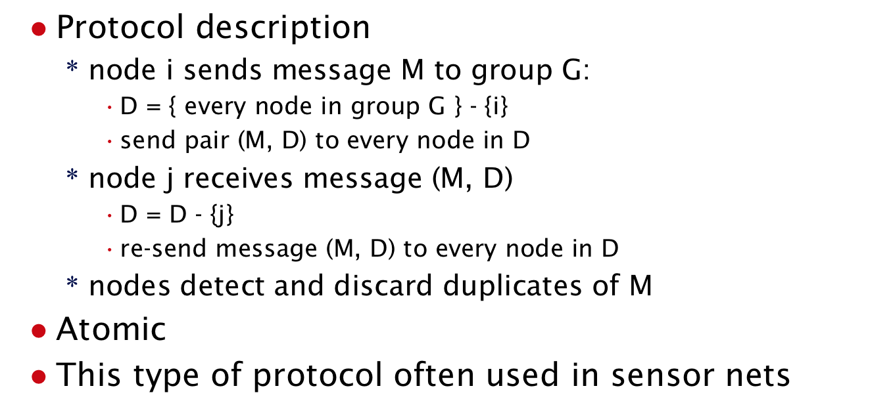

- __Properties of Flood__: If any node receives M and does not fail then all non-failed nodes will receive M

### Message Ordering
- __Problem__: Suppose several group messages were sent simultaneously from different nodes. Would all nodes receive the messages in the same order? Does it matter?

### Total ordering with ABCAST
- Need a global clock per group
	- generates globally unique and increasing times
- Assign every message a global send time
	- each send results in a “read” of the clock
- Receive messages in send-time order
	- hold message until all “earlier” messages received

### Atomic Total Ordered Broadcast (AOBCAST)
- Basically the sender proposes a sequence number
- Receivers propose a sequence number and send it back
- Sender selects the largest sequence number that was sent back
- Tells all the nodes what the final sequence number is
- Messages only given to application once sequence numbers are definitively known

### Causally ordered atomic multicast (CBCAST)
//TODO

## Group Communication and Synchronization
- Sharing in a distributed systems:
	- Clients read and write a shared resource (e.g., database, file system)
- Distributed systems are naturally concurrent
	- Clients run in parallel and Servers handle multiple requests at once

### Mutual exclusion
- Critical section: code that accesses a shared resource
- Mutual exlusion ensures that only one thread in critical sections at the same time
- Approach to mutual exclusion:
	- 1. First approach: centralize all shared resources
		- put shared resources at a server
		- clients access resources via RPC to server
		- all critical sections are on server
		- this is a non-distributed approach, easy, but hard to scale
	- 2. Second approach: distributed resources
		- server stores a database
		- clients cache portions of daabase locally, manipulates its copy and RPC to server to save updated data
		- __Problem__: mutual exlusion of client and maintain consistency of client-cached data

- __Problem 1__: Mutual Exlusion of Client:
- Locks in a Distributed System
	- Lock is a global variable used for synchronization in a non-distributed system
	- Centralized locks in distributed systems store on a centralized server
	- Clients synchronize using RPC to lock server
- Centralized Lock Manager
	- Operations (via RPC): acquire (read/write) and release
	- State: held, waiter queue (list of clients waiting for the lock)

- __Problem 2__: Consistency of Data
- Invalidation-based consistency
	- First get lock from lock manager, then get data from server
- Update-based consistency
	- Get data from server without holding lock
	- Get lock from lock manager
	- Get any updates to data from server: 
		- Push: server sends updates automatically; local check
		- Pull: client must request the updates from server

- Advantage of distributed resources:
	- readers can operate in parallel
	- writers cannot operate in parallel, but operate with fine-grain updates

- Centralized Lock Manager
	- Good: Three messages to request/release, simple and works
	- Issues: Lock contention, Client failure, Scalability and server failure

- Problem 1: Client that holds lock x, prevent all other client and server from acquiring x
- Solution: Callback locks and leases: Server upcalls client to request lock back - revoke(aLock)
- Leased Locks: 
	- lock is only good for predetermined amount of time - expiryTime = aLock.request()
	- clients must renew locks before they expire - bool = aLock.renew()
	- revokes lock by refusing to allow client to renew it

- Orphaned Lock: client or network fails while client is holding lock
- Solution: Leases and server tracks client health using probe messages or heartbeat (e.g., AYA, IAA)
- After the lease is expired, expired leases can be granted to another client
- Problem with server revocation approach:
	- network fails, but client continues to run, client might think it holds the lock, but server may have revoked it
- Solution: client must also track server’s health
	- if client can’t contact the server, it must assume that the lock has been revoked

### Scalability and Server Failure
- __Addressing scalability__: Lock messages are small and overhead is low and every lock can have a different server
- __Server Failure__: If lock manager fails, no client can access anything
- Responsibility of a lock manager: it enforces a global order on lock acquisition by serializing requests at the lock manager

### Distributing Lock Management
- Get rid of lock-manager server
- Use logical clock to order lock requests
- Use broadcast to request and release locks

__Implementation__:

- Nodes maintains a DLC-TO, T - Total-ordered distributed logical lock
- For each lock, nodes also maintain:
	- a request queue reqQ[], sorted by earliest time first
- Lock request is broadcast to every node
	- Node A sends message (REQ, lockname, TA, A)
	- reqQ[lockname] += (REQ, TA, A)
	- Waits for response from every node
- Node B Receives REQ from A
	- B updates TB to max(TA , TB)
	- If B does not have or want lock, it sends reply to A: (OKAY, lockname, B)
	- If B has lock:
		- It queues the req: reqQ[lockname] += (REQ, TA, A), and no reply
	- If B is waiting for the lock too
		- If TA < time of B’s lock request, then send OKAY
		- Else, reqQ[lockname] += (REQ, TA, A)
- Release / Acquire
	- When a node releases a resource
		- Send OKAY for every request in reqQ[lockname]
	-  When node receives OKAY from every node, it holds the lock
- __Analysis__:
	- Good: No single point of failure
	- Bad: Higher overhead than Centralized Lock Manager (3 messages for CLM)
	- Issue: Group membership when node fails, failure of node that holds the lock

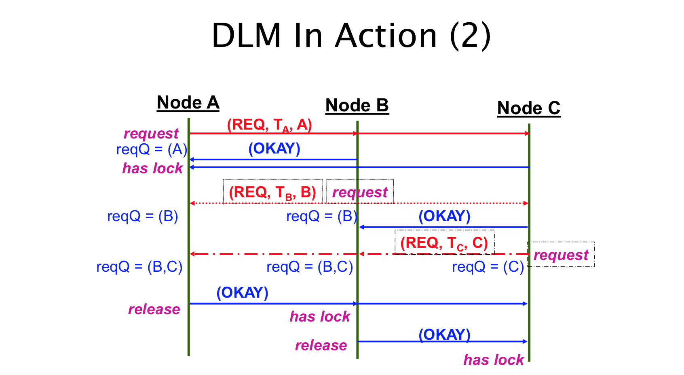

### Token Ring Lock Management
- Logically organize nodes into a ring
- Each lock has a single lock token 
- Pass token around the ring until someone wants to acquire the lock
- To acquire the lock:
	- Wait for token, hold it until you're done with the lock, then pass it
- Cost: To acquire: n-1 messages, To release: 1 messages
- Bad: Overhead even when no one wants the lock

### Summary of Distributed Lock Management
- Lowest Cost: Centralized lock manager (3 msgs VS O(n) msgs)
- Tolerate server failure - Distributed and Token ring lock management 
- Transactions allow us to deal with failures better 

---
## Transactions

### Distributed Transaction
- __Goal__: a transaction that involves multiple nodes, and achieves atomicity through logging
- __Definition__: A transaction is a sequence of data operations with the following properties:
	- Atomic: All or nothing
	- Consistent: consistent state in => consistent state out
	- Independent: Patial results are not visible to concurrent transactions 
	- Durable: Once completed, new state survives crashes
- Importance of Independence:
	- lost update: t1 and t2 read x and then write x, t1's update is lost 
	- inconsistent retrieval: intermediate state may be inconsistent
	- dirty read: t1 updates x, t2 reads x, t1 aborts, t2 has dirty value of x
	- premature write: t1 and t2 update x, t1 aborts. t2's update is lost

### Serializability
- A set of transactions is serializability iff
	- resulting state is equivalent to that produced by some serial ordering of those transactions
- Transactions don't actually have to run in serial order, system just ensures that actual outcome is the same as if they had 
- Two possbile approaches to this:
	- Two Phase Locking
	- Strict Two Phase Locking

### Two Phase Locking
- Locks: reader/writer locks, acquired as transaction proceeds, and no more acquired after first release
- __Phase 1__: acquire locks and access data, but release no locks
- __Phase 2__: access data, release locks, but acquire no new locks
- Two phase locking ensures serializability, but not independence

### Strict Two Phase Locking
- Like two-phase locking, but release no locks until transaction commits
- __Phase 1__: acquire locks and access data, but release no locks
- __Phase 2__: commit/abort transaction and then release all locks
- Strict two phase locking ensures insolation - no transaction can see incomplete results of another

### Deadlock
- Transactions increase likelihood of deadlock because they must hold lock until transaction commits/abort
- All deadlocks appear as cycles in graph, so we will have to abort ransactions until cycles are broken

### Optimistic Concurrency Control
- Two phase locking creates more lock conflicts than necessary, especially for long running transactions
- Optimistic concurrency control: no locks - process works on copies of data
- During commit, check for conflicts and abort if any otherwise write the copies
- __Analysis__:
	- Good: no overhead when there’s no conflict
	- Bad: if conflicts are common overhead much higher

### Recoverability (Atomicity)
- __Problem__: ensure atomic update in face of failure
- If failure occurs while updates are performed:
	- rollback to remove updates or
	- roll forward to complete updates

### Logging
- Persistent (on disk) log: records information to support recovery and abort
- Types of logging:
	- redo logging --- roll forward
	- undo logging --- roll back (and abort)
	- WAL --- roll forward and back
- Types of log records: begin, update, abort, commit, and truncate
- Atomic update: atomic operation is write of commit record to disk
- Transaction committed iff __commit record__ in log

### Logging an Update
- Value logging:
	- write old or new value of modified data to log
	- simple, but not always space efficient or easy (hard for: malloc, system calls)
- Operation logging
	- write name of operation and its arguments, usually used for redo logging

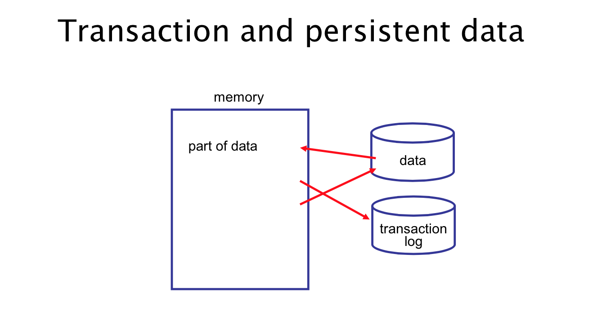

### Redo logging - Roll forward
- For each transactional update
	* change in-memory copy
	* write new value to log
	* do not change on-disk copy until commit
- Commit
	* write commit record to log 
	* write changed data to disk 
	* write truncate record to log
- Abort
	* write abort record to log 
	* invalidate in-memory data 
	* reread from disk

__Recovery__:

- When the system restarts after a failure
	* use log to roll forward committed transactions
	* normal access stopped until recover is completed
- Complete committed, but untruncated trans 
	* for every trans with a commit but no truncate
	* read new values from log and update disk values 
	* write truncate record to log
- Abort all uncommitted transacton
	* for every transaction with no commit or abort, write abort record to log

__Disadvantage__:

- No disk writes until commit
- Must integrate cache and transaction logging 
	* complicates design of both systems
- This locking in memory degrades performance
	* particularly if transactions are long running or modify lots of data

### Undo logging - Roll backward
- For each transactional update
	* write old value to log
	* modify data and then write new value to disk any time
- Commit
	* ensure that all updates have been written to disk (called “force”)
	* write commit record to log 
- Abort
	* use log to recover disk to old values

__Recovery__:

- When the system restarts after a failure
	* use log to rollback uncommitted transactions
	* normal access stopped until recovery completed
- Undo effect of any uncommitted trans
	* For every trans with no commit or abort, use log to recover disk to old values and write abort record to log

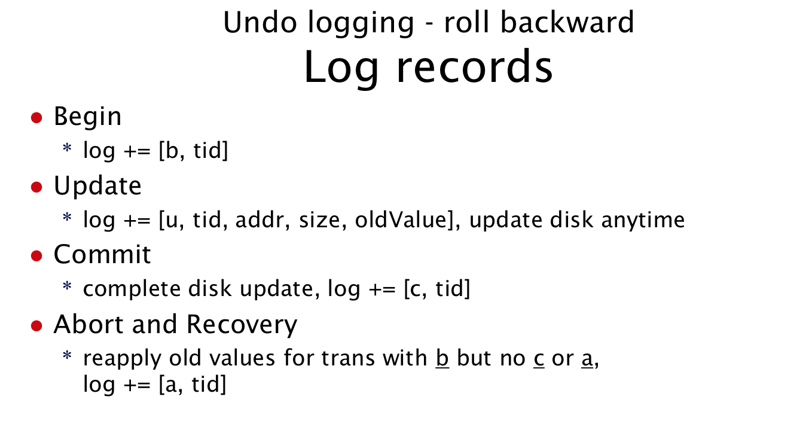

__Disadvantage__:

- Must modify disk data before commit can be written to log
- Performance impact
	* slows commit: transactions hold locks longer
	* increases disk-write bandwidth requirements: if several transactions in a row modify same data, would write to disk only once, at end of updates

### Write-ahead logging
- Idea
	* combine undo and redo logging
- How
	* write old values to log
	* modify data
	* write new values to log anytime before commit
	* write commit record to log
	* write data back to disk at anytime, when done write truncate record to log

__Failure Recovery__:

- Commit but no truncate
	* Use roll forward based on new values 
- No commit
	* Use old value to roll back

### Shrinking the Log File (Truncation)
- Truncation is the process of
	* removing unneeded records from transaction log 
- For redo logging
	* remove transactions with t or a 
- For undo logging
	* remove transactions with c or a

### Transactions in Distributed Systems
-  A distributed transaction involves
	* updates at multiple nodes
	* and the messages between those nodes
- Distributed __Atomic Commit__ Requirements:
	1. All workers that reach a decision reach the same one
	2. Workers cannot change their decisions on commit or abort once a decision is made
	3. To commit all workers must vote commit
	4. If all workers vote commit and there are no failures the transaction will commit
	5. If all failures are repaired and there are no more failures each worker will eventually reach a decision (In fact it will be the same decision)

### Atomic commit using coordinator
- Transaction coordinator
	- issues tid to clients (called workers)
	- knows about all workers
	- provides atomic commit
- Workers
	- contact coordinator to begin and commit transactions, to respond to votes and to determine outcome when uncertain
	- maintain local log of updates

---
### Two phase commit
- Transaction logs
	* Coordinator – begin, commit, and abort 
	* Worker – begin, commit, abort, update, and prepared
- Messages
	* worker 􏰥-> cordinator: commitRequest 
	* cordinator 􏰥-> workers: prepareToCommit
	* worker 􏰥-> cordinator: prepared or abort 
	* cordinator -> workers: committed or abort

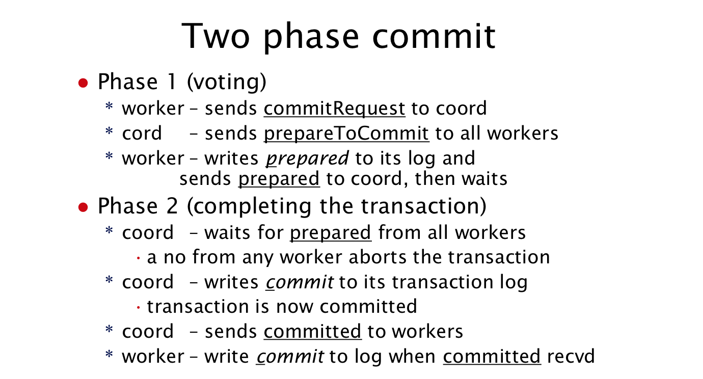

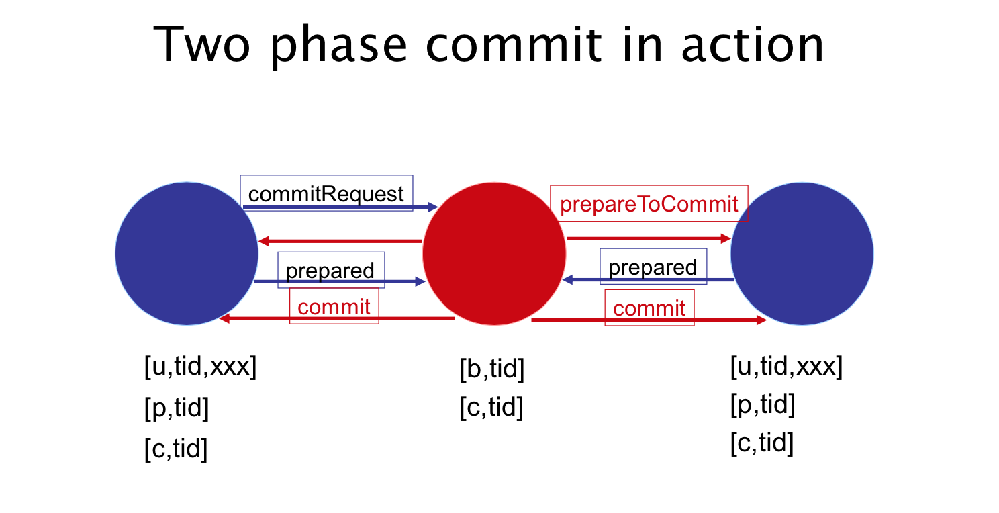

### Problem: Failure of Worker
- __Type 1__:
- Coordinator action
	* Coordinator’s prepareToCommit has timeout and it aborts transaction if worker fails to reply
- Worker recovery
	* Log records with no P, and locally abort transaction
- __Type 2__:
- Any transaction with a P and no C
	* worker does not know if transaction committed
	* must send message to coordinator to find out
		- If coordinator is down could it send a message to another worker?
- In summary
	* once worker has sent prepared, the transaction can commit at anytime, even if the worker has not received the commit message.

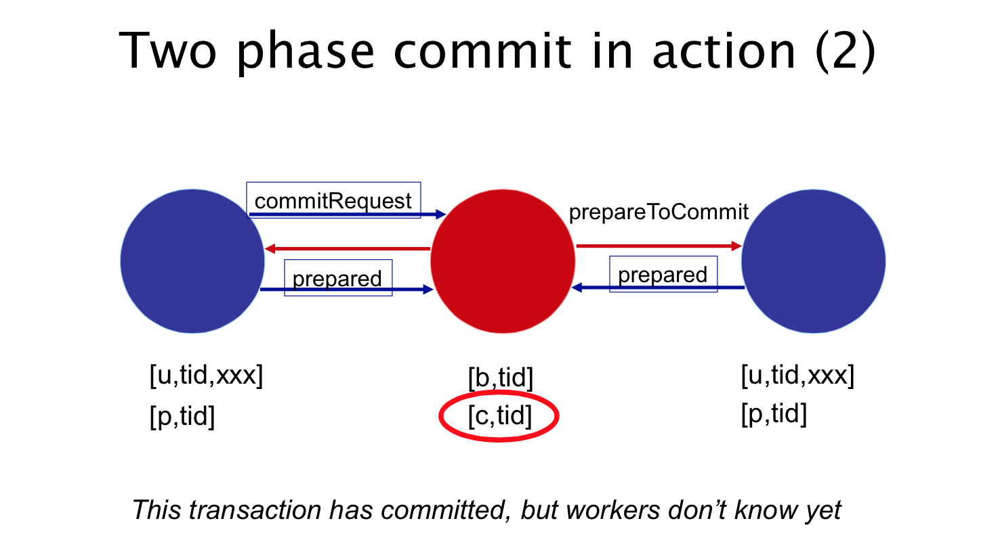

### Problem: Failure of Coordinator
- worker sends commitRequest
	* timeout if no prepareToCommit received 
	* abort transaction locally
- worker sends prepared (or aborted)
	* timeout if no committed (or aborted) received
	* worker does not know if transaction has committed and must check with someone (other works)

### Determining Transaction Decision
- need to ask someone else when coordinator fails with incomplete prepareToCommit
	* worker fails with P, but not C in its log
- ask coordinator
	* worker sends decisionRequest(tid) to coord
	* coord scans log for this tid and sends committed or aborted back to worker

### Coordinator Unavailable
- Worker checks with other workers (got list of workers with the prepareToCommit)
	* Some worker has commit – then commit the transaction
	* Some woker has abort – then abort the transaction
	* Some worker has no prepared – it can abort
	* All workers have prepared – block indefinitely (in some cases may be OK to select a new coordinator)

---
### Three Phase Commit

- key idea
	* add another exchange of “get ready” messages
	* so that workers can know state of failed worker 
- worker determines transaction decision by
	* if coordinator is down, contact another worker 
	* if no worker has received final decision
		- a majority can make the decision 
	* must deal with inaccessible workers
		- if any could abort then majority must abort
		- if any could commit then majority must commit

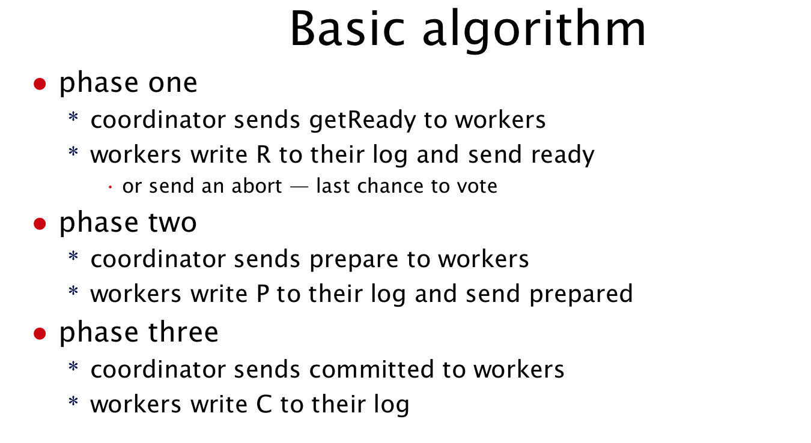

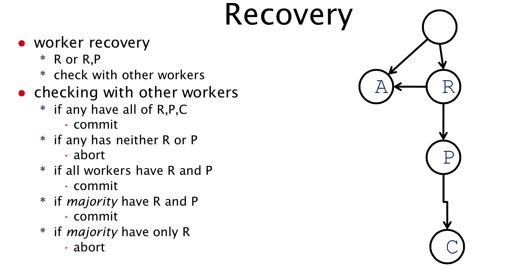

### Unit Summary
- Transactions
	- atomicity using undo/redo logs
	- and atomic disk-write of commit record
- Distributed Transactions
	- two-phase commit
		- updates logged locally at each participant
		- one node coordinates transaction
		- atomicity using atomic disk-write to coordinator log
		- worker may not know decision locally if it or coordinator fails, ask coordinator or another worker for final decision
	- three-phase commit
		- ensure transaction decision can be reached and without blocking when a majority of workers are accessible

### Crashed node recovery
- If in R, or P must locate current coordinator to get commit decision
- If in R at the time of crash
	* All non-failed processes could have been in R and hence abort would have been decided
	* Commit could have been decided and processes in P so might have committed as well
- If in P
	* Could have been first process moved to P before coordinator failure so everyone in R and abort would have been decided
	* One or more other processed could also have been in P so commit decided

### Three-phase commit Network failures
- Elect a new coordinator, but now require a majority for a decision – only send commit once a majority are in P
- If see only Rs, or PA send messages to advance to PA, once you have a majority abort
- If majority in R or P and at least one in P then send messages to move everyone to P, this includes those in PA, Commit once the majority is confirmed
- Block all other cases

---
## Reliable Interprocess Communication (IPC)
- Request-response model
	* client-server model (typically)
	* client sends request and waits
	* server processes request and sends response
- Ideally it takes 2 messages 
	* Request from client to server 
	* Result from server to client

- Example: TCP for request and response
	- Designed for streaming
	- Connection-based: three way handshake to setup and four messages to teardown connection
	- Total: 9~11 messages, heavy-weight state, used for http
	- We can do better

- Message delivery semantics
	- Request processed by server:
	- Maybe ( >=0 ), at least once ( >=1), at most once (0 or 1), exactly once ( =0 )  

### Best effort IPC
- Protocol tries (real hard) to deliver req
	* no guarantee of delivery
- What if res doesn’t come back?
	* client can either: wait forever, give up or try again

### Problem: Lost Response
- __Solution 1__: Idempotent operations
	- An operation is idempotent if performing it more than once produces the same result as performing it exactly once
- __Solution 2__: Reliable IPC
	- Exactly-once semantics: If client gets a response client must know that message processed exactly once
	- Must be able to tolerate four problems 
		* loss of req message
		* loss of res message
		* crash/restart of server
		* crash/restart of client

### Basic IPC protocol
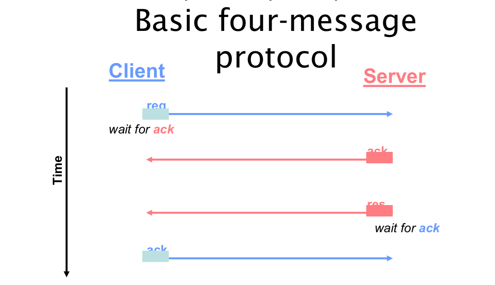

- __Question__: Can we get rid of server’s ack?
	* can we use res as ack?
	* need another way to detect duplicate messages

- Solution: Client sequence numbers
	- Client assign unique number to every req (higher than all previous used by that client), and include seqnum with req message
	- Server includes a client table, one entry for each client, and each entry contains the highest req seqnum received from that client, plus the value of res for that seqnum
	- Check seqnum of each req against the table entry data:
		- if < highest, then reject
		- if = highest,  send saved res, or if still processing then wait until res is ready
		- if > highest, process the req

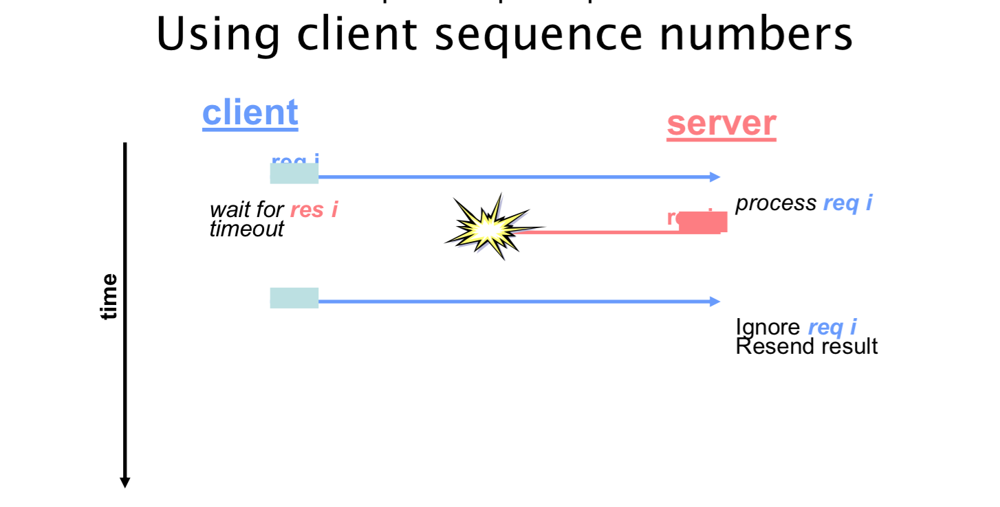

### The client timeout value (t-req)
- t-req must adjust to failure and delay, if it's too short, causes unnecessary retransmissions; if it's too long, causes delay recovery from lost message
- __Approximation__: t-req >= 2 * network-delay + server-processing time
- Issue: the server-processing time is too long
- Solution: Server-to-client: I-am-alive (iaa)

### Server-to-client: I-am-alive (iaa)
- Needed if takes a long time to process req
- Server starts prcoessing req, and wait __t-iaa__ before sending iaa to client
- send res when finished and wait for ack
- Client send req, wait t-req before re-sending req
- if __iaa__ received, cancel t-req but continue wating 
- when res received send ack

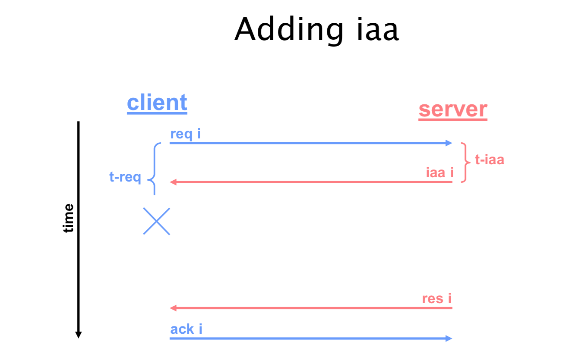

### Calibrating the parameters
- __t-iaa__: threshold between "short" and "long" requests
- __t-req__: expected worst-case delay for req, network-delay + iaa (in sec)
- number of client retries: 3 or so
- Number of messages:
	- if server-processing < network-delay + t-iaa, three messages (req, res, ack)
	- otherwise four messages (req, iaa, res, ack

### Problem with iaa
- Client waits forever for res after receiving iaa
- And it's really forever if res is lost after iaa, due to server crashes between iaa and res
- Solution: Client must keep tabs on the server (heart beat)

### Client-to-server: are-you-alive? (aya)
- Client sends aya i to server, allows client to detect server failure, and informs server that client is still waiting
- Protocol changes:
	- Client: after receiving iaa i, wait t-aya before sending aya i 
	- wait for iaa i, re-trying N times before giving up
	- Server: when aya i received, check seq, respond with either res i or iaa i

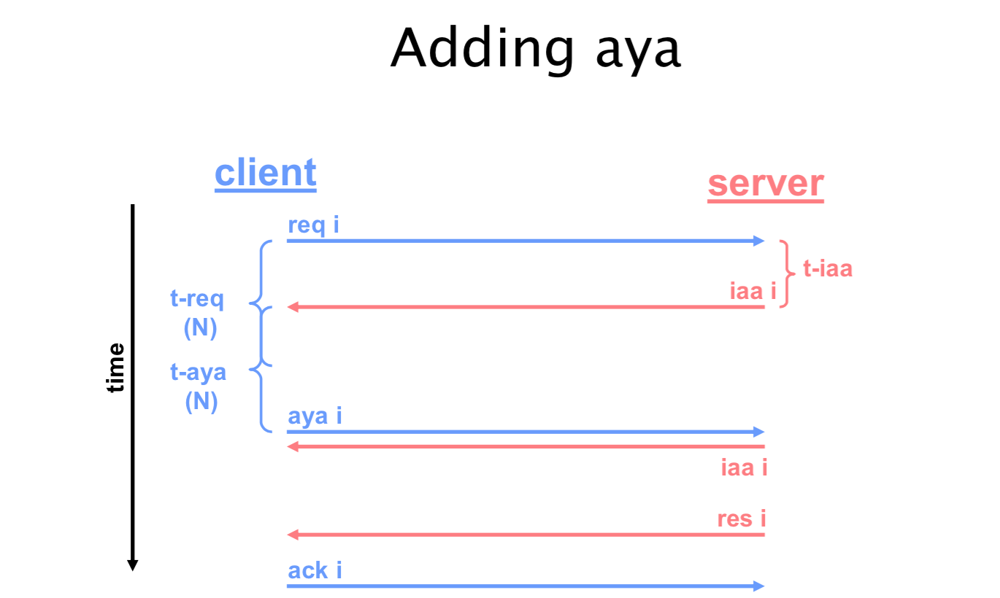

### Handling message loss
- From Server -> Client
	- req: client waits t-req, resends req up to N times 
	- res: if no iaa received, client times out and resends req, if iaa received, client times out and sends aya (N times)

### Going from three messages to two
- Maybe we can get rid of client to server ack
	* purpose is to tell server it can free last res
- Alternatives: Use req i + 1 as implied ack for req i 
 	* only works for single-threaded clients 
- Discard res after a while 
- How long must server save res?
	- Server must save res while client is waiting
	- Hard part is to get to know how long to wait without getting a message from client
	- __Waiting time__: 
		- if no iaa sent: N * t-req 
		- if iaa sent: 
			- N * t-req + (N + 1) * t-aya (no aya received)
			- N * t-aya (aya received)

### Server Crash
- Problem
	* we want server to process each request exactly once. However after restart, server’s seqnum database is lost 
	* must ensure that no req is processed twice, once before crash and again after 
- Solution
	* server epoch numbers, new epoch number for every server restart; sometimes port number can act as epoch number 
	* include epoch number in server identifier: id = (ip-addr, port-num, epoch)
	* server rejects requests from other epochs and returns “stale identifier” error

### Client Crash
- Client crashes with outstanding req 
	* req is called an orphaned request
	* server can stop processing
	* server uses aya as heartbeat, if server does not receive aya after N*t-aya, it stops processing 
- Client crashes while holding resource
	* solutions: server probes client
	* resource lease
- Problem with sequence numbers
	* upon restart client does not know highest seqnum
	* Server could already have completed request with that seqnum and respond with “old” result
- Solution
	* client epoch numbers: unique number with every restart; again, port number can be used as epoch number 
	* client identifier includes epoch
		- id = (ip-addr, port-num, epoch)
	* to server restarted client is different client 
	* also solves problem of seqnum rollover

### Multi-threading
- A thread is a sequential flow of control.
	- its like a process, lighter weight
	- Implemented by programming language, same __address space__, and same program/process
- Multi-Threading means multiple threads are allowed to run concurrently.
	- For example, when a thread blocks to wait for an IPC or disk-IO, another thread, possibly in the same process, is run.

__Problem with Mutl-Threaded Clients__:

- Server might receive a req from a client process while processing an earlier req from that process
- Impact to server:
	- must save multiple res for each client
	- cannot use "highest seqnum" to detect duplicates
	- cannot use req i+1 as implied ack for res i

__Handling multi-threaded clients__:

- For each client, server stores:
	- list of all outstanding requests (all reqs from the same client), including seqnum, saved res, and expiration time
	- lowest ad highest seqnum of outstanding reqs
- When server receives a req i 
	- if i > highest seqnum, process new request 
	- if i < lowest seqnum, reject request with error message
	- if i is know, it's a duplicate, send saved __res__
	- else, process new request
- Need to take care when changing what the lowest numbered outstanding request is

### Other Optimizations
- Can send fewer iaa/aya messages
	- One iaa/aya per client-server (to all outstanding reqs of a client)
	- aya: don't include a sequnum
	- iaa: list seqnums received from client
- Client waiting for res
	- one waiter loops for all res 
	- keep table of outstanding req
	- match incoming res to req

## Setting the Stage for RPC
//TODO UP TO 405 