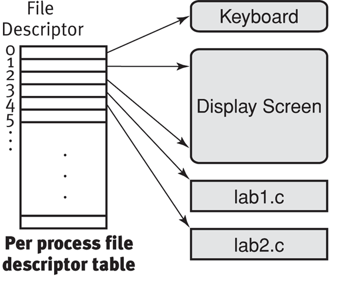
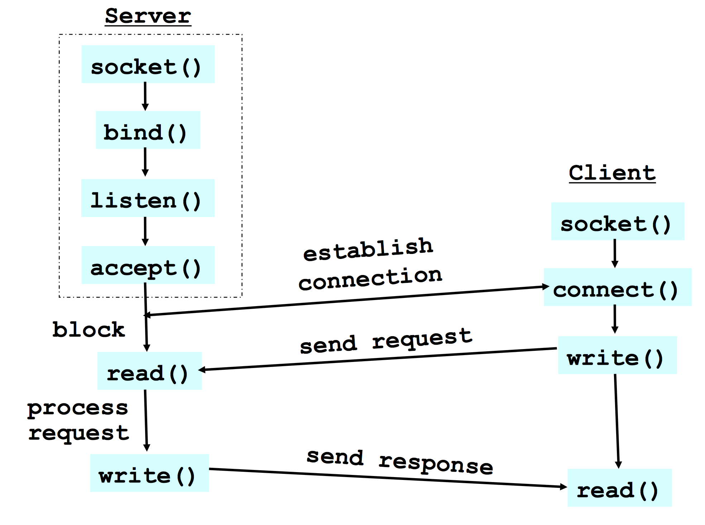

# Socket Programming
### Definition:
- Sockets are communication points on the same or different computers to exchange data, with OS level support by Unix/Linux/Windows.
- A process sends and receives through a socket
- Analogy: the doorway of the house.
- Socket, as an API, supports the creation of network applications

### Socket interface:
- A collection of system calls to write a networking program at user-level.
- Originally provided in Berkeley UNIX, later adopted by all popular operating systems.
- In UNIX, everything is like a file, all input is like reading a file, and all output is like writing a file. File is represented by an integer file descriptor.
- Data written into socket on one host can be read out of socket on other host.

### System calls for sockets:
- Client: create, connect, write, read, close
- Server: create, bind, listen, accept, read, write, close

### Socket Parameters:
__A socket connection has 5 general parameters:__

- The protocol (Example: TCP and UDP)
- The local and remote address (Example: 8.8.8.8)
- The local and remote port number

### File Descriptor:
__Definition__: In C programming, files are represented using file pointers or file descriptors. Each running process has a file descriptor table which contains pointers to all open I/O streams. The process passes the file descriptor to the kernel through a system call, and the kernel will access the file on behalf of the process. The process itself cannot read or write the file descriptor table directly.

When a process starts, three entries are created in the first three cells of the table. Entry 0 points to standard input, entry 1 points to standard output, and entry 2 points to standard error. Whenever a file is opened, a new entry is created in this table, usually in the first available empty slot. The socket system call returns an entry into this table; i.e. a small integer. This value is used for other calls which use this socket. The accept() system call returns another entry into this table. The value returned by accept() is used for reading and writing to that connection.



##### A more detailed example:


### Protocol Suites or Protocol Families: TCP/IP 
TCP/IP provides end-to-end connectivity specifying how data should be:

- formatted
- addressed
- transmitted
- routed
- received at the destination

### Typical Client Program
- Prepare to communicate
	- Create a socket
	- Determine server address and port number
	- Initiate the connection to the server
- Exchange data with the server
	- Write data to the socket
	- Read data from the socket
	- Manipulate the data (e.g., render a Web page)
- Close the socket

__Important FuncNons for Client Program__:

- socket(): create the socket descriptor
- connect(): connect to the remote server
- read(),write(): communicate with the server
- close(): end communicaGon by closing socket descriptor

__Creating a Socket__:

```cpp
int socket(int domain, int type, int protocol)

• Returns a descriptor (or handle) for the socket 
•  Domain: protocol family
	•  PF_INET for the Internet
•  Type: semantics of the communication
	•  SOCK_STREAM: Connection oriented
	•  SOCK_DGRAM: Connectionless 
•  Protocol: specific protocol
	•  UNSPEC: unspecified
	•  (PF_INET and SOCK_STREAM already implies TCP) 
•  E.g., TCP: sd = socket(PF_INET, SOCK_STREAM, 0);
•  E.g., UDP: sd = socket(PF_INET, SOCK_DGRAM, 0);
```

__Connecting to the Server__:

```cpp
int connect(int sockfd, struct sockaddr *server_address, socketlen_t addrlen)

• Arguments: socket descriptor, server address, and address size
• Remote address and port are in struct sockaddr 
• Returns 0 on success, and -1 if an error occurs
```

__Sending and Receiving Data__:

```cpp
//Sending data
write(int sockfd, void *buf, size_t len)

• Arguments: socket descriptor, pointer to buffer of data, and length of the buffer
• Returns the number of characters writtien, and -1 on error

//Receiving data
read(int sockfd, void *buf, size_t len)

• Arguments: socket descriptor, pointer to buffer to place the data, size of the buffer
• Returns the number of characters read (where 0 implies “end of file”), and -1 on error

//Closing the socket
int close(int sockfd)
```

__Byte Ordering: Little and Big Endian__:

- Hosts differ in how they store data  
	• E.g., four-byte number (byte3, byte2, byte1, byte0)  
- Little endian (Intel PCs)  
	• Low-order byte stored at the lowest memory locaGon • byte0, byte1, byte2, byte3
- Big endian (AMD)  
	• High-order byte stored at lowest memory locaGon • byte3, byte2, byte1, byte 0
- IP is big endian (aka “network byte order”)  
	• Use htons() and htonl() to convert to network byte order • Use ntohs() and ntohl() to convert to host order

---

### Servers Differ From Clients
- Passive open
	- Prepare to accept connection
	- But don’t actually establish on, until hearing from a client
- Hearing from multiple clients
	- Allow a backlog of waiting clients, in case several try to start a connection at once
- Create a socket for each client
	- Upon accepting a new client, create a new socket for the communication

### Typical Server Program
- Prepare to communicate
	- Create a socket
	- Associate local address and port with the socket
- Wait to hear from a client (passive open)
	- Indicate how many clients-in-waiting to permit 
	- Accept an incoming connection from a client
- Exchange data with the client over new socket
 	- Receive data from the socket 
 	- Send data to the socket 
 	- Close the socket
- Repeat with the next connection request

__Important FuncNons for Server Program__:

```cpp
 socket()
 - create the socket descriptor

 bind()
 - associate the local address

 listen()
 - wait for incoming connections from clients

 accept()
 - accept incoming connection

 read(), write() communicate with client

 close()
 - close the socket descriptor
```

__Socket Preparation for Server Program__:

```cpp
// Bind socket to the local address and port
int bind (int sockfd, struct sockaddr *my_addr, socklen_t addrlen)

• Arguments: socket descriptor, server address, address length
• Returns 0 on success, and -1 if an error occurs

// Define the number of pending connections
int listen(int sockfd, int backlog)

• Arguments: socket descriptor and acceptable backlog 
• Returns 0 on success, and -1 on error
```

__Accepting a New Connection__:

```cpp
int accept(int sockfd, struct sockaddr *addr, socketlen_t *addrlen)

• Arguments: socket descriptor, structure that will provide client address and port, and length of the structure
• Returns descriptor for a new socket for this connection 
• What happens if no clients are around?
  - The accept() call blocks waiting for a client
• What happens if too many clients are around?
  - Some connection requests don’t get through; that’s okay, because the Internet makes no promises
```

### Server Operation
- The socket returned by accept() is not the same socket that the server was listening on.
- A new socket, bound to a random port number, is created to handle the connection
- New socket should be closed when done with communication
- Initial socket remains open, can still accept more connections

### Putting it All Together


#### Supporting Function Calls
- gethostbyname() get address for given host name
- getservbyname() get port and protocol for a given service e.g. ftp, http
- getsockname() get local address and local port of a socket
- getpeername() get remote address and remote port of a socket

#### Useful Structures
```cpp
// Generic address, “connect(), bind(), accept()” <sys/socket.h>
struct sockaddr { 
	u_short sa_family;
	char sa_data[14]; 
};

// Client and server addresses TCP/UDP address (includes port #) <netinet/in.h>
struct sockaddr_in { 
	u_short sa_family; /* should be AF_INET */
	u_short sin_port;
	struct in_addr sin_addr; 
	char sin_zero[8];
};

// IP address <netinet/in.h>
struct in_addr {
	u_long s_addr; 
};

// Host name
struct  hostent {
  char    *h_name;        /* official name of host */
  char    **h_aliases;    /* alias list */
  int     h_addrtype;     /* host address type */
  int     h_length;       /* length of address */
  char    **h_addr_list;  /* list of addresses from name server */
  #define h_addr  h_addr_list[0]  /* address, for backward compatiblity */
};

```

#### Useful Libraries
```cpp
// Convert between system’s representaGon of IP addresses and readable strings
unsigned long inet_addr(char* str);
char * inet_ntoa(struct in_addr inaddr);

// Important header files
<sys/types.h>, <sys/socket.h>, 
<neNnet/in.h>, <arpa/inet.h>
```
