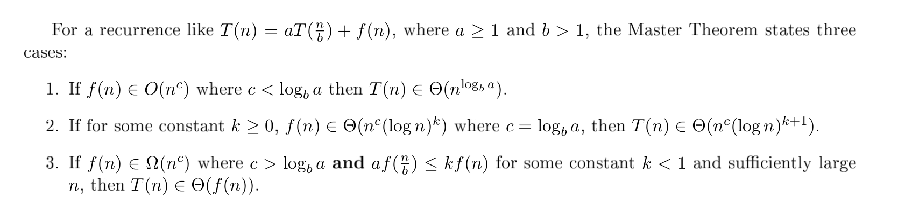

# Divide and Conquer
### Introduction

### Master Theorem

### Randomized-Select / QuickSelect.
 Finding the kth smallest element in an unsorted array.

- QuickSelect: Given array A of size n and integer k ≤ n,
	- Pick a pivot element p at random from A.
	- Split A into subarrays LESS and GREATER by comparing each element to p as in
Quicksort. While we are at it, count the number L of elements going in to LESS.
	- (a) If L = k−1,then output p.  
	   (b) If L > k − 1, output QuickSelect(LESS, k).  
		 (c) If L < k − 1, output QuickSelect(GREATER, k − L − 1)  

__Runtime__: T(n) ∈ Θ(n)