# Dynamic Programming

## Weighted Interval Scheduling Problem
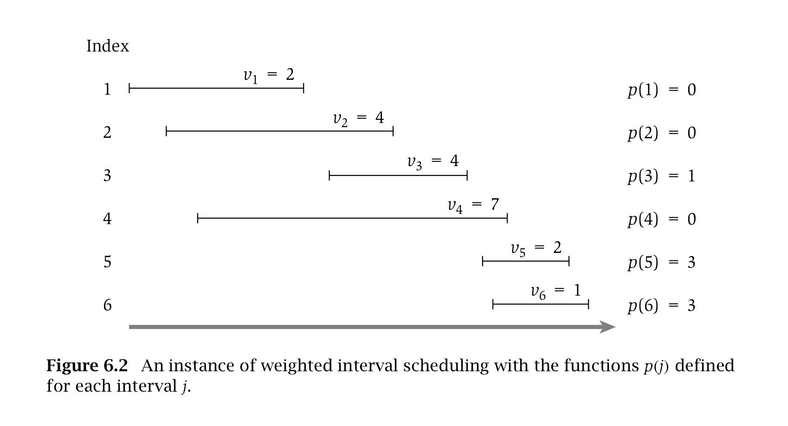

 
 - Recursive calls without memorization, exponential runtime

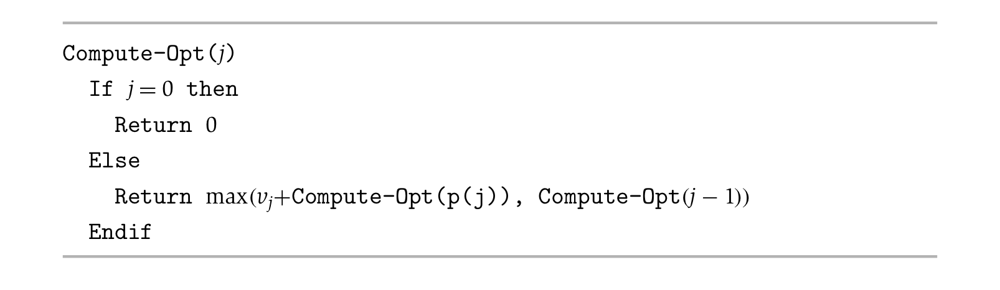

- Recursive calls without memorization, linear runtime

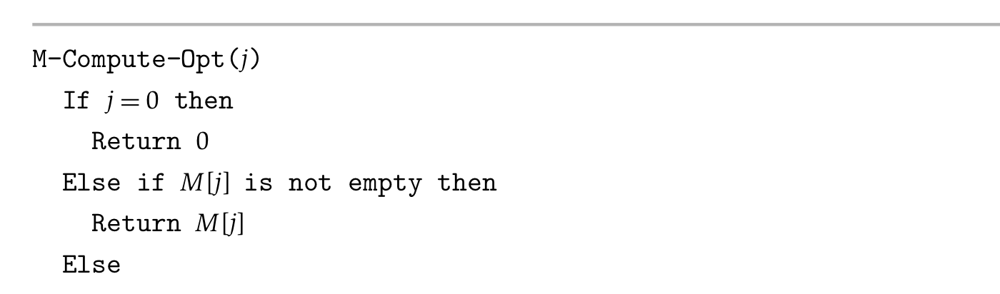
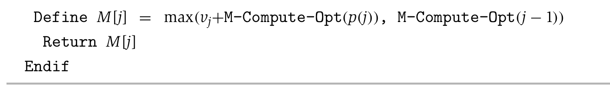

- Compute the intervals for original problem

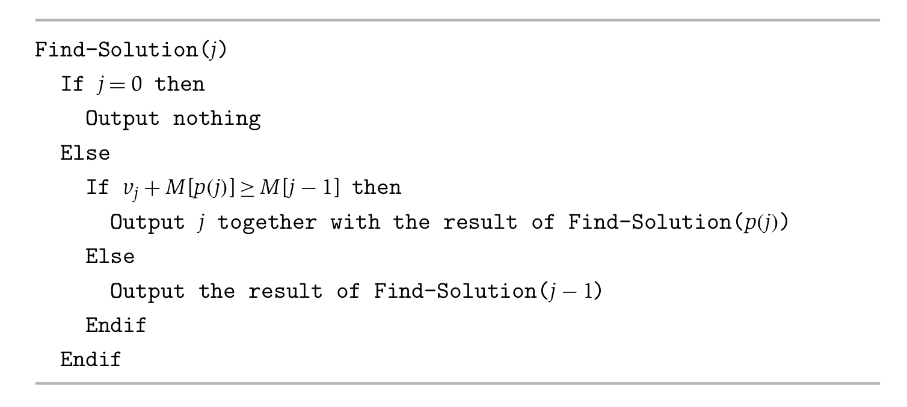

- Iterative building up of subproblem, from the bottom up

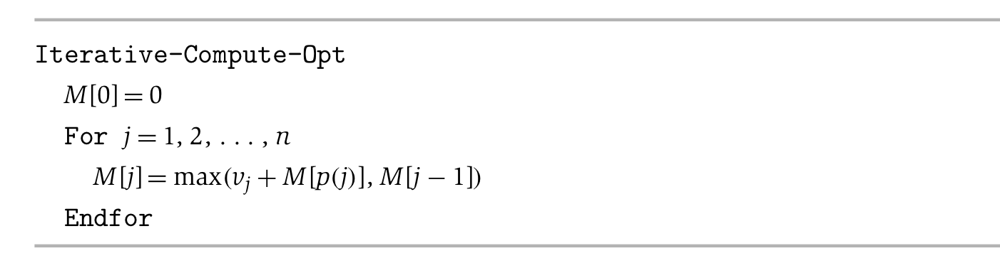

- To set about developing an algorithm based on dynamic programming, one needs a collection of subproblems derived from the original problem that satisfies a few basic properties.

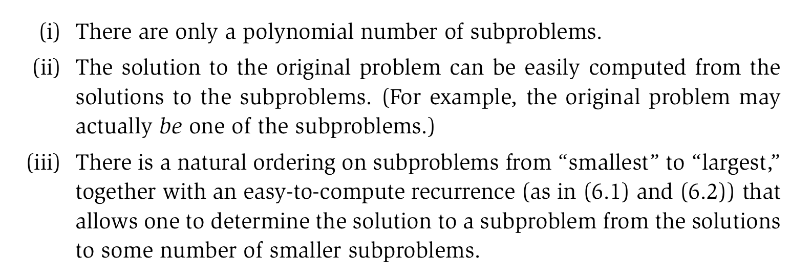

### Multi-way Choices on Recurrence
//TODO

### Subset Sums and Knapsacks: Adding a Variable
__Problem__: In the scheduling problem we consider here, we have a single machine that can process jobs, and we have a set of requests {1, 2, . . . , n}. We are only able to use this resource for the period between time 0 and time W, for some number W. Each request corresponds to a job that requires time wi to process. If our goal is to process jobs so as to keep the machine as busy as possible up to the “cut-off” W, which jobs should we choose?

This problem is a natural special case of a more general problem called the Knapsack Problem, where each request i has both a value vi and a weight wi. The goal in this more general problem is to select a subset of maximum total value, subject to the restriction that its total weight not exceed W.

__Note__: Main principles of dynamic programming: We have to come up with a small number of subproblems so that each subproblem can be solved easily from __“smaller”__ subproblems, and the solution to the original problem can be obtained easily once we know the solutions to all the subproblems. The tricky issue here lies in figuring out a good set of subproblems.

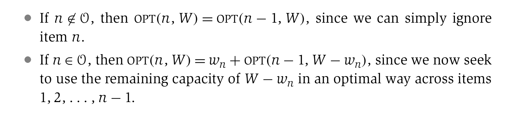

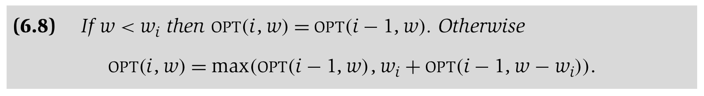

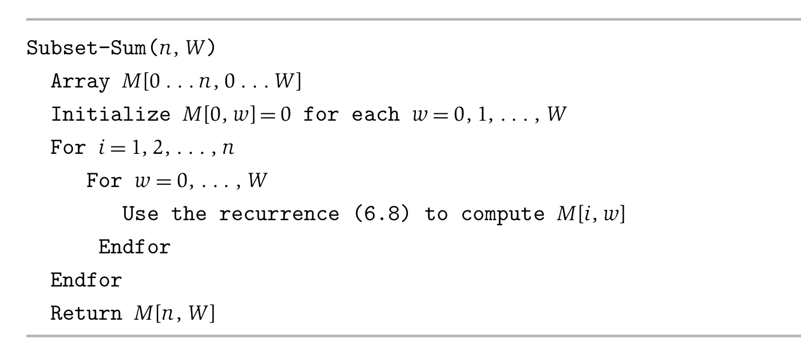

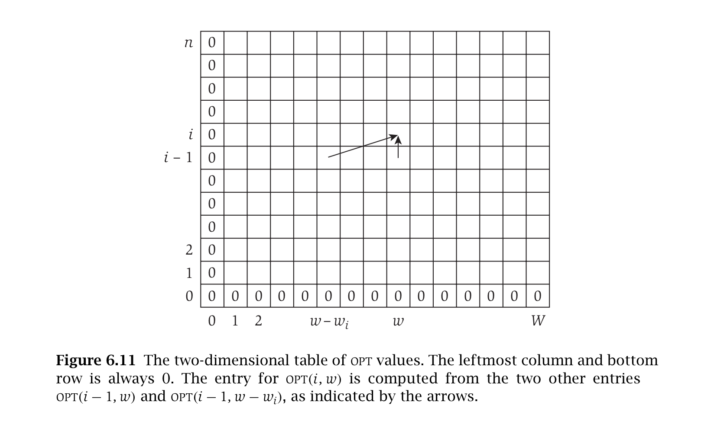

- The Subset-Sum(n , W ) Algorithm correctly computes the optimal value of the problem, and runs in O(nW) time.
- Given a table M of the optimal values of the subproblems, the optimal set S can be found in O(n) time.
