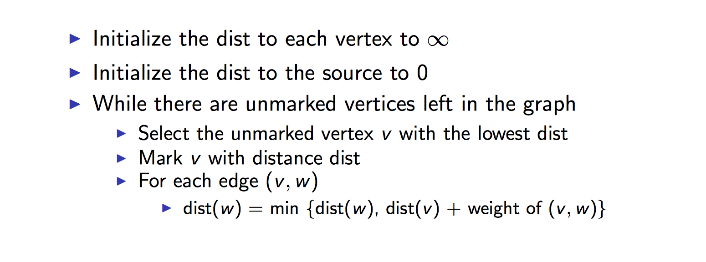
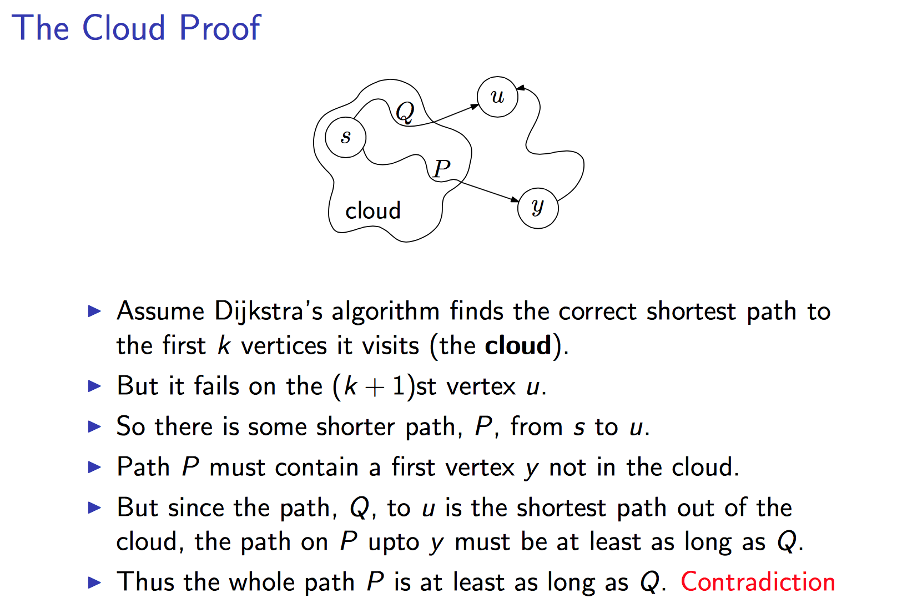

# Graph Algorithms

## The Shortest Path Problem
### Djikstra’s Algorithm
### Introduction


### Steps
1. Assign to every node a tentative distance value: zero for initial node and infinity to all other nodes
2. Keep a set of visited nodes and unvisited nodes.
3. For current node, consider all of its unvisited neighbors and calculate:  
_e_ = __(distance_to_current_node + distance_from_current_to_neighbor)__
4. If _e_ is __less than__ current tentative distance, replace the tentative value with e.
5. After finishing considering all the neighbors of the current node, mark the current node as visited and remote it from the unvisited set.
6. Set the current node as the next unvisited node with the __smallest__ tentaive distance.
7. If the destination node has been marked visited, the algorithm finishes.
8. Else go back to step 3.




### Pseudocode
```python
Input: Graph G = (V, E), directed or un directed 
			 Positive edge lengths l, vertex u ∈ V
Output: For all vertices u reachable from s, dist(u) is set to the distance from s to u

dist[s] ← 0												# (distance to source vertex is zero)
for all v ∈ V – {s}									#	(set all other distances to infinity)					
	do dist[v] ← ∞ 										 
S ← 0															# (S, the set of visited vertices is initially empty)
Q ← V 															# (Q, the queue initially contains all vertices)
while Q != 0												# (while the queue is not empty)
	do u ← minDistance(Q, dist) 			# (select the element of Q with the min. distance)
	S ← S∪{u}												# (add u to list of visited vertices)
	for all v ∈ neighbors[u]					#
		 if dist[v] > dist[u] + w(u, v) # (if new shortest path found)
				then d[v] ←d[u] + w(u, v)  # (set new value of shortest path) 
return dist													# (if desired, add traceback code)
```

__Runtime__: Using a binary heap, __O( |E| + |V|log|V| )__

__Space__: Using a binary heap, __O( |V| )__, up to |V| vertices may have to be stored.



---
## The Minimum Spanning Tree Problem
__Problem__: Suppose we have a set of locations V = {v<sub>1</sub>, v<sub>2</sub>, . . . , v<sub>n</sub>}, and we want to build a communication network on top of them. The network should be __connected__ — there should be a path between every pair of nodes — but subject to this requirement, we wish to build it as cheaply as possible.

> __Fact__: Let T be a minimum-cost solution to the network design problem defined above. Then (V , T ) is a tree. We will call a subset T ⊆ E a spanning tree of G if (V , T ) is a tree.

> __Fact__: Assume that all edge costs are distinct. Let S be any subset of nodes that is neither empty nor equal to all of V, and let edge e = (v, w) be the minimum-cost edge with one end in S and the other in (V − S). Then every minimum spanning tree contains the edge e.

> __Fact__: Assume that all edge costs are distinct. Let C be any cycle in G, and let edge e = (v, w) be the most expensive edge belonging to C. Then e does not belong to any minimum spanning tree of G.

### Kruskal’s Algorithm 

### Pseudocode
```python
Kruskal(V, E)

A = {}
foreach v ∈ V:
	Make-disjoint-set(v)
Sort E by weight increasingly 
foreach(v1, v2) ∈ E:
	if Find(v1) != Find(v2)
		A = A U {(v1, v2)}
		Union(v1, v2)
return A

```

> __Fact__: Kruskal’s Algorithm can be implemented on a graph with n nodes and m edges to run in O(m log n) time.

### Prim’s Algorithm

### Reverse-Delete Algorithm