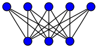

# Graph Theory

#### Graph definition:
It’s enough to think of a graph G as simply a way of encoding pairwise relationships among a set of objects. Thus, G consists of a pair of sets (V, E) — a collection V of nodes and a collection E of edges, each of which “joins” two of the nodes. We thus represent an edge e ∈ E as a two-element subset of V: e = {u, v} for some u, v ∈ V, where we call u and v the ends of e.  
A graph G = (V , E) has two natural input parameters, the number of nodes
|V|, and the number of edges |E|. We denote n = |V| and m = |E|.

#### Directed graph:
A directed graph G′ consists of a set of nodes V and a set of directed edges E′. Each e′ ∈ E′ is an ordered pair (u, v); in other words, the roles of u and v are not interchangeable, and we call u the tail of the edge and v the head. We will also say that edge e′ leaves node u and enters node v.

#### Undirected graph:
An undirected graph is graph that a set of nodes are connected together, where all the edges are bidirectional. In contrast, a graph where the edges point in a direction is called a directed graph.

#### Bipartite graph:
A bipartite graph (or bigraph) is a graph whose vertices can be divided into two disjoint sets U and V (that is, U and V are each independent sets), such that __every edge connects a vertex in U to one in V__. Vertex set U and V are often denoted as partite sets. Equivalently, a bipartite graph is a graph that does not contain any odd-length cycles. 

_A complete bipartite graph with m = 5 and n = 3_   

#### Connectivity:
We say that an undirected graph is connected if, for every pair of nodes u and v, there is a path from u to v.

#### Tree:
We say that an undirected graph is a tree if it is connected and does not contain a cycle.

> __Theory__: Let G be an undirected graph on n nodes. Any two of the following statements implies the third.

> 1. G is connected.
2. G does not contain a cycle.
3. G has n−1 edges.

#### Graph usages in real world:
1. Transportation networks 
2. Communication networks
3. Informationnetworks
4. Social networks
5. Dependency networks

---

### Representing Graphs

#### Adjacency Matrix:
- Consider a graph G = (V , E) with n nodes, and assume the set of nodes is V = {1, . . . , n}. The simplest way to represent a graph is by an adjacency matrix, which is an n × n matrix A where A[u, v] is equal to 1 if the graph contains the edge (u, v) and 0 otherwise.
- If the graph is undirected, the matrix A is symmetric, with A[u, v]= A[v, u] for all nodes u, v ∈ V. 
- The adjacency matrix representation allows us to check in O(1) time if a given edge (u, v) is present in the graph.
- Disadvantage: The representation takes 􏰘⊝(n2) space, and many graph algorithms need to examine all edges incident to a given node v.

_Undirected graph, adjacency matrix representation_:

#### Adjacency List:
- we have an array Adj, where Adj[v] is a record containing a list of all nodes adjacent to node v.
- For an undirected graph G = (V, E), each edge e = (v, w) ∈ E occurs on two adjacency lists: node w appears on the list for node v, and node v appears on the list for node w.
- Good for sparse graphs. It only requires O(m + n) space.

_Undirected graph, adjacency list representation_:

> The adjacency matrix representation of a graph requires O(n2) space, while the adjacency list representation requires only O(m + n) space.

---
### Articulation Point and Diameter
__An articulation point__ in an undirected graph is a vertex whose removal increases the number of connected components in the graph. Intuitively: Consider a node in a graph. If removing that node and all edges incident on that node 􏰀breaks􏰁 the graph into pieces, then the node is an articulation point.

The __diameter__ of an undirected, unweighted graph is the largest possible value of the following quantity: the smallest number of edges on any path between two nodes. In other words, it's the largest number of steps required to get between two nodes in the graph.

### Breadth-First Search

### Depth-First Search