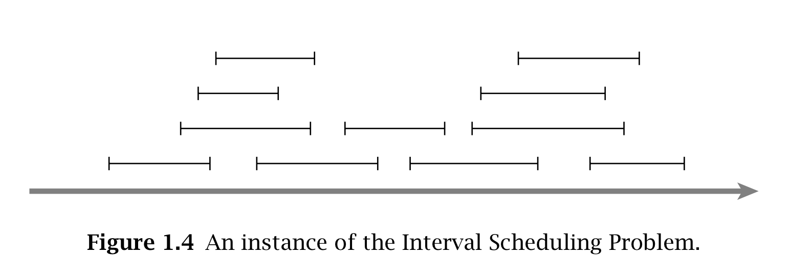
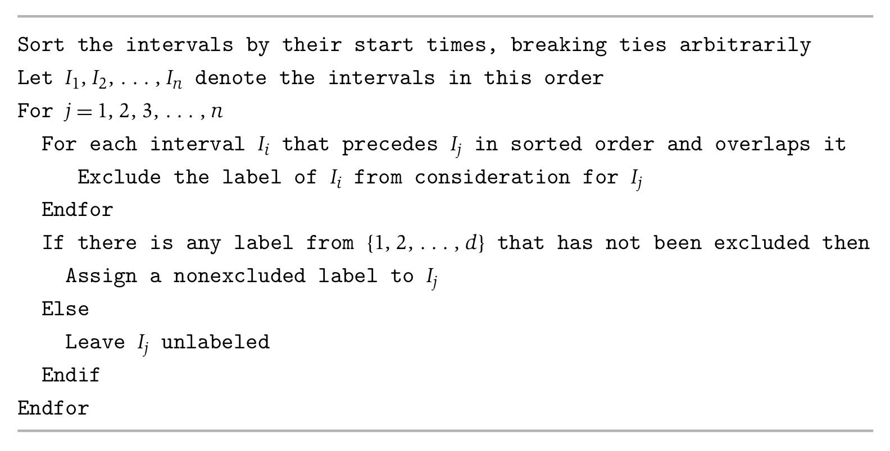
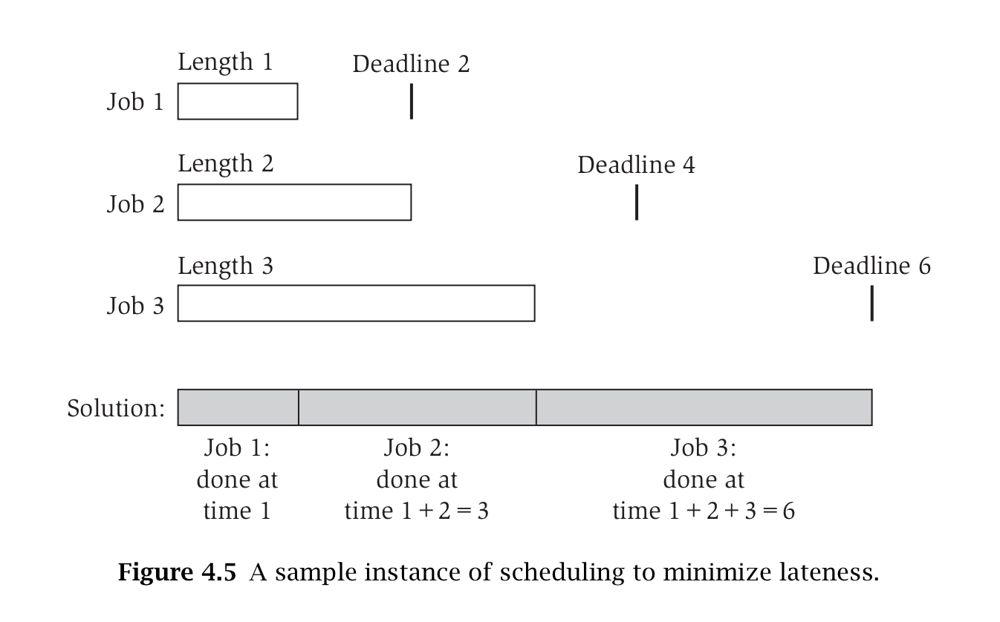

# Greedy Algorithm
__Definition__: We consider an algorithm to be greedy if the algorithm builds a solution one step at a time, using a simple, local criterion. Graph algorithms such as _Djikstra’s shortest path algorithm_ or _Kruksal’s minimum spanning tree algorithm_ are considered to be greedy algorithms.

__Problem__: We are given a set of intervals I = i<sub>1</sub> , i<sub>2</sub>, ..., i<sub>n</sub> , each of which has a beginning and an ending time. We say that intervals i<sub>m</sub> and i<sub>n</sub> are compatible if i<sub>m</sub> ∩ in<sub>n</sub> = ∅, that is, no period of time in i<sub>m</sub>  and i<sub>n</sub> overlaps.



A subset I’ of I is optimal if:

- All intervals are compatible.
- There is no compatible subset which is larger than I’.

### The Interval Scheduling Algorithm
Using the principle of greedy algorithms, we can consider intervals one at a time and decide if they are contained within the optimal subset or not. The general idea is: if an interval does not overlap with any other interval in the solution, then add it to the solution.

> The basic idea in a greedy algorithm for interval scheduling is to use a simple rule to select a first request i<sub>1</sub>. Once a request i<sub>1</sub> is accepted, we reject all requests that are not compatible with i<sub>1</sub>. We then select the next request i<sub>2</sub> to be accepted, and again reject all requests that are not compatible with i<sub>2</sub>. We continue in this fashion until we run out of requests. The challenge in designing a good greedy algorithm is in deciding which simple rule to use for the selection—and there are many natural rules for this problem that do not give good solutions.

__Decision Metrics__:

- Length of interval
- Number of overlaps with other intervals
- Relative position in the day
- Latest start time
- Earliest end time

```python
# simplified version

let S be empty
while I is not yet empty do
	choose interval i ∈ I with smallest finishing time add i to S
	delete all elements i of I that overlap with i
endwhile
return S
```



__Runtime__: If the starting time of interval i<sub>k</sub> is less than the finishing time of interval i<sub>k-1</sub>, then they overlap. Sorting the intervals by increasing finishing time, so the algorithm will take O(n log n) time.

__Theorem__: The greedy algorithm returns an optimal set S

__Note__: If we use the greedy algorithm above, every interval will be assigned a label, and no two overlapping intervals will receive the same label. The greedy algorithm above schedules every interval on a resource, using a number of resources equal to the depth of the set of intervals. This is the optimal number of resources needed.

### Scheduling to Minimize Lateness
Two main decision metrics: length _t<sub>i</sub>_ and deadline _d<sub>i</sub>_


- Slack time: _d<sub>i</sub>_ - _t<sub>i</sub>_

__Psudo Code__:

- Order the jobs in order of their deadlines
- Assume for simplicity of notation that d<sub>1</sub> ≤ . . . ≤ d<sub>n</sub>, and initially, f = s
- Consider the jobs i=1,..., n in this order
	- Assign job i to the time interval from s(i) = f to f(i) = f + t<sub>i</sub> 
	- Let f = f + t<sub>i</sub>
- Return the set of scheduled intervals [s(i), f (i)] for i = 1, . . . , n

## The Minimum Spanning Tree Problem.
Kruskal’s Algorithm

## Example
Consider the problem of making change for n cents, using the least number of coins. The input to this problem is the integer n, and the output is a sequence of coin values (where each value is allowed to appear multiple times) whose sum adds up to n. Describe a greedy algorithm to make change consisting of quarters (25 cents), dimes (10 cents), nickels (5 cents) and pennies (1 cent, a blast from the past).

```python
# Num is floored to int

quarterNum = amount/25
amount = amount % 25

dimeNum = amount/10
amount = amount % 10

nickelNum = amount/5
pennyNum = amount % 5
```
__Note__: If we had coins worth 25, 12, 5 and 1 cents, then the greedy algorithm would make change for 29 cents as 25 + 1 + 1 + 1 + 1 (5 coins) instead of 12 + 12 + 5 (3 coins) and so it would not always return the solution with the fewest coins.  
So, coins set must have common factors (5 and 1 in previous case) in order to optimize the greedy algorithm.

### Exhibition Guarding Problem
// todo