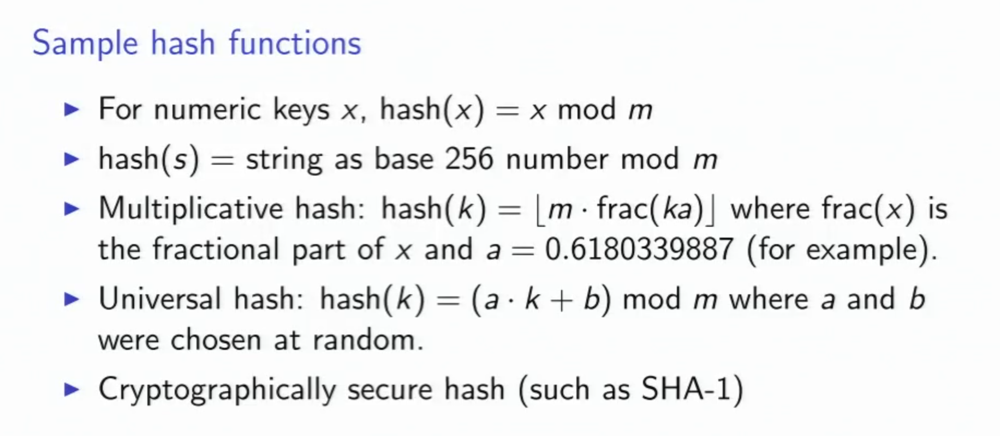

# Hashing

### Hash table:
Using a hash table to implement a dictionary ADT, then the find operation is:
```cpp
find('GNU') == 'GNU is not Unix';
Value find(Key key) {
	int index = hash(key) % m;
	return HashTable[index];
}
```

- hash( ) is a hashing function, and ideally m is chosen to be a prime number.
- a ideal hash function should be fast to compute and causes few collisions.
- m chosen to be prime number to avoid collisions caused by patterns in key values.

### Hashing string (Horner's Rule)
```cpp
m = table_size

int hash(string s) {
	int h=0;
	for (i = s.length()-1; i>=0; i--) {
		h = (256*h + s[i]) % m;
	}
	return h;
}

```


### Pigeonhole principle
- If more than m pigons fly into m pigeonholes then some pigeonhole contains at least two pgeons.
- __Corollary__: If we hash n > m keys into m slots, two keys will collide.