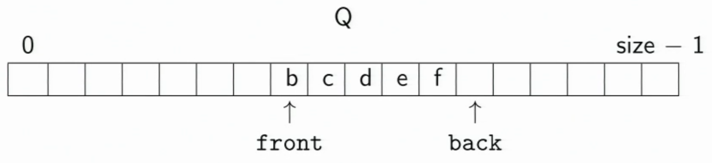
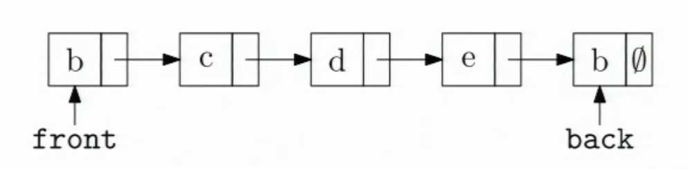
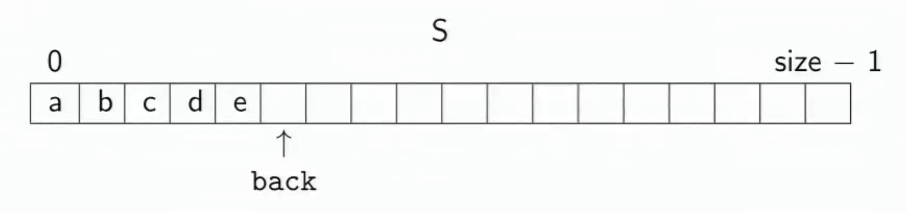
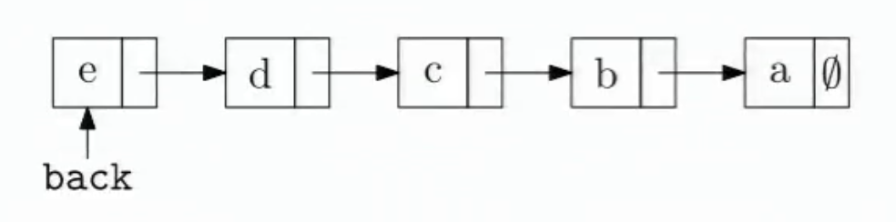

## Definition

#### Algorithm
> A high level, language independent description of a step-by-step process for solving a problem.

#### Data Structure
> A way of storing and organizing data so that it can be manipulated as described by an ADT.

> A data structure is defined by the algorithms that implement the ADT operations

> Abstract Data Type (ADT): A mathematical model for a certain class of data structures that have similar behaviors. It only defines operations upon the data structure, due to different languages have different syntax. (eg. Abstract Stack, Operations: [push, pop, peek], Abstract Queue, Operations: [enqueue, dequeue, front] )

## Circular Array Queue (FIFO)


```cpp
void enqueue(Object x) {
	Q[back] = x;
	back = (back + 1) % size;
}

bool is_empty() {
	return (front == back);
}

Object dequeue() {
	x = Q[front];
	front = (front + 1) % size;
	return x;
}

bool is_full() {
	return (front == (back + 1) % size);
}
```

## Linked List Queue


```cpp

Node {
	Object data;
	Node *next;
}

void enqueue(Object x) {
	if (is_empty()) {
		front = back = new Node(x);
	}else {
		back->next = new Node(x);
		back = back->next;
	}
}

bool is_empty() {
	return (front == NULL);
}

Object dequeue() {
	assert(!is_empty);
	Object ret = front->data;
	Node *tmp = front;
	front = front->next;
	delete tmp;  // garbage collection
	return ret;
}

```

## Array Stack Data Structure (LIFO)
#### Implementations: Depth first search, Function call stack


```cpp
void push(Object x) {
	assert(!is_full());
	S[back] = Object;
	back++;
}

Object top() {
	//also known as peek()
	assert(!is_empty());
	Object x = S[back-1];
	return x;
}

Object pop() {
	assert(!is_empty());
	back--;
	return S[back];
}

bool is_empty() {
	return (back == 0);
}

bool is_full() {
	return (back == size);
}

```


## Linked List Stack Data Structure


```cpp

Node {
	Object data;
	Node *next;
}

void push(Object x) {
	Node *tmp = back;
	back = new Node(x);
	back->next = tmp;
}

Object top() {
	assert(!is_empty());
	return back->data;
}

Object pop() {
	assert(!is_empty());
	Object ret = back->data;
	Node *tmp = back;
	back = back->next;
	delete tmp;
	return ret;
}

bool is_empty() {
	return (back == NULL);
}

```
