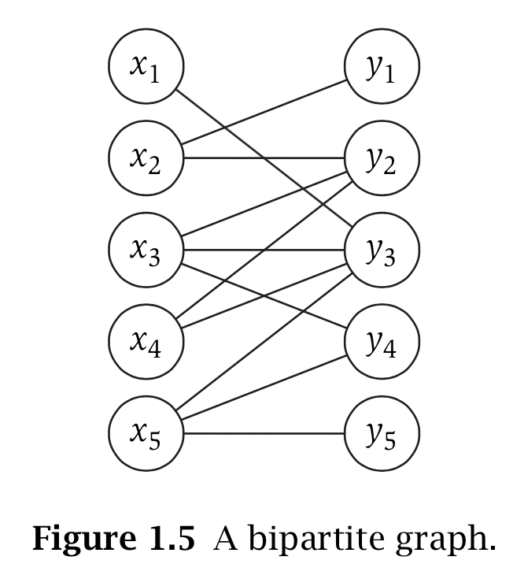

## Stable Matching Problem
### Definitions
__Perfect matching__: So consider a set M = {mx<sub>1</sub>, . . . , mx<sub>n</sub>} of n men, and a set W = {w<sub>1</sub>, . . . , w<sub>n</sub>} of n women. A matching S is a set of ordered pairs, each from M × W, with the property that each member of M and each member of W appears in __at most__ one pair in S. (each man and each woman belong to at most one of the ordered pairs.) A perfect matching S′ is a matching with the property that each member of M and each member of W appears in __exactly one__ pair in S′. (each man and each woman belong to exactly one of the ordered pairs.)

__Instability__: There are two pairs (m,w) and (m′,w′) in S with the property that m prefers w′ to w, and w′ prefers m to m′. We’ll say that such a pair (m, w′) is an instability with respect to S.

__Stability__:  We’ll say that a matching S is stable if (i) it is perfect, and (ii) there is no instability with respect to S.

- - -
### Gale-Shapley algorithm
```python
Initially all m ∈ M and w ∈ W are free
while there is a man m who is free and hasn’t proposed to every woman
Choose such a man m
	Let w be the highest-ranked woman in m’s preference list to whom m has not yet proposed
	if w is free then
		(m, w) become engaged
	else w is currently engaged to m′
		if w prefers m′ to m then m remains free
		else w prefers m to m′ (m, w) become engaged m′ becomes free
Return the set S of engaged pairs
```
__Truth__: Gale-Shapley algorithm returns a stable and perfect matching.

- - -
### Example
```python
m prefers w to w′.
m′ prefers w′ to w.
w prefers m′ to m.
w′ prefers m to m′.
```
This example shows a certain “unfairness” in the G-S algorithm, favoring men. If the men’s preferences mesh perfectly (they all list different women as their first choice), then in all runs of the G-S algorithm all men end up matched with their first choice, independent of the preferences of the women. If the women’s preferences clash completely with the men’s preferences (as was the case in this example), then the resulting stable matching is as bad as possible for the women. So this simple set of preference lists compactly summarizes a world in which someone is destined to end up unhappy: women are unhappy if men propose, and men are unhappy if women propose.

__Question__: Do all executions of the G-S algorithm yield the same matching? <br>
Yes, All Executions Yield the Same Matching

- - -
### Graph definition
it’s enough to think of a graph G as simply a way of encoding pairwise relationships among a set of objects. Thus, G consists of a pair of sets (V, E) — a collection V of nodes and a collection E of edges, each of which “joins” two of the nodes. We thus represent an edge e ∈ E as a two-element subset of V: e = {u, v} for some u, v ∈ V, where we call u and v the ends of e.

---
### Algorithm and Problem Preview
__Interval Scheduling__: Greedy Algorithm <br>
_The goal is to maximize the number of requests accepted._


__Weighted Interval Scheduling__: Dynamic Programming <br>
_Each request interval i has an associated value, or weight, our goal will be to find a compatible subset of intervals of maximum total value._

__Bipartite Matching__: Augmentation <br>
A graph G = (V , E) is bipartite if its node set V can be partitioned into sets X and Y in such a way that every edge has one end in X and the other end in Y.

Consider a bipartite graph G with a set X of n men, a set Y of n women, and an edge from every node in X to every node in Y. We say that a matching in a graph G = (V, E) is a set of edges M ⊆ E with the property that each node appears in at most one edge of M. M is a perfect matching if every node appears in exactly one edge of M.

Matchings in bipartite graphs can model situations in which objects are being assigned to other objects. Thus, the nodes in X can represent jobs, the nodes in Y can represent machines, and an edge (x<sub>i</sub>,y<sub>j</sub>) can indicate that machine y<sub>j</sub> is capable of processing job x<sub>i</sub>. A perfect matching is then a way of assigning each job to a machine that can process it, with the property that each machine is assigned exactly one job.

Thus the __Bipartite Matching Problem__ is the following: Given an arbitrary bipartite graph G, find a matching of maximum size. If |X| = |Y| = n, then there is a perfect matching if and only if the maximum matching has size n.

__Independent Set Problem__: NP-complete<br>
Given a graph G = (V, E), we say a set of nodes S ⊆ V is independent if no two nodes in S are joined by an edge. The _Independent Set Problem_ is, then, the following: Given G, find an independent set that is as large as possible. For example, the maximum size of an independent set in the graph in Figure 1.6 is four, achieved by the four-node independent set {1, 4, 5, 6}.

Interval Scheduling and Bipartite Matching can both be encoded as special cases of the Independent Set Problem. For Interval Scheduling, define a graph G = (V , E) in which the nodes are the intervals and there is an edge between each pair of them that overlap.

Given a bipartite graph G′ = (V′, E′), the objects being chosen are edges, and the conflicts arise between two edges that share an end. So we define a graph G = (V , E) in which the node set V is equal to the edge set E′ of G′. We define an edge between each pair of elements in V that correspond to edges of G′ with a common end. We can now check that the independent sets of G are precisely the matchings of G′.

__Competitive Facility Location Problem__: PSPACE-complete<br>

The game consists of two players, P1 and P2, alternately selecting nodes in G, with P1 moving first. At all times, the set of all selected nodes must form an __independent set__ in G. Suppose that player P2 has a target bound B, and we want to know: is there a strategy for P2 so that no matter how P1 plays, P2 will be able to select a set of nodes with a total value of at least B? We will call this an instance of the _Competitive Facility Location Problem_. __Problem area__: Game-playing and planning.


