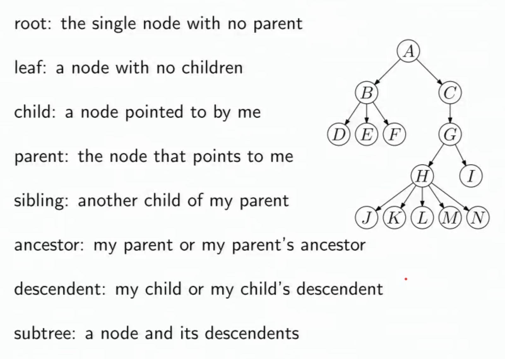
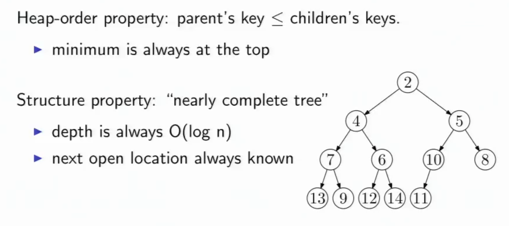

# Tree Terminology

__Depth__: Number of edges on the path from root to node.  
__Height__: Number of edges on the __longest__ path from node to descendent or for the whole tree, from root to leaf.  
__Degree__: Number of children of a node.  
__Complete__: As many nodes as possible for its height. (A complete binary three with height n, has 2^(n+1) - 1 nodes in total.  
__Nearly complete__: Complete plus some nodes on the left at the bottom.
(n = total nodes, h = height of a nearly complete binary tree, then n > 2^h - 1, and n <= 2^(h+1) - 1) 
Given a binary tree with n nodes, height = floor(lg(n))

## Binary Heap Priority Queue

__Heap__ definition: A heap is a partially sorted binary tree. It can be thought of as a priority queue; the most important node will always be at the top, and when removed, its replacement will be the most important. Heaps can also be used to sort data. A heap sort is O(nlogn) efficiency.